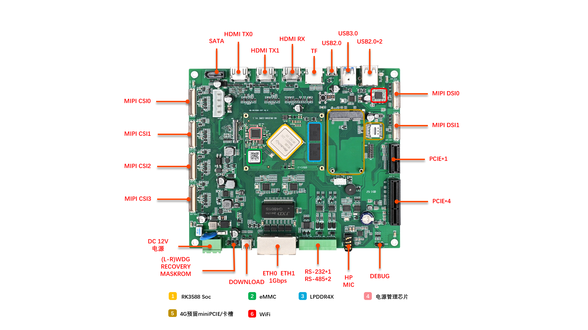

# RK3588 CORE Yocto 项目

基于 Yocto Project **scarthgap（5.0 LTS）** 的 **Vanxak HD-RK3588-CORE** 核心板嵌入式 Linux 构建环境。

结构参考同系列 [yocto-rk3506b-core](https://github.com/CHTUZKI/yocto-rk3506b-core)，面向 RK3588J 模组（8GB LPDDR4x + eMMC），当前仅构建**最小镜像**，并通过自研层生成 RKDevTool 可用的 `update.img`。

## 硬件参数（摘要）

| 项目 | 参数 |
|------|------|
| 处理器 | Rockchip RK3588J（4×A76 + 4×A55） |
| 内存 | 8GB LPDDR4x |
| 存储 | 32GB/64GB eMMC |
| 烧录 | USB OTG（`update.img` / RKDevTool） |
| 串口 | **115200 8N1**（厂家固件实测；非 EVB 默认 1500000） |

## 项目结构

```
yocto-rk3588-core/
├── poky/                      # Yocto scarthgap（官方）
├── meta-openembedded/         # OE 附加层（官方）
├── meta-arm/                  # meta-rockchip 依赖（官方）
├── meta-rockchip/             # 社区 Rockchip BSP（官方，勿改）
├── meta-rockchip-updateimg/   # 自研：打包 update.img
├── meta-rk3588-custom/        # HD-RK3588-CORE 机器与镜像
└── build/                     # BitBake 构建目录
```

## Yocto 版本

选用 **scarthgap（Yocto 5.0 LTS）**，相对 RK3506B 工程的 kirkstone（4.0）更新，且为当前长期支持发行版。

## 快速开始

### 构建准备

在开始构建之前，需要先安装必要的依赖包：

```bash
sudo apt-get update
sudo apt-get install build-essential chrpath cpio debianutils diffstat file gawk gcc git iputils-ping libacl1 lz4 locales python3 python3-jinja2 python3-pexpect python3-pip python3-subunit socat texinfo unzip wget xz-utils zstd
```

### 初始化并构建

```bash
cd yocto-rk3588-core
git submodule update --init --recursive
source poky/oe-init-build-env build
bitbake rk3588-image-minimal
```

产物目录：

```
build/tmp/deploy/images/hd-rk3588-core/
├── update.img                 # RKDevTool 烧录（符号链接）
├── *.update.img
├── *.wic / *.wic.bmap
├── idbloader.img / u-boot.itb / fitImage
└── *.ext4
```

## 启动与 update.img（对齐厂家包）

厂家 `参考文件/update.img` 实测串口为 **115200**（DDR → SPL → U-Boot → `ttyFIQ0`）。

- parameter 从 **`uboot@0x4000`** 起
- **无 idblock 行**，由 MiniLoader 自写入 New IDB
- MiniLoader 用板级验证版本（ImageUbuntu DDR v1.17）
- Yocto 侧：`u-boot.itb` + rootfs 内 fitImage；串口统一 **115200;ttyS2**

## 登录

- 用户：`root`
- 密码：无（`debug-tweaks`）
