EtherCAT

User Manual

## Contents

1 Introduction....4
1.1 About this manual....4
1.2 Reference documents....4
1.3 Commonly used acronyms....4
1.4 Revisions....5
2 EtherCAT communication specification....7
2.1 Introduction to EtherCAT....7
2.2 EtherCAT protocol....7
2.3 CANopen over EtherCAT....8
2.4 EtherCAT addressing....9
2.5 EtherCAT slaver information....10
2.6 Distributed clock....10
2.7 EtherCAT state machine(ESM)....12
3 Motion control....13
3.1 Control the power drive system....13
3.2 Mode of operation....15
3.3 Profile position mode....16
3.3.1 General information....16
3.3.2 Main controlling object....16
3.3.3 Functional description....17
3.4 Profile velocity mode....21
3.4.1 General information....21
3.4.2 Main controlling object....21
3.4.3 Functional description....22
3.5 Profile torque mode (StepSERVO only)....23
3.5.1 General information....23
3.5.2 Main controlling object....23
3.5.3 Functional description....24
3.6 Homing mode....25
3.6.1 General information....25
3.6.2 Main controlling object....25
3.6.3 Functional description....26
3.6.4 Method 1 and 2....26
3.6.5 Method 3 and 4....27
3.6.6 Method 5 and 6....27
3.6.7 Method 7 and 8....28
3.6.8 Method 9 and 10....28
3.6.9 Method 11 and 12....29
3.6.10 Method 13 and 14....29
3.6.11 Method 17 and 18....30
3.6.12 Method 19 and 20....30
3.6.13 Method 21 and 22....31
3.6.14 Method 23 and 24....31
3.6.15 Method 25 and 26....32
3.6.16 Method 27 and 28....32
3.6.17 Method 29 and 30....33
3.6.18 Method 33 and 34....33

3.6.19 Method 35 .... 34
3.6.20 Method 37 .... 34
3.6.21 Method -1 .... 34
3.6.22 Method -2 .... 34
3.6.23 Method -3 .... 34
3.6.24 Method -4 .... 34
3.7 Cyclic synchronous position mode .... 35
3.7.1 General information .... 35
3.7.2 Main controlling object .... 35
3.7.3 Functional description .... 36
3.8 Cyclic synchronous velocity mode .... 37
3.8.1 General information .... 37
3.8.2 Main controlling object .... 38
3.8.3 Functional description .... 38
3.9 Q program mode .... 39
3.9.1 General information .... 39
3.9.2 Normal Q execution .... 39
3.10 Touch probe .... 40
3.10.1 General information .... 40
3.10.2 Main control object .... 40
3.10.3 Functional description .... 40
3.10.4 Timing diagrame .... 42
4 Object dictionary .... 43
4.1 CoE object dictionary description .... 43
4.2 Communication profile .... 43
4.3 Motion control profile .... 50
4.4 Manufacturer profile .... 65
4.5 Manufacturer parameter for StepSERVO .... 70
4.6 Manufacturer parameter for Stepper .... 81
5 Contact MOONS' .... 93

## 1 Introduction

## 1.1 About this manual

This manual provides the details of EtherCAT communication about MOONS' Stepper and StepSERVO drives. It is used for engineers or technicians that develop a motion control system with EtherCAT communication. It is necessary that the user should know both a basic EtherCAT protcol and this manual.

EtherCAT® is a registered trademark and patented technology, licensed by Beckhof Automation GmbH,Germany.

## 1.2 Reference documents

Hardware Manual of MOONS' drive CiA 402 ETG 1000 ETG 6010 MOONS' Host Command Reference

## 1.3 Commonly used acronyms

<table><tr><td>100Base-Tx</td><td>100 MBit/s Ethernet on twisted pairs</td></tr><tr><td>AL</td><td>Application Layer</td></tr><tr><td>CAN</td><td>Controller Area Network</td></tr><tr><td>CANopen</td><td>Application layer protocol for the CAN bus</td></tr><tr><td>CoE</td><td>CANopen over EtherCAT</td></tr><tr><td>DC</td><td>Distributed Clocks Mechanism to synchronize EtherCAT slaves and master</td></tr><tr><td>DL</td><td>Data Link Layer</td></tr><tr><td>EMCY</td><td>Emergency Object</td></tr><tr><td>ESI</td><td>EtherCAT Slave Information</td></tr><tr><td>ESC</td><td>EtherCAT Slave Controller</td></tr><tr><td>ETG</td><td>EtherCAT Technology Group</td></tr><tr><td>PDO</td><td>Process Data Object</td></tr><tr><td>SDO</td><td>Service Data Object</td></tr><tr><td>XML</td><td>eXtensible Markup Language - used for the ESI file</td></tr></table>

## 1.4 Revisions

<table><tr><td>Data</td><td>Revisions</td><td>Changes</td></tr><tr><td>8/12/2020</td><td>2.1</td><td>Update and rectification</td></tr><tr><td></td><td></td><td></td></tr><tr><td></td><td></td><td></td></tr><tr><td></td><td></td><td></td></tr></table>

This manual mainly introduces the communication description of StepSERVO and Stepper drives. Stepper drives:

<table><tr><td>Model</td><td>Firmware</td></tr><tr><td>STF03-EC</td><td></td></tr><tr><td>STF05-EC</td><td></td></tr><tr><td>STF06-EC</td><td></td></tr><tr><td>STF10-EC</td><td></td></tr><tr><td>STF05-ECX-H</td><td></td></tr><tr><td>STF10-ECX-H</td><td></td></tr></table>

## StepSERVO drives:

<table><tr><td>Model</td><td>Firmware</td></tr><tr><td>SSDC03-EC</td><td></td></tr><tr><td>SSDC06-EC</td><td></td></tr><tr><td>SSDC10-EC</td><td></td></tr><tr><td>SSDC06-ECX-H</td><td></td></tr><tr><td>SSDC10-ECX-H</td><td></td></tr><tr><td>SSDC06W-ECX-H</td><td></td></tr></table>

<table><tr><td>OD</td><td>Name</td><td>SSDC**-EC</td><td>SSDC**-ECX-H</td><td>SSDC**-ECX-J</td><td>SSDC**W-EC-H</td></tr><tr><td>0x2036</td><td>Move Homeoffset</td><td></td><td>√</td><td>√</td><td></td></tr><tr><td>0x2040</td><td>Qcontrolword</td><td></td><td>√</td><td>√</td><td></td></tr><tr><td>0x2041</td><td>Qstatusword</td><td></td><td>√</td><td>√</td><td></td></tr><tr><td>0x2230</td><td>Full closed-loop Mode</td><td>√</td><td>√</td><td>√</td><td></td></tr><tr><td>0x2231</td><td>Secondary Encoder Resolution</td><td>√</td><td>√</td><td>√</td><td></td></tr><tr><td>0x2240</td><td>Full closed-loop Position Gain</td><td>√</td><td>√</td><td>√</td><td></td></tr><tr><td>0x2241</td><td>Full closed-loop PositionDeri Gain</td><td>√</td><td>√</td><td>√</td><td></td></tr><tr><td>0x2242</td><td>Full closed-loop PositionDeri Filter</td><td>√</td><td>√</td><td>√</td><td></td></tr><tr><td>0x2244</td><td>Full closed-loop Velocity Gain</td><td>√</td><td>√</td><td>√</td><td></td></tr><tr><td>0x2245</td><td>Full closed-loop VelocityInteg Gain</td><td>√</td><td>√</td><td>√</td><td></td></tr><tr><td>0x2246</td><td>Full closed-loop AccFeedForward</td><td>√</td><td>√</td><td>√</td><td></td></tr><tr><td>0x2247</td><td>Full closed-loop PID Filter</td><td>√</td><td>√</td><td>√</td><td></td></tr><tr><td>0x2250</td><td>Full closed-loop Cherk turns</td><td>√</td><td>√</td><td>√</td><td></td></tr><tr><td>0x2251</td><td>Full closed-loop Turns Pos Error</td><td>√</td><td>√</td><td>√</td><td></td></tr><tr><td>0x2265</td><td>E-Stop on Input X8</td><td></td><td>√</td><td>√</td><td></td></tr><tr><td>0x22D5</td><td>Touch probe1 pos edge counter</td><td></td><td>√</td><td>√</td><td></td></tr><tr><td>0x22D6</td><td>Touch probe1 neg edge counter</td><td></td><td>√</td><td>√</td><td></td></tr><tr><td>0x22D7</td><td>Touch probe2 pos edge counter</td><td></td><td>√</td><td>√</td><td></td></tr><tr><td>0x22D8</td><td>Touch probe2 neg edge counter</td><td></td><td>√</td><td>√</td><td></td></tr><tr><td>0x2270</td><td>Encoder error</td><td></td><td></td><td></td><td>√</td></tr><tr><td>0x2271</td><td>Clear Multi-Turn</td><td></td><td></td><td></td><td>√</td></tr></table>

<table><tr><td>OD</td><td>Name</td><td>STF**-EC</td><td>STF**-ECX-H</td></tr><tr><td>0x2036</td><td>Move Homeoffset</td><td></td><td>√</td></tr><tr><td>0x2040</td><td>Qcontrolword</td><td></td><td>√</td></tr><tr><td>0x2041</td><td>Qstatusword</td><td></td><td>√</td></tr><tr><td>0x2615</td><td>StepInputs Counts</td><td>√</td><td></td></tr></table>

## 2 EtherCAT communication specification

## 2.1 Introduction to EtherCAT

EtherCAT (Ethernet for Control Automation Technology) is a real-time Industrial Ethernet technology originally developed by Beckhof Automation. The EtherCAT protocol which is disclosed in the IEC standard IEC61158 is suitable for hard and soft real-time requirements in automation technology, in test and measurement and many other applications.

The main focus during the development of EtherCAT was on short cycle times (≤ 100 µs), low jitter for accurate synchronization (≤ 1 µs) and low hardware costs.

## 2.2 EtherCAT protocol

EtherCAT embeds its payload in a standard Ethernet frame. The frame is identified with the Identifier (0x88A4) in the EtherType field. Since the EtherCAT protocol is optimized for short cyclic process data, the use of protocol stacks, such as TCP/IP or UDP/IP, can be eliminated.

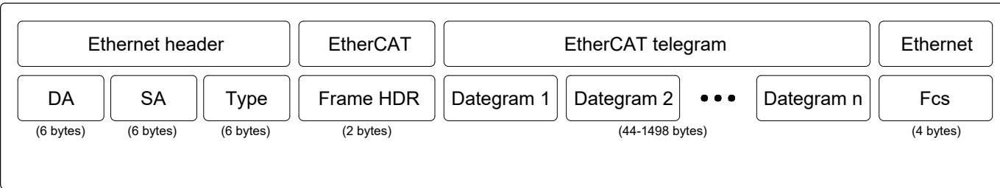

To ensure Ethernet IT communication between the nodes, TCP/IP connections can optionally be tunneled through a mailbox channel without impacting real-time data transfer. During startup, the master device configures and maps the process data on the slave devices. Diferent amounts of data can be exchanged with each slave, from one bit to a few bytes, or even up to kilobytes of data.

The EtherCAT frame contains one or more datagrams. The datagram header indicates what type of access the master device would like to execute:

## -Read, write, read-write

Access to a specific slave device through direct addressing, or access to multiple slave devices through logical addressing (implicit addressing)

## 2.3 CANopen over EtherCAT

With the CoE protocol, EtherCAT provides the same communication mechanisms as in CANopen®- Standard EN 50325-4: Object Dictionary, PDO Mapping (Process Data Objects) and SDO (Service Data Objects) – even the network management is similar. This makes it possible to implement EtherCAT with minimal efort in devices that were previously outfitted with CANopen®, and large portions of the CANopen® Firmware are even reusable. Optionally, the legacy 8-byte PDO limitation can be waived, and it's also possible to use the enhanced bandwidth of EtherCAT to support the upload of the entire Object Dictionary. The device profiles, such as the drive profile CiA 402, can also be reused for EtherCAT.

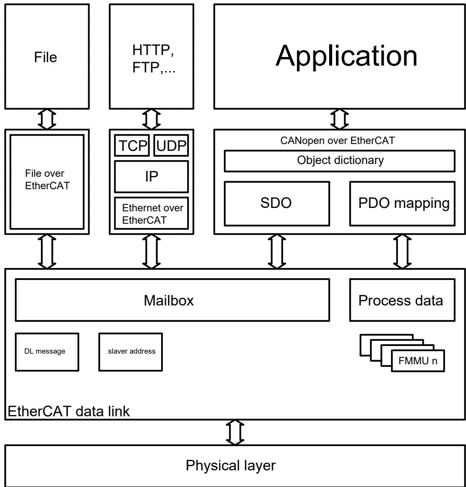

## 2.4 EtherCAT addressing

EtherCAT communication is that the master read and write the data from the internal flash of EtherCAT slave. There has two ways for addressing to controll the internal ESC register. EtherCAT addressing is as follow.

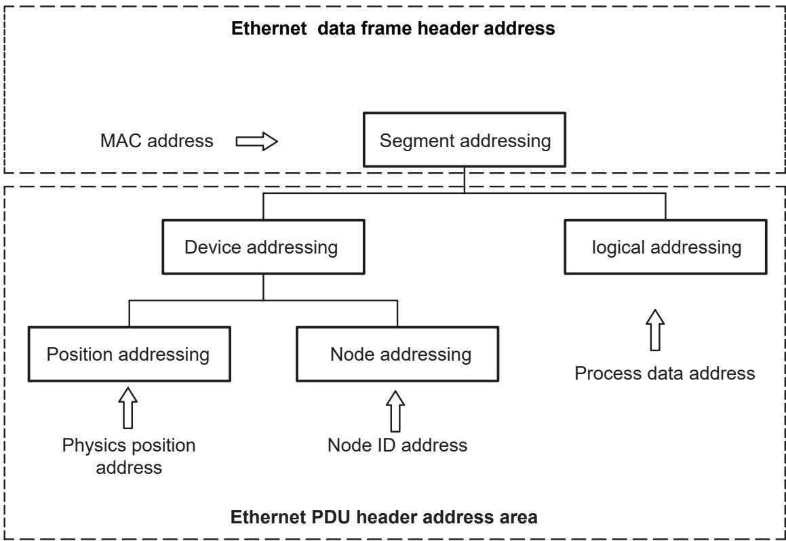

Hereby we describe about the Node addressing. Node addressing is that the salve adddress is nothing to do with the physics position of the topology.

There has two ways for addressing:

• -The master configurate the EtherCAT ID to the slave during the data link startup phase.

• - EtherCAT ID upload from EEPROM of slaver during the data link startup phase.

The EtherCAT ID of MOONS' drive is zero in default, it means the master should assign address to the drive for EhterCAT communication when first power up. If you assign ID to the EhterCAT alias address from the software or switch of the drive except zero, the master can upload the ID from EtherCAT alias address of EEPROM with the drive.

Assign EtherCAT ID by software in the picture below:

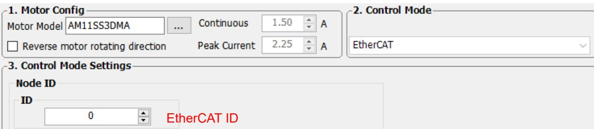

Plesase reference the hardware manual of drives for details about EtherCAT ID setting.

## 2.5 EtherCAT slaver information

For each EtherCAT Slave a device description, the so called EtherCAT Slave Information(ESI) has to be delivered. This is done in form of an XML file (eXtensible Markup Language). It descibes EtherCAT specific as well as application specific features of the slave.

The ESI file is used by an EtherCAT configuration tool to generate the EtherCAT Network Information (ENI).

There is always one unique ESI file for a device. Revision changes on the device's hardware and/or software may have to be reflected in the ESI of this device(usually by the revision Number).

The XML file can be found from our webside: https://www.moonsindustries.com/.

## 2.6 Distributed clock

Distributed clock can make all the EtherCAT slave synchronize with a same reference clock. The slave that supports the distributed clock is called the DC slave. MOONS' Stepper and StepSERVO drive have three methold for EtherCAT communication；

## -Free Run

-SM synchron

-DC synchron

## Free Run

With this mode, the data cycle time based on the local timer time. T1 and T2 is that the MPU copy the data from frame, then set output valid and caculate time.T3 is hardware delay.

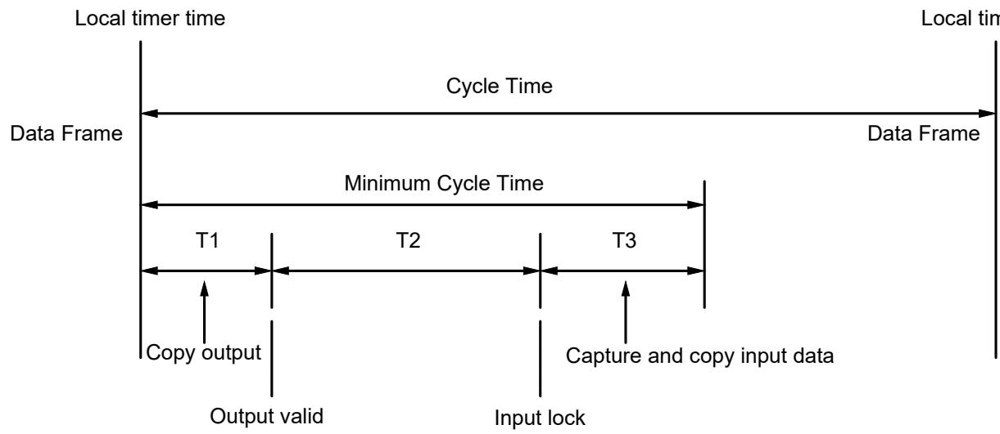

## SM synchron

Synchronized with data in/out event, the local timer is trigger by the data in/out event.

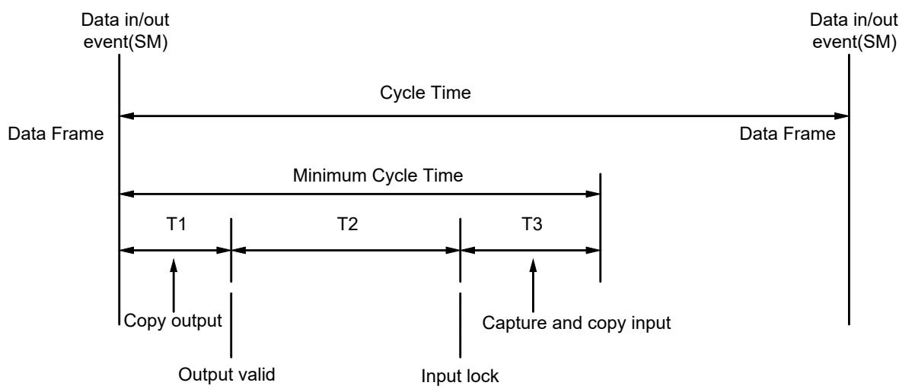

## DC synchron

Synchronized with SYNC event, the EtherCAT master should transmit the data frame before the SYNC trigger. Then the EtherCAT master should synchronzie with the same clock.

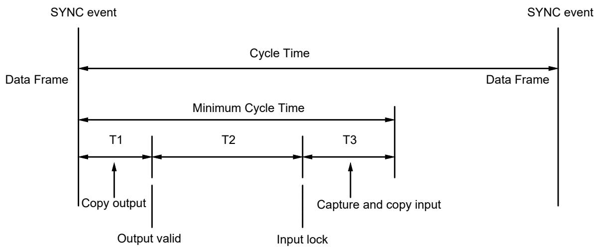

To improve synchronization performance of slave communication, the master can copy the output message of receiving process frame when the data frame out/in event is trigger.

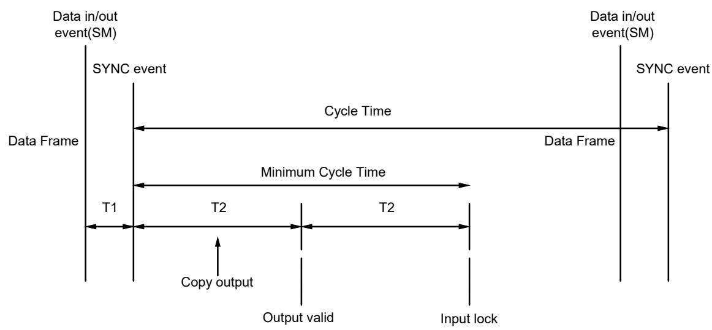

## 2.7 EtherCAT state machine(ESM)

ESM (EtherCAT state machine) is used to coordinate the master and slave when in start up or working . As shown below, It indicate the transition diagram of EtherCAT state.

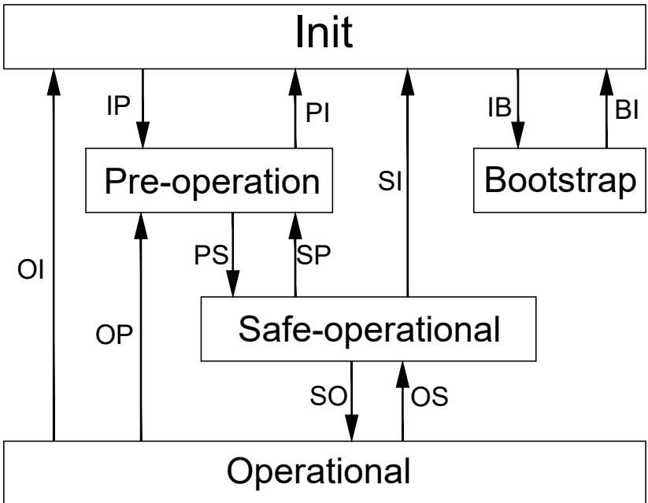

<table><tr><td>State transition</td><td>Description</td></tr><tr><td>IP</td><td>Start Mailbox Communication</td></tr><tr><td>PI</td><td>Stop mailbox communication</td></tr><tr><td>PS</td><td>Start input update</td></tr><tr><td>SP</td><td>Stop input update</td></tr><tr><td>SO</td><td>Start output update</td></tr><tr><td>OS</td><td>Stop output update</td></tr><tr><td>OP</td><td>Stop output update,stop input update</td></tr><tr><td>SI</td><td>Stop input update, stop mailbox communication</td></tr><tr><td>OI</td><td>Stop output update, stop input update, stop mailbox communication</td></tr><tr><td>IB</td><td>Start bootstrap mode</td></tr><tr><td>BI</td><td>Restart device</td></tr></table>

## 3 Motion control

## 3.1 Control the power drive system

MOONS' drive follows the CANopen protocol in EtherCAT communication(CANopen over EtherCAT) at application layer. So the PDS FSA control system is aslo suitable for EtherCAT application.

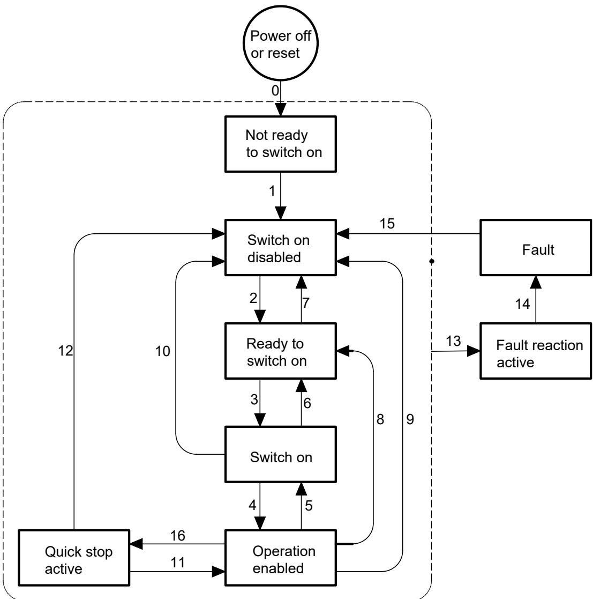

The state cording in FSA

<table><tr><td>Statusword(6041h)</td><td>PDS FSA state</td></tr><tr><td>xxxx xxxx x0xx 0000</td><td>Not ready to switch on</td></tr><tr><td>xxxx xxxx x1xx 0000</td><td>Switch on disabled</td></tr><tr><td>xxxx xxxx x01x 0001</td><td>Ready to switch on</td></tr><tr><td>xxxx xxxx x01x 0011</td><td>Switch on</td></tr><tr><td>xxxx xxxx x01x 0111</td><td>Operation enabled</td></tr><tr><td>xxxx xxxx x00x 0111</td><td>Quick stop active</td></tr><tr><td>xxxx xxxx x0xx 1111</td><td>Fault reaction active</td></tr><tr><td>xxxx xxxx x0xx 1000</td><td>Fault</td></tr></table>

<table><tr><td>Transition</td><td>Event(s)</td><td>Action(s)</td></tr><tr><td>0</td><td>Automatic transition after power-on or reset application</td><td>Drive device self-test and/or self initialization shall be performed.</td></tr><tr><td>1</td><td>Automatic transition</td><td>Communication shall be activated.</td></tr><tr><td>2</td><td>Shut down command from control device or local signal</td><td>None</td></tr><tr><td>3</td><td>Switch on command received from control device or local signal</td><td>The high-level power shall be switched on, if possible.</td></tr><tr><td>4</td><td>Enable operation command received from control device or local signal</td><td>The drive function shall be enabled and all internal set-points cleared.</td></tr><tr><td>5</td><td>Disable operation command received from control device or local signal</td><td>The drive function shall be disabled.</td></tr><tr><td>6</td><td>Shut down command received from control device or local signal</td><td>The high-level power shall be switched off, if possible.</td></tr><tr><td>7</td><td>Quick stop or disable voltage command from control device or local signal</td><td>None</td></tr><tr><td>8</td><td>Shut down command from control device or local signal</td><td>The drive function shall be disabled, and the high-level power shall be switched off, if possible.</td></tr><tr><td>9</td><td>Disable voltage command from control device or local signal</td><td>The drive function shall be disabled, and the high-level power shall be switched off, if possible.</td></tr><tr><td>10</td><td>Disable voltage or quick stop command from control device or local signal</td><td>The high-level power shall be switched off, if possible.</td></tr><tr><td>11</td><td>Quick stop command from control device or local signal</td><td>The quick stop function shall be started.</td></tr><tr><td>12</td><td>Automatic transition when the quick stop function is completed and quick stop option code is 1, 2, 3 or 4, or disable voltage command received from control device (depends on the quick stop option code)</td><td>The drive function shall be disabled, and the high-level power shall be switched off, if possible.</td></tr><tr><td>13</td><td>Fault signal</td><td>The configured fault reaction function shall be executed.</td></tr><tr><td>14</td><td>Automatic transition</td><td>The drive function shall be disabled; the high-level power shall be switched off, if possible.</td></tr><tr><td>15</td><td>Fault reset command from control device or local signal</td><td>A reset of the fault condition is carried out, if no fault exists currently on the drive device; after leaving the fault state, the fault reset bit in the controlword shall be cleared by the control device.</td></tr><tr><td>16</td><td>Enable operation command from control device, if the quick stop option code is 5, 6, 7, or 8</td><td>The drive function shall be enabled.</td></tr></table>

The command codes with object at 6040h.

<table><tr><td rowspan="2">Command</td><td colspan="5">Bits of the controlword</td><td rowspan="2">Transitions</td></tr><tr><td>Bit7</td><td>Bit3</td><td>Bit2</td><td>Bit1</td><td>Bit0</td></tr><tr><td>Shutdown</td><td>0</td><td>x</td><td>1</td><td>1</td><td>0</td><td>2,6,8</td></tr><tr><td>Switch on</td><td>0</td><td>0</td><td>1</td><td>1</td><td>1</td><td>3</td></tr><tr><td>Switch on + Enable operation</td><td>0</td><td>1</td><td>1</td><td>1</td><td>1</td><td>3+4</td></tr><tr><td>Quick stop</td><td>0</td><td>x</td><td>x</td><td>0</td><td>x</td><td>7,9,10,12</td></tr><tr><td>Disable operation</td><td>0</td><td>0</td><td>1</td><td>1</td><td>1</td><td>5</td></tr><tr><td>Enable operation</td><td>0</td><td>1</td><td>1</td><td>1</td><td>1</td><td>4,16</td></tr><tr><td>Fault reset</td><td>↑</td><td>x</td><td>x</td><td>x</td><td>x</td><td>15</td></tr></table>

## 3.2 Mode of operation

The following operation modes for MOONS' Stepper and StepSERVO are recommended:

<table><tr><td>Mode of operation</td><td>Code(6060)</td></tr><tr><td>Profile position mode</td><td>1</td></tr><tr><td>Profile velocity mode</td><td>3</td></tr><tr><td>Profile Torque mode</td><td>4</td></tr><tr><td>Homing mode</td><td>6</td></tr><tr><td>Cynclic synchronous position mode</td><td>8</td></tr><tr><td>Cynclic synchronous velocity mode</td><td>9</td></tr><tr><td>Q mode(manufacturer specific mode)</td><td>-1</td></tr></table>

0x6060h object is the register for change control mode. when the mode of operation has been change, the object 0x6061 will be update too.

## 3.3 Profile position mode

## 3.3.1 General information

Profile position mode is a point to point operating mode using set points which consist of velocity, acceleration, deceleration, and target position. Once all these parameters have been set, the drive bufers the commands and begins executing the set point. When using a set of set points method, a new set point can be sent to the drive while a previously sent set point is still executing.

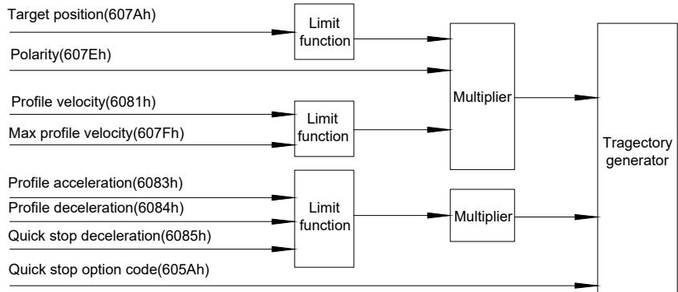

## 3.3.2 Main controlling object

<table><tr><td>Index</td><td>Name</td><td>Type</td><td>Access</td><td>Mapping</td></tr><tr><td>0x6040</td><td>Controlword</td><td>UINT16</td><td>WO</td><td>YES</td></tr><tr><td>0x6041</td><td>Statusword</td><td>UINT16</td><td>RO</td><td>YES</td></tr><tr><td>0x6060</td><td>Modes of operation</td><td>INT8</td><td>WO</td><td>YES</td></tr><tr><td>0x6061</td><td>Modes of operation display</td><td>INT8</td><td>RO</td><td>YES</td></tr><tr><td>0x607A</td><td>Target position</td><td>INT32</td><td>RW</td><td>YES</td></tr><tr><td>0x6081</td><td>Profile velocity</td><td>UINT32</td><td>RW</td><td>YES</td></tr><tr><td>0x6083</td><td>Profile acceleration</td><td>UINT32</td><td>RW</td><td>YES</td></tr><tr><td>0x6084</td><td>Profile deceleration</td><td>UINT32</td><td>RW</td><td>YES</td></tr><tr><td>0x6085</td><td>Quick stop deceleration</td><td>UINT32</td><td>RW</td><td>YES</td></tr><tr><td>0x605A</td><td>Quick stop code</td><td>INT16</td><td>RW</td><td>NO</td></tr></table>

Controlword of profile position mode (6040h)

<table><tr><td>15</td><td>10</td><td>9</td><td>8</td><td>7</td><td>6</td><td>5</td><td>4</td><td>3</td><td>0</td></tr><tr><td colspan="2">***</td><td>Change on set point</td><td>Halt</td><td>***</td><td>Abs/Rel</td><td>Change set immediately</td><td>New set point</td><td colspan="2">***</td></tr></table>

\*\*\*: See object description

<table><tr><td>Bit</td><td>Name</td><td>Value</td><td>Description</td></tr><tr><td rowspan="2">4</td><td rowspan="2">New set point</td><td>0</td><td rowspan="2">Toggle this bit from 0-&gt;1 to clock in a new set point</td></tr><tr><td>1</td></tr><tr><td rowspan="2">5</td><td rowspan="2">Change set point immediately</td><td>0</td><td>Positioning shall be completed before the next one gets started</td></tr><tr><td>1</td><td>Next positioning shall be started immediately</td></tr><tr><td rowspan="2">6</td><td rowspan="2">Abs/Rel</td><td>0</td><td>Target position shall be an absolute value</td></tr><tr><td>1</td><td>Target position shall be an relative value</td></tr><tr><td rowspan="2">8</td><td rowspan="2">Halt</td><td>0</td><td>positioning shall be executed or continued</td></tr><tr><td>1</td><td>Axis shall be stopped</td></tr><tr><td rowspan="2">9</td><td rowspan="2">Change of set point</td><td>0</td><td>The previous set-point will be completed and the motor will come to rest before a new set point is processed</td></tr><tr><td>1</td><td>The motor will continue at the speed commanded by the previous set point until it has reached the position commanded by the previous set point, then transition to the speed of the new set point</td></tr></table>

Statusword of profile position mode (6041h).

<table><tr><td>15</td><td>14</td><td>13</td><td>12</td><td>11</td><td>10</td><td>9</td><td>0</td></tr><tr><td colspan="2">****</td><td>Following error</td><td>Set point acknowledge</td><td>****</td><td>Target reached</td><td colspan="2">****</td></tr></table>

\*\*\*: See object description

<table><tr><td>Bit</td><td>Name</td><td>Value</td><td>Description</td></tr><tr><td rowspan="4">10</td><td rowspan="4">Target reached</td><td rowspan="2">0</td><td>Halt (bit 8 in controlword) = 0: Target position not reached</td></tr><tr><td>Halt (bit 8 in controlword) = 1: Axis decelerates</td></tr><tr><td rowspan="2">1</td><td>Halt (bit 8 in controlword) = 0: Target position reached</td></tr><tr><td>Halt (bit 8 in controlword) = 1: Velocity of axis is 0</td></tr><tr><td rowspan="2">12</td><td rowspan="2">Set point ACK</td><td>0</td><td>Previous set-point already processed, waiting for new set-point</td></tr><tr><td>1</td><td>Previous set-point still in process, set-point overwriting shall be accepted</td></tr><tr><td rowspan="2">13</td><td rowspan="2">Following error</td><td>0</td><td>No following error</td></tr><tr><td>1</td><td>Following error</td></tr></table>

## 3.3.3 Functional description

## General

The setting of set-points is controlled by the timing of the new set-point bit and the change set immediately bit in the controlword as well as the set-point acknowledge bit in the statusword.

If the change set immediately bit of the controlword is set to 1, a single set-point is expected by the drive device. If the change set immediately bit of the controlword is set to 0, a set of set-points is expected by the drive device.

## Set point

After a set-point is applied to the drive device, the control device signals that the set-point is valid by a rising edge of the new set-point bit in the controlword. The drive device sets the set-point acknowledge bit in the statusword to 1, and afterwards, the drive device signals with the set-point acknowledge bit set to 0 its ability to accept new set-points.

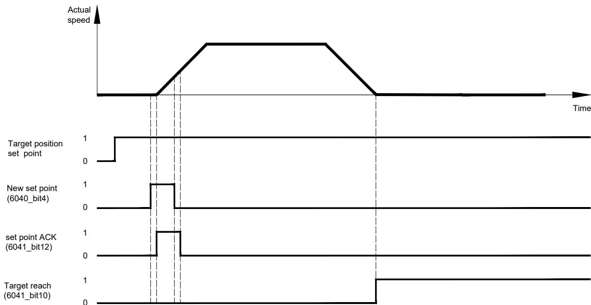

The data of controlling object:

<table><tr><td colspan="2">Event</td><td>Set parameter</td></tr><tr><td rowspan="3">Enable motor power</td><td>Shut down</td><td>0x6040=6(06h)</td></tr><tr><td>Switch on</td><td>0x6040=7(07h)</td></tr><tr><td>Switch on + enable operation</td><td>0x6040=15(0Fh)</td></tr><tr><td>Set mode of operation</td><td>Profile position mode</td><td>0x6060=1(01h)</td></tr><tr><td rowspan="4">Set motion parameters</td><td>Distance</td><td>0x607A=100000(0186A0h)</td></tr><tr><td>Velocity</td><td>0x6081=20000(4E20h)</td></tr><tr><td>Acceleration</td><td>0x6083=50000(C350h)</td></tr><tr><td>Deceleration</td><td>0x6084=50000(C350h)</td></tr><tr><td rowspan="2">Set point absolute</td><td>New set point</td><td>0x6040=31(1Fh)</td></tr><tr><td>Clear new set point</td><td>0x6040=15(0Fh)</td></tr><tr><td rowspan="2">Set point relative</td><td>New set point</td><td>0x6040=95(5Fh)</td></tr><tr><td>Clear new set point</td><td>0x6040=79(4Fh)</td></tr></table>

If one set-point is still in progress and a new one is validated, two methods of handling are supported: single set-point (change set immediately bit of controlword is 1) and set of set points (change set immediately bit of controlword is 0).

## Single set-point

When a set-point is in progress and a new set-point is validated by the new set-point (bit 4) in the controlword, the new set-point shall be processed immediately.

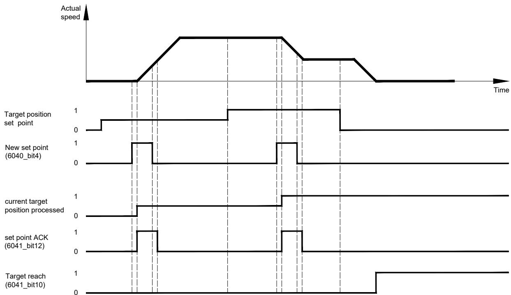

The data of controlling object:

<table><tr><td colspan="2">Event</td><td>Set parameter</td></tr><tr><td rowspan="3">Enable motor power</td><td>Shut down</td><td>0x6040=6(06h)</td></tr><tr><td>Switch on</td><td>0x6040=7(07h)</td></tr><tr><td>Switch on + enable operation</td><td>0x6040=15(0Fh)</td></tr><tr><td>Set mode of operation</td><td>Profile position mode</td><td>0x6060=1(01h)</td></tr><tr><td rowspan="2">Set motion parameters</td><td>Acceleration</td><td>0x6083=50000(C350h)</td></tr><tr><td>Deceleration</td><td>0x6084=50000(C350h)</td></tr><tr><td rowspan="8">Single set point</td><td>First part of velocity</td><td>0x6081=30000(7530h)</td></tr><tr><td>First part of distance</td><td>0x607A=200000(030D40h)</td></tr><tr><td>New set point</td><td>0x6040=639(27Fh)</td></tr><tr><td>Clear new set point</td><td>0x6040=623(26Fh)</td></tr><tr><td>Second part of velocity</td><td>0x6081=20000(4E20h)</td></tr><tr><td>Second part of distance</td><td>0x607A=100000(0186A0h)</td></tr><tr><td>New set point</td><td>0x6040=639(27Fh)</td></tr><tr><td>Clear new set point</td><td>0x6040=623(26Fh)</td></tr></table>

Set of set-points

When a set-point is in progress and a new set-point is validated by the new set-point (bit 4) in the controlword, the new set-point shall be processed only after the previous has been reached.

change on set-point

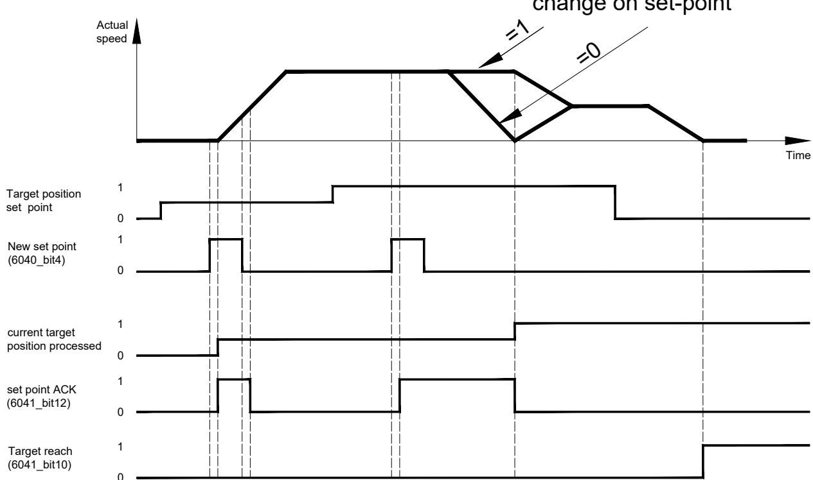

The data of controlling object:

<table><tr><td>Event</td><td>Set parameter</td><td>Set parameter</td></tr><tr><td rowspan="3">Enable motor power</td><td>Shut down</td><td>0x6040=6(06h)</td></tr><tr><td>Switch on</td><td>0x6040=7(07h)</td></tr><tr><td>Switch on + enable operation</td><td>0x6040=15(0Fh)</td></tr><tr><td>Set mode of operation</td><td>Profile position mode</td><td>0x6060=1(01h)</td></tr><tr><td rowspan="2">Set motion parameters</td><td>Acceleration</td><td>0x6083=50000(C350h)</td></tr><tr><td>Deceleration</td><td>0x6084=50000(C350h))</td></tr><tr><td rowspan="8">Set of set-points with change on set-point=0</td><td>First part of velocity</td><td>0x6081=30000(7530h)</td></tr><tr><td>First part of distance</td><td>0x607A=400000(061A80h)</td></tr><tr><td>New set point</td><td>0x6040=95(5Fh)</td></tr><tr><td>Clear new set point</td><td>0x6040=79(4Fh)</td></tr><tr><td>Second part of velocity</td><td>0x6081=20000(4E20h)</td></tr><tr><td>Second part of distance</td><td>0x607A=300000(7530h)</td></tr><tr><td>New set point</td><td>0x6040=95(5Fh)</td></tr><tr><td>Clear new set point</td><td>0x6040=79(4Fh)</td></tr><tr><td rowspan="8">Set of set-points with change on set-point=1</td><td>First part of velocity</td><td>0x6081=30000(7530h)</td></tr><tr><td>First part of distance</td><td>0x607A=400000(061A80h)</td></tr><tr><td>New set point</td><td>0x6040=607(25Fh)</td></tr><tr><td>Clear new set point</td><td>0x6040=591(24Fh)</td></tr><tr><td>Second part of velocity</td><td>0x6081=20000(4E20h)</td></tr><tr><td>Second part of distance</td><td>0x607A=300000(0493E0h)</td></tr><tr><td>New set point</td><td>0x6040=607(25Fh)</td></tr><tr><td>Clear new set point</td><td>0x6040=591(24Fh)</td></tr></table>

NOTE: MOONS' EtherCAT drive can be set up with two set-points, if the bit 12 of statusword is 1, then the bufer is full and another set-point will be ignored.

Stop the motor with halt (0x6040\_bit8)

If a drive is processing a set-point, the halt bit (bit 8 of the controlword) can be used to stop the motor and keep it in position control. After releasing the halt bit the processing of the actual set-point is continued.

## 3.4 Profile velocity mode

## 3.4.1 General information

Profile Velocity Mode is a relatively simple operating mode. Once the velocity, acceleration, and deceleration are set, the drive will either command the motor to accelerate to the running velocity according to the acceleration parameter, or to halt movement according to the deceleration parameter.

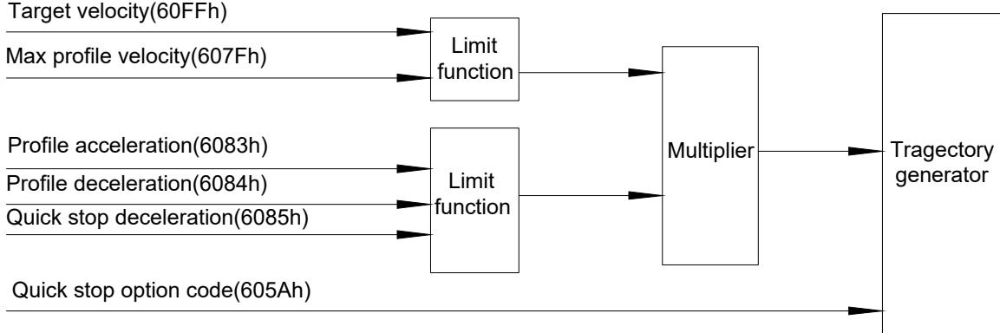

## 3.4.2 Main controlling object

<table><tr><td>Index</td><td>Name</td><td>Type</td><td>Access</td><td>Mapping</td></tr><tr><td>0x6040</td><td>Controlword</td><td>UINT16</td><td>WO</td><td>YES</td></tr><tr><td>0x6041</td><td>Statusword</td><td>UINT16</td><td>RO</td><td>YES</td></tr><tr><td>0x6060</td><td>Modes of operation</td><td>INT8</td><td>WO</td><td>YES</td></tr><tr><td>0x6061</td><td>Modes of operation display</td><td>INT8</td><td>RO</td><td>YES</td></tr><tr><td>0x60FF</td><td>Target velocity</td><td>UINT32</td><td>RW</td><td>YES</td></tr><tr><td>0x6083</td><td>Profile acceleration</td><td>UINT32</td><td>RW</td><td>YES</td></tr><tr><td>0x6084</td><td>Profile deceleration</td><td>UINT32</td><td>RW</td><td>YES</td></tr></table>

Controlword of profile velocity mode

<table><tr><td>15</td><td>9</td><td>8</td><td>7</td><td>6</td><td>5</td><td>4</td><td>3</td><td>0</td></tr><tr><td colspan="2">***</td><td>Halt</td><td colspan="2">****</td><td colspan="2">***</td><td colspan="2">***</td></tr></table>

\*\*\*: See object description

<table><tr><td>Bit</td><td>Name</td><td>Value</td><td>Description</td></tr><tr><td rowspan="2">8</td><td rowspan="2">Halt</td><td>0</td><td>The motion shall be executed or continued</td></tr><tr><td>1</td><td>Axis shall be stopped according to the halt option code (0x605D)</td></tr></table>

Statusword of profile velocity mode

<table><tr><td>15</td><td>14</td><td>13</td><td>12</td><td>11</td><td>10</td><td>9</td><td>0</td></tr><tr><td colspan="2">***</td><td>Max slippage error</td><td>Speed</td><td>***</td><td>Target reached</td><td colspan="2">***</td></tr></table>

\*\*\*: See object description

<table><tr><td>Bit</td><td>Name</td><td>Value</td><td>Description</td></tr><tr><td rowspan="2">10</td><td rowspan="2">Target reached</td><td>0</td><td>Halt (bit 8 in controlword) = 0: Target not reachedHalt (bit 8 in controlword) = 1: Axis decelerates</td></tr><tr><td>1</td><td>Halt (bit 8 in controlword) = 0: Target reachedHalt (bit 8 in controlword) = 1: Velocity of axis is 0</td></tr><tr><td rowspan="2">12</td><td rowspan="2">Speed</td><td>0</td><td>Speed is not equal 0</td></tr><tr><td>1</td><td>Speed is equal 0</td></tr><tr><td rowspan="2">13</td><td rowspan="2">Max slippage error</td><td>0</td><td>Maximum slippage not reached</td></tr><tr><td>1</td><td>Maximum slippage reached</td></tr></table>

## 3.4.3 Functional description

Profile velocity mode is according to the specified velocity, acceleration and deceleration value for moving. And to stopped with halt (6040\_bit8) control.

1. Target velocity (60FFh)

2. Profile acceleration (6083h)

3. Profile deceleration (6084h)

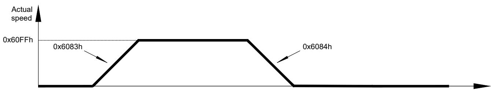

<table><tr><td colspan="2">Event</td><td>Set parameter</td></tr><tr><td rowspan="3">Enable motor power</td><td>Shut down</td><td>0x6040=6(06h)</td></tr><tr><td>Switch on</td><td>0x6040=7(07h)</td></tr><tr><td>Switch on + enable operation +halt</td><td>0x6040=271(010Fh)</td></tr><tr><td>Set mode of operation</td><td>Profile velocity mode</td><td>0x6060=3(3h)</td></tr><tr><td rowspan="3">Set motion parameter</td><td>Target velocity</td><td>0x60FF=20000(4E20h)</td></tr><tr><td>Acceleration</td><td>0x6083=50000(C350h)</td></tr><tr><td>Deceleration</td><td>0x6084=50000(C350h)</td></tr><tr><td rowspan="2">Velocity mode</td><td>Start</td><td>0x6040=15(Fh)</td></tr><tr><td>Stop</td><td>0x6040=271(010Fh)</td></tr></table>

## 3.5 Profile torque mode (StepSERVO only)

## 3.5.1 General information

Profile Torque mode is a servo-control torque operating mode. It requires knowledge of the Torque Constant of the motor in mN/A. This information can be found in the motor print.

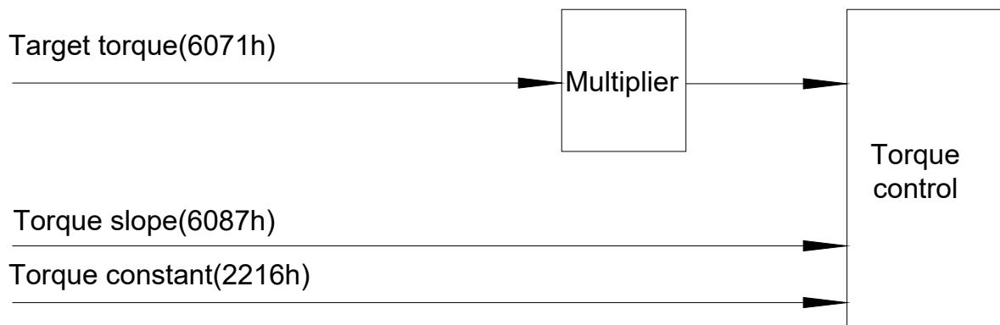

## 3.5.2 Main controlling object

<table><tr><td>Index</td><td>Name</td><td>Type</td><td>Access</td><td>Mapping</td></tr><tr><td>0x6040</td><td>Controlword</td><td>UINT16</td><td>WO</td><td>YES</td></tr><tr><td>0x6041</td><td>Statusword</td><td>UINT16</td><td>RO</td><td>YES</td></tr><tr><td>0x6071</td><td>Target torque</td><td>INT16</td><td>RW</td><td>NO</td></tr><tr><td>0x6087</td><td>Torque slope</td><td>INT8</td><td>WO</td><td>YES</td></tr><tr><td>0x2216</td><td>Torque constant</td><td>INT8</td><td>RO</td><td>YES</td></tr></table>

Controlword of profile torque mode

<table><tr><td>15</td><td>9</td><td>8</td><td>7</td><td>0</td></tr><tr><td>***</td><td colspan="2">Halt</td><td>****</td><td>***</td></tr></table>

\*\*\*: See object description

<table><tr><td>Bit</td><td>Name</td><td>Value</td><td>Description</td></tr><tr><td rowspan="2">8</td><td rowspan="2">Halt</td><td>0</td><td>The motion shall be executed or continued</td></tr><tr><td>1</td><td>Axis shall be stopped according to the halt option code (0x605D)</td></tr></table>

## Statusword of profile torque mode

<table><tr><td>15</td><td>14</td><td>13</td><td>12</td><td>11</td><td>10</td><td>9</td><td>0</td></tr><tr><td colspan="2">***</td><td colspan="2">Reserved</td><td>***</td><td>Target reached</td><td colspan="2">***</td></tr></table>

\*\*\*: See object description

<table><tr><td>Bit</td><td>Name</td><td>Value</td><td>Description</td></tr><tr><td rowspan="4">10</td><td rowspan="4">Target reached</td><td rowspan="2">0</td><td>Halt (bit 8 in controlword) = 0: Target not reached</td></tr><tr><td>Halt (bit 8 in controlword) = 1: Axis decelerates</td></tr><tr><td rowspan="2">1</td><td>Halt (bit 8 in controlword) = 0: Target reached</td></tr><tr><td>Halt (bit 8 in controlword) = 1: Velocity of axis is 0</td></tr></table>

## 3.5.3 Functional description

To operate in profile torque mode, the following parameters must be set:

<table><tr><td>Index</td><td>Name</td><td>Description</td></tr><tr><td>0x2216</td><td>Torque constants</td><td>Motor parameter, found on the motor print</td></tr><tr><td>0x6071</td><td>Target torque</td><td>Torque to be applied to the motor</td></tr><tr><td>0x6087</td><td>Torque slope</td><td>Rate at which to ramp torque to new target</td></tr></table>

## Parameter calculations – example

An application requires a torque of 0.353 Nm, and torque slope of 0.177 Nm/sec. we found the torque constants is 0.07Nm/A. then we write the value to the object:

<table><tr><td>Index</td><td>value</td><td>Units</td></tr><tr><td>0x2216</td><td>70</td><td>m•Nm/A</td></tr><tr><td>0x6071</td><td>353</td><td>m•Nm</td></tr><tr><td>0x6087</td><td>177</td><td>m•Nm/sec</td></tr></table>

## Current verification – example

It is important to check that the current required of the drive is within the limits of the servo amplifier. The drive being used, for example, has a continuous rating of 7 amps, and a peak current of 14 amps, which may be held continuously for 2 seconds. This means that a current of 7 amps can be held indefinitely, and currents between 7 and 14 amps may be used in short bursts.

Using the target torque and torque constant from the example above the current draw can be checked, as shown:

## 0.353Nm/(0.07 Nm/A) = 5.044A

The resultant current, 5.044A, is below the 7A continuous current rating of the drive, and well below the peak current rating of 14A. It is possible for the drive to maintain a current of 7A indefinitely, and peak up to 14A for up to two seconds continuously. Values between 7A and 14A may be held proportionally long.

<table><tr><td colspan="2">Event</td><td>Set parameter</td></tr><tr><td rowspan="3">Enable motor power</td><td>Shut down</td><td>0x6040=6(06h)</td></tr><tr><td>Switch on</td><td>0x6040=7(07h)</td></tr><tr><td>Switch on + enable operation +halt</td><td>0x6040=271(010Fh)</td></tr><tr><td>Set mode of operation</td><td>Profile velocity mode</td><td>0x6060=4(04h)</td></tr><tr><td rowspan="3">Set motion parameter</td><td>Target torque</td><td>0x6071=20(14h)</td></tr><tr><td>Torque slope</td><td>0x6087=500(01F4h)</td></tr><tr><td>Torque constant</td><td>0x2216=100(64h)</td></tr><tr><td rowspan="2">Profile torque mode</td><td>Start</td><td>0x6040=15(0Fh)</td></tr><tr><td>Stop</td><td>0x6040=271(10Fh)</td></tr></table>

## 3.6 Homing mode

## 3.6.1 General information

This clause describes the method by which a drive seeks the home position (also called, the datum, reference point or zero point). There are various methods of achieving this using limit. switches at the ends of travel or a home switch (zero point switch) in mid-travel, most of the methods also use the index (zero) pulse train from an incremental encoder.

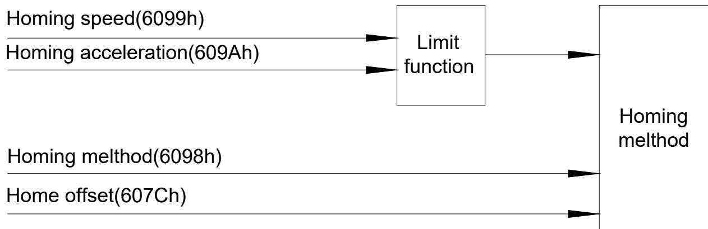

## 3.6.2 Main controlling object

<table><tr><td>Index</td><td>Name</td><td>Type</td><td>Access</td><td>Mapping</td></tr><tr><td>0x6040</td><td>Controlword</td><td>UINT16</td><td>WO</td><td>YES</td></tr><tr><td>0x6041</td><td>Statusword</td><td>UINT16</td><td>RO</td><td>YES</td></tr><tr><td>0x6060</td><td>Mode of operation</td><td>INT8</td><td>WO</td><td>YES</td></tr><tr><td>0x6098</td><td>Home method</td><td>INT8</td><td>RW</td><td>NO</td></tr><tr><td>0x6099</td><td>Homing speed</td><td>-</td><td>-</td><td>-</td></tr><tr><td>0x609A</td><td>Homing acceleration</td><td>INT32</td><td>RW</td><td>YES</td></tr><tr><td>0x2001</td><td>Home switch</td><td>INT8</td><td>RW</td><td>YES</td></tr><tr><td>0x607C</td><td>Homing offset</td><td>INT32</td><td>RW</td><td>YES</td></tr></table>

Controlword of homing mode

<table><tr><td>15</td><td>9</td><td>8</td><td>7</td><td>6</td><td>5</td><td>4</td><td>3</td><td>0</td></tr><tr><td colspan="2">***</td><td>Halt</td><td colspan="2">****</td><td>Reserved(0)</td><td colspan="2">Homing operation start</td><td>***</td></tr></table>

: See object description

<table><tr><td>Bit</td><td>Name</td><td>Value</td><td>Description</td></tr><tr><td rowspan="2">4</td><td rowspan="2">Homing operation start</td><td>0</td><td>Do not start homing procedure</td></tr><tr><td>1</td><td>Start or continue homing procedure</td></tr><tr><td rowspan="2">8</td><td rowspan="2">Halt</td><td>0</td><td>Enable bit4</td></tr><tr><td>1</td><td>Stop axis according to halt option code (0x605D)</td></tr></table>

## Statusword of homing mode

<table><tr><td>15</td><td>14</td><td>13</td><td>12</td><td>11</td><td>10</td><td>9</td><td>0</td></tr><tr><td colspan="2">***</td><td>Homing error</td><td>Homing attained</td><td>****</td><td>Target reached</td><td colspan="2">***</td></tr></table>

## \*\*: See object description

<table><tr><td>Bit13</td><td>Bit12</td><td>Bit10</td><td>definition</td></tr><tr><td>0</td><td>0</td><td>0</td><td>Homing procedure is in progress</td></tr><tr><td>0</td><td>0</td><td>1</td><td>Homing procedure is interrupted or not started</td></tr><tr><td>0</td><td>1</td><td>0</td><td>Homing is attained, but target is not reached</td></tr><tr><td>0</td><td>1</td><td>1</td><td>Homing is procedure is completed successfully</td></tr><tr><td>1</td><td>0</td><td>0</td><td>Homing error occurred, velocity is not 0</td></tr><tr><td>1</td><td>0</td><td>1</td><td>Homing error occurred, velocity is 0</td></tr><tr><td>1</td><td>1</td><td>X</td><td>Reserved</td></tr></table>

## 3.6.3 Functional description

The homing modes are working on logical values of the limit and homing switches (object 60FDh). The data of controlling object:

<table><tr><td colspan="2">Event</td><td>Set parameter</td></tr><tr><td rowspan="3">Enable motor power</td><td>Shut down</td><td>0x6040=06(06h)</td></tr><tr><td>Switch on</td><td>0x6040=07(07h)</td></tr><tr><td>Switch on+ enable operation</td><td>0x6040=15(0Fh)</td></tr><tr><td>Set mode of operation</td><td>Homing mode</td><td>0x6060=06(06h)</td></tr><tr><td>Set home method</td><td>Home method=13</td><td>0x6098=13(0Dh)</td></tr><tr><td rowspan="5">Set motion parameters</td><td>Homing acceleration</td><td>0x609A=200000(030D40h)</td></tr><tr><td>Velocity for switch</td><td>0x6099_sub1=20000(4E20h)</td></tr><tr><td>Velocity for index</td><td>0x6099_sub2=2000(07D0h)</td></tr><tr><td>Homing offset</td><td>0x607C=100000(0186A0h)</td></tr><tr><td>Homing switch</td><td>0x2001=5(05h)</td></tr><tr><td rowspan="2">Homing mode</td><td>Homing start</td><td>0x6040=31(1Fh)</td></tr><tr><td>Homing stop</td><td>0x6040=287(011Fh)</td></tr></table>

## 3.6.4 Method 1 and 2

The initial direction of movement shall be leftward (method 1) or rightward (method 2) if the limit switch is inactive. The position of home shall be at the first index pulse to the limit switch becomes inactive.

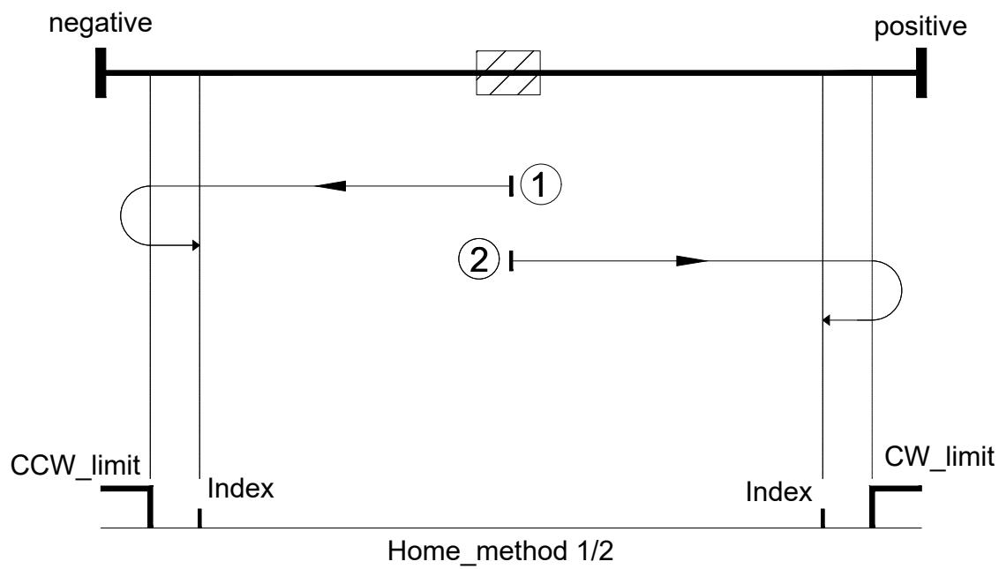

## 3.6.5 Method 3 and 4

The initial direction of movement shall be dependent on the state of the home switch. The home position shall be at the index pulse to either to the left or the right of the point where the home switch changes state. If the initial position is situated so that the direction of movement shall reverse during homing, the point at which the reversal takes place is anywhere after a change of state of the home switch.

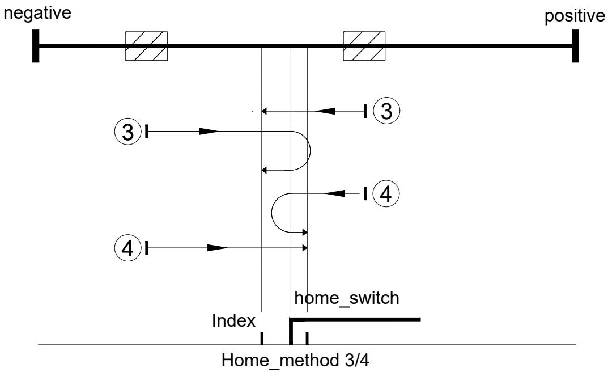

## 3.6.6 Method 5 and 6

The initial direction of movement shall be dependent on the state of the home switch. The home position shall be at the index pulse to either to the left or the right of the point where the home switch changes state. If the initial position is situated so that the direction of movement shall reverse during homing, the point at which the reversal takes place is anywhere after a change of state of the home switch.

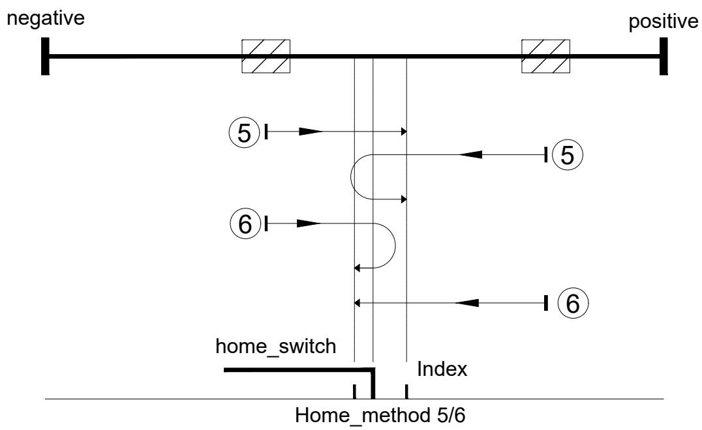

## 3.6.7 Method 7 and 8

The initial direction of movement shall be rightward if the positive limit switch is inactive. With the method 7, the home position shall be at the first index pulse to the left side of the home switch which the changes status is on falling edge. The home position shall be at the first index pulse to the left side of home switch which the changes status is on rising edge that moved from negative to positive on method 8 .

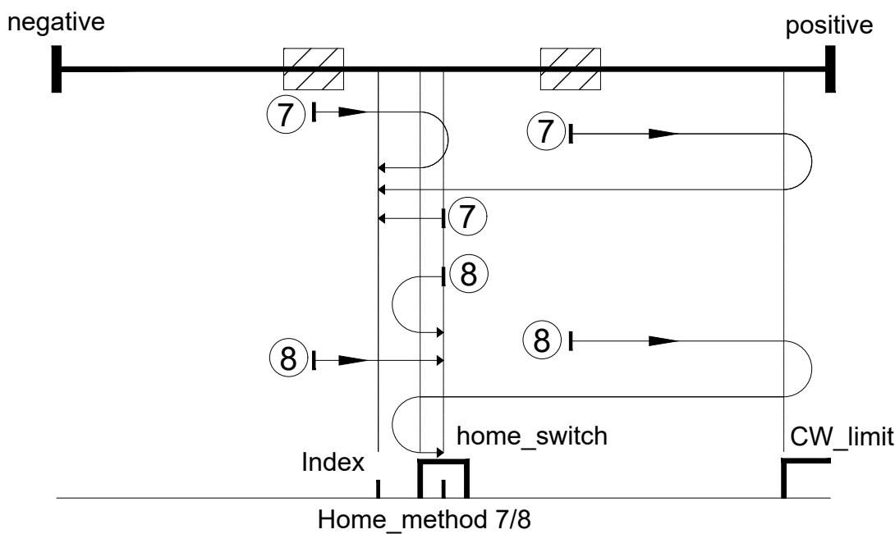

## 3.6.8 Method 9 and 10

The initial direction of movement shall be rightward if the positive limit switch is inactive. With the method 9, the home position shall be at the first index pulse to the right side of the home switch which the changes status is on rising edge that moved from positive to negative. The home position shall be at the first index pulse to the right side of home switch which the changes status is on falling edge with method 10.

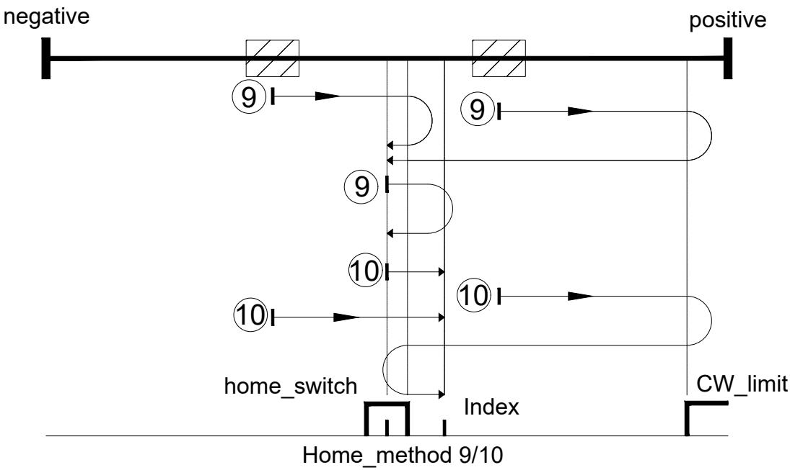

## 3.6.9 Method 11 and 12

The initial direction of movement shall be leftward if the negative limit switch is inactive. With the method 11, the home position shall be at the first index pulse to the right side of the home switch which the changes status is on falling edge. The home position shall be at the first index pulse on the right side of home switch which the changes status is on rising edge with method 12.

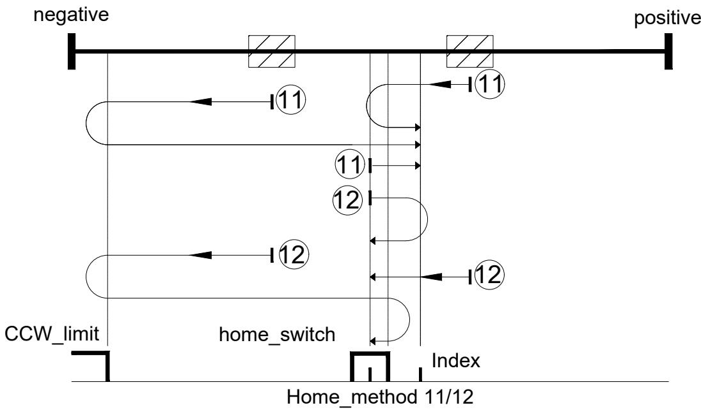

## 3.6.10 Method 13 and 14

The initial direction of movement shall be leftward if the negative limit switch is inactive. With the method 13, the home position shall be at the first index pulse to the left side of the home switch which the changes status is on falling edge. The home position shall be at the first index pulse to the left side of home switch which the changes status is on rising edge that moved from negative to positive on method 14.

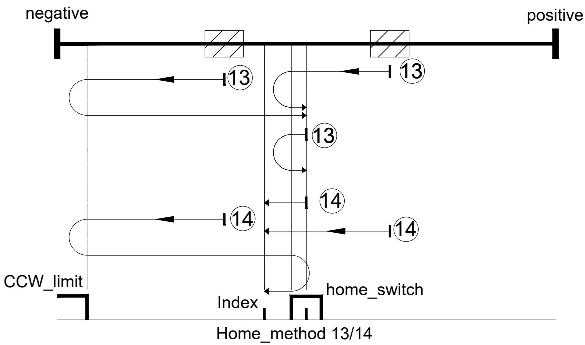

## 3.6.11 Method 17 and 18

The method17 and 18 are similar to methods 1 and 2 except that the home position is not dependent on the index pulse but only dependent on the relevant home or limit switch transitions.

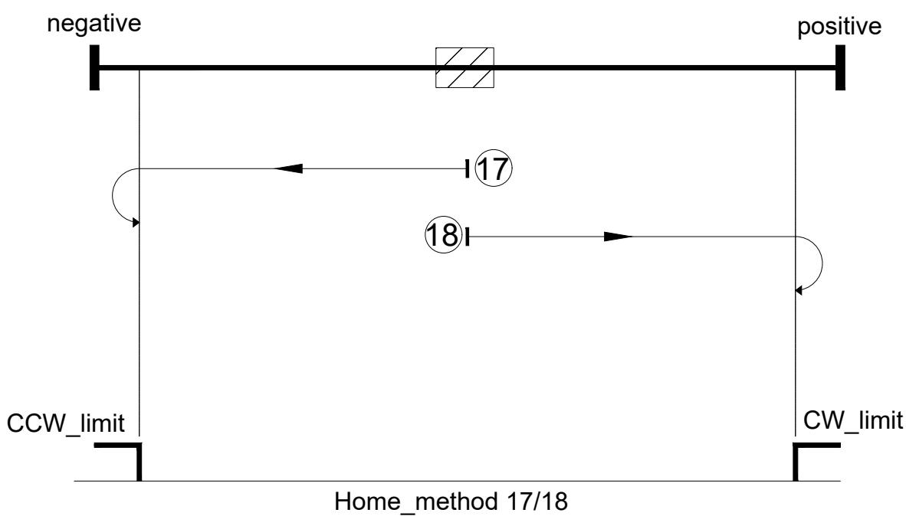

## 3.6.12 Method 19 and 20

The method 19 and 20 are similar to methods 3 and 4 except that the home position is not dependent on the index pulse but only dependent on the relevant home or limit switch transitions.

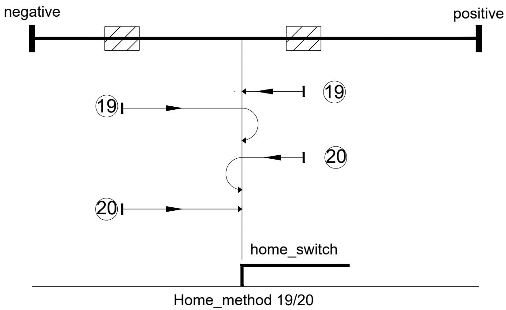

## 3.6.13 Method 21 and 22

The method 21 and 22 are similar to methods 5 and 6 except that the home position is not dependent on the index pulse but only dependent on the relevant home or limit switch transitions.

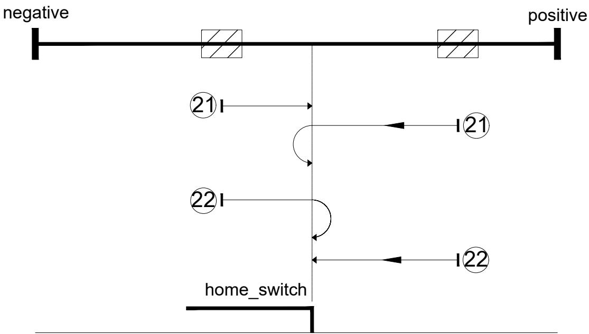  
Home\_method 21/22

## 3.6.14 Method 23 and 24

The method 23 and 24 are similar to methods 7 and 8 except that the home position is not dependent on the index pulse but only dependent on the relevant home or limit switch transitions.

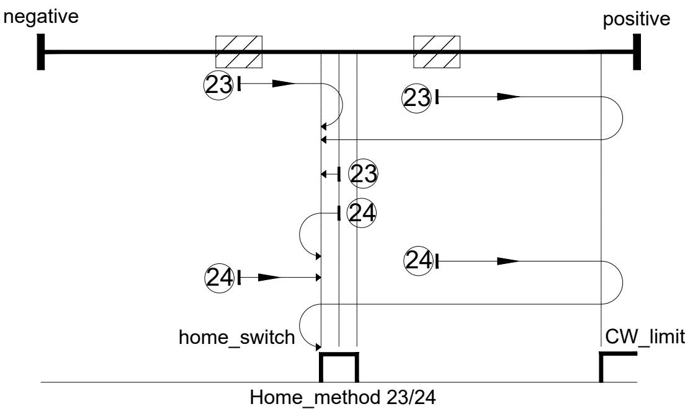

## 3.6.15 Method 25 and 26

The method 25 and 26 are similar to methods 9 and 10 except that the home position is not dependent on the index pulse but only dependent on the relevant home or limit switch transitions.

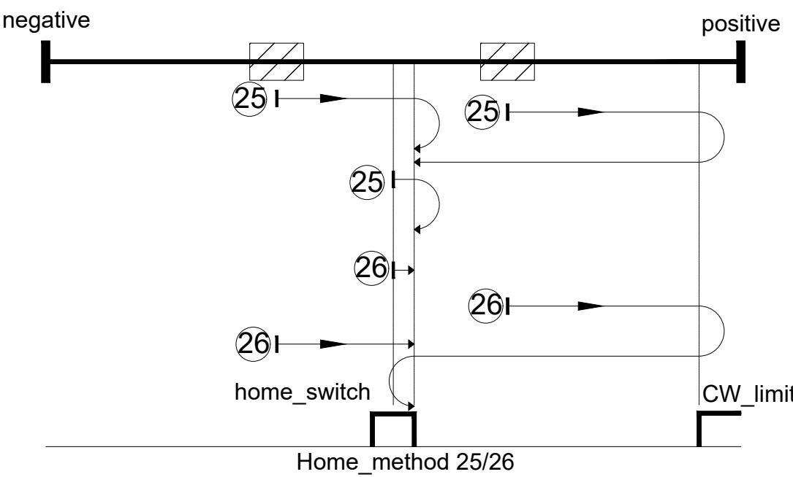

## 3.6.16 Method 27 and 28

The method 27 and 28 are similar to methods 11 and 12 except that the home position is not dependent on the index pulse but only dependent on the relevant home or limit switch transitions.

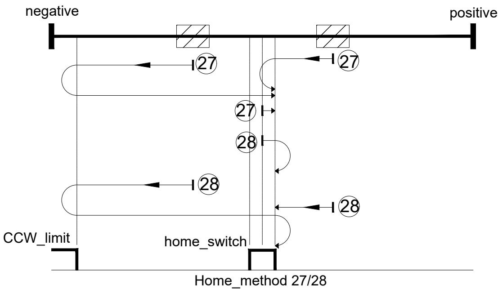

## 3.6.17 Method 29 and 30

The method 29 and 30 are similar to methods 13 and 14 except that the home position is not dependent on the index pulse but only dependent on the relevant home or limit switch transitions.

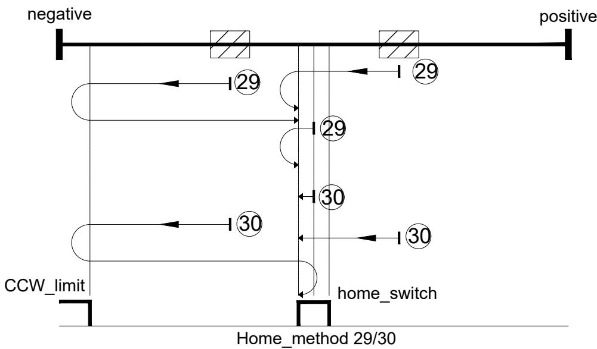

## 3.6.18 Method 33 and 34

Using these methods, the direction of homing is negative or positive respectively. The home position shall be at the index pulse found in the selected direction

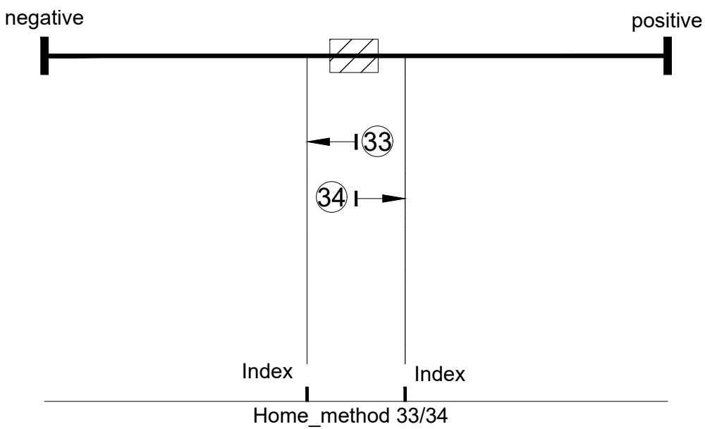

## 3.6.19 Method 35

In this method, the current position shall be taken to be the home position. This method does not require the drive device to be in operational enabled state.

## 3.6.20 Method 37

In this method, the position sensor information (converted in user-defined position units) shall be taken to be the home position. This method does not require the drive device to be in operation enabled state. At the home position (i.e. after the homing process) the position actual value (6064h) is calculated as follows:

Position actual value (6064h) = Home ofset (607Ch)

In addition, we provide the hard stop homing without limit switch.

## 3.6.21 Method -1

In this method, the initial direction of movement shall be rightward and reach the mechanical end position. Then the motor will return to the first index pulse.

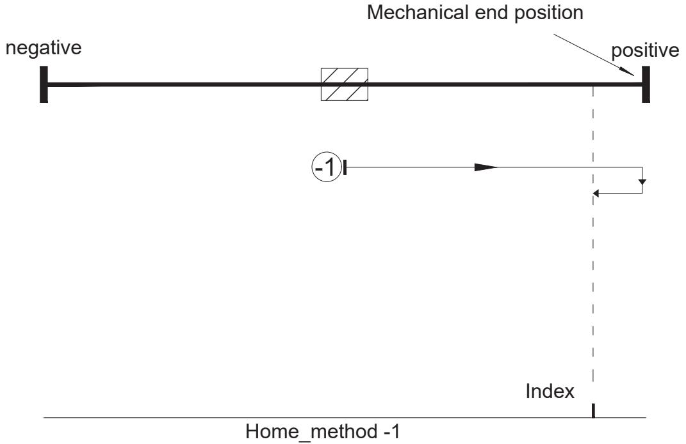

## 3.6.22 Method -2

In this method, the initial direction of movement shall be leftward and reach the mechanical end position. Then the motor will return to the first index pulse.

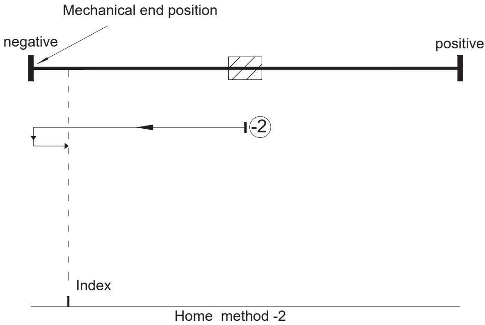

## 3.6.23 Method -3

In this method, the initial direction of movement shall be rightward and reach the mechanical end position.

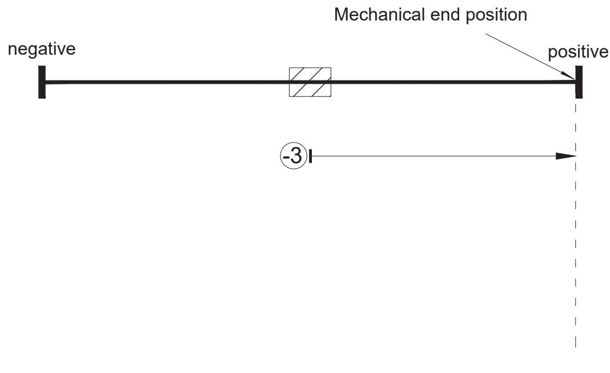  
Home\_method -3

## 3.6.24 Method -4

In this method, the initial direction of movement shall be leftward and reach the mechanical end position.

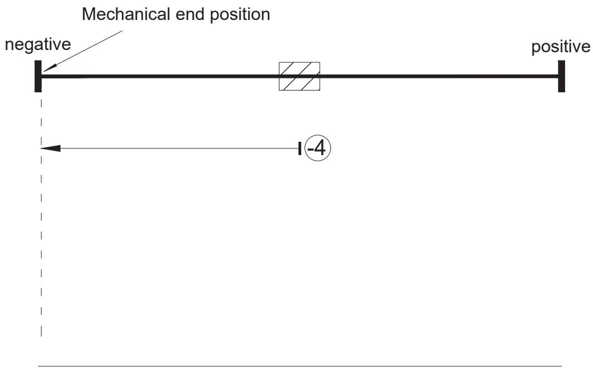  
Home\_method -4

## 3.7 Cyclic synchronous position mode

## 3.7.1 General information

With this mode, the trajectory generator is located in the control device, not in the drive device. In cyclic synchronous manner, it provides a target position to the drive device, which performs position control, velocity control and torque control.

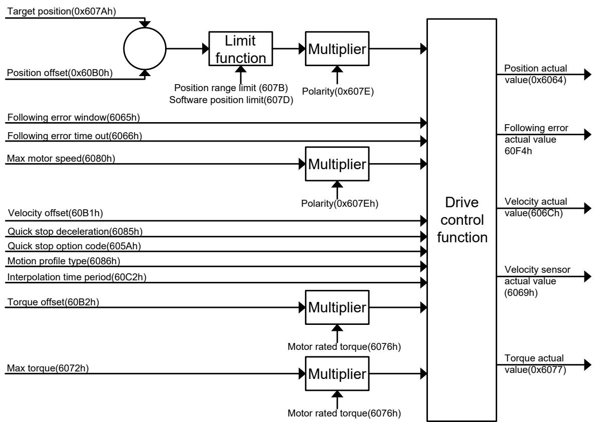

## 3.7.2 Main controlling object

<table><tr><td>Index</td><td>Name</td><td>Type</td><td>Access</td><td>Mapping</td></tr><tr><td>0x6040</td><td>Controlword</td><td>UINT</td><td>WO</td><td>YES</td></tr><tr><td>0x6041</td><td>Statusword</td><td>UINT</td><td>RO</td><td>YES</td></tr><tr><td>0x6060</td><td>Mode of operation</td><td>INT</td><td>WO</td><td>YES</td></tr><tr><td>0x607A</td><td>Target position</td><td>INT</td><td>WO</td><td>YES</td></tr><tr><td>0x60B0</td><td>Position offset</td><td>DINT</td><td>RW</td><td>YES</td></tr><tr><td>0x6085</td><td>Quick stop deceleration</td><td>UDINT</td><td>RW</td><td>YES</td></tr><tr><td>0x605A</td><td>Quick stop option code</td><td>INT</td><td>RW</td><td>YES</td></tr><tr><td>0x6064</td><td>Position actual value</td><td>DINT</td><td>RO</td><td>YES</td></tr><tr><td>0x60F4</td><td>Following error actual value</td><td>DINT</td><td>RO</td><td>YES</td></tr><tr><td>0x606C</td><td>Velocity actual value</td><td>DINT</td><td>RO</td><td>YES</td></tr><tr><td>0x6065</td><td>Following error window</td><td>UDINT</td><td>RW</td><td>NO</td></tr></table>

## Controlword

The cyclic synchronous position mode uses no mode-specific bits of the controlword .

## Statusword

<table><tr><td>15</td><td>14</td><td>13</td><td>12</td><td>11</td><td>10</td><td>9</td><td>0</td></tr><tr><td colspan="2">***</td><td>Following error</td><td>Drive follows the command value</td><td>****</td><td colspan="2">Status toggle</td><td>***</td></tr></table>

\*\*\*: See object description

<table><tr><td>Bit</td><td>Value</td><td>Definition</td></tr><tr><td rowspan="2">10</td><td>0</td><td>Reserved</td></tr><tr><td>1</td><td>Reserved</td></tr><tr><td rowspan="2">12</td><td>0</td><td>Target position ignored</td></tr><tr><td>1</td><td>Target position used as input to position control loop</td></tr><tr><td rowspan="2">13</td><td>0</td><td>No following error</td></tr><tr><td>1</td><td>Following error</td></tr></table>

In the statusword Bit 12 is mandatory. The Bit 13 is recommended.

The Bit 10 is used in Profile position mode as "Target reached" information. In csp the new target position is given cyclically be the control device. This bit is used as Status Toggle information to indicate if the device provides updated input data. The bit shall be toggled with every update of the input process data. If object 0x60D9 is supported, the Status Toggle function can be enabled or disabled.

The Bite 12 drive follows the command value shall be zero if the drive does not follow the target value(position,velocity or torque) because of local reasons(internal set-point settings).E.g. if a local Input is configured to a halt function or a safety function prevents the drive in operational to follow the target set point. The control device shal evaluate the bit. The Bit 12 shal be set if the drive is in state operation enabled and follows the target and set-point values of the control device. In all other cases it shall be zero. If the bit is not supported it shall be fix set to 1 in the statusword.

## 3.7.3 Functional description

With this mode, the control device should provide the target position with every cyclic communication.

The velocity, acceleration, deceleration of motor is based on cyclic time and tartget position.

Note: Before the drvie mode has changed to CSP and operation mode, the control device should update the target position to the same as the position actual valul of drive. if it is not equal to position actual value of drive, the drive will move to new position when operation mode activated.

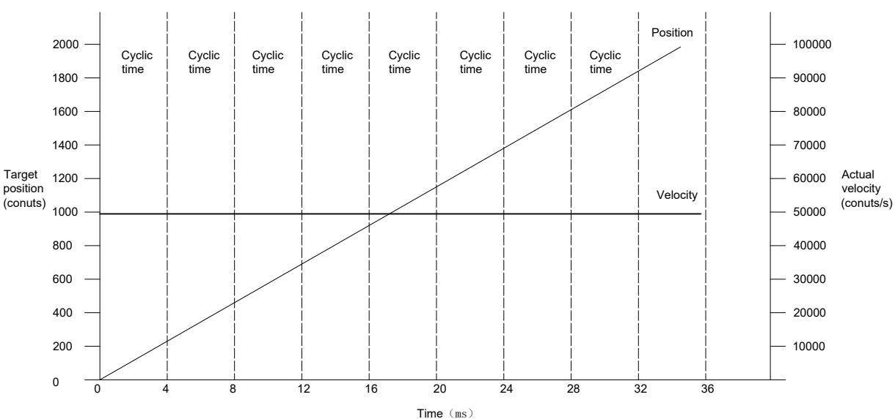

## 3.8 Cyclic synchronous velocity mode

## 3.8.1 General information

With this mode, the trajectory generator is located in the control device, not in the drive device. In cyclic synchronous manner, it provides a target velocity to the drive device, which performs velocity control and torque control.

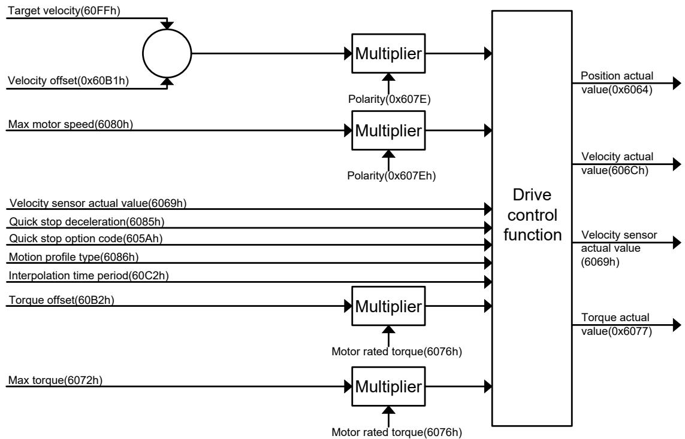

## 3.8.2 Main controlling object

<table><tr><td>Index</td><td>Name</td><td>Type</td><td>Access</td><td>Mapping</td></tr><tr><td>0x6040</td><td>Controlword</td><td>UINT</td><td>WO</td><td>YES</td></tr><tr><td>0x6041</td><td>Statusword</td><td>UINT</td><td>RO</td><td>YES</td></tr><tr><td>0x6060</td><td>Mode of operation</td><td>INT</td><td>WO</td><td>YES</td></tr><tr><td>0x60FF</td><td>Target velocity</td><td>INT</td><td>WO</td><td>YES</td></tr><tr><td>0x60B1</td><td>Velocity offset</td><td>DINT</td><td>RW</td><td>YES</td></tr><tr><td>0x6085</td><td>Quick stop deceleration</td><td>UDINT</td><td>RW</td><td>NO</td></tr><tr><td>0x60FF</td><td>Target velocity</td><td>DINT</td><td>RW</td><td>YES</td></tr></table>

## Controlword

The cyclic synchronous position mode uses no mode-specific bits of the controlword . Statusword

<table><tr><td>15</td><td>14</td><td>13</td><td>12</td><td>11</td><td>10</td><td>9</td><td>0</td></tr><tr><td colspan="2">***</td><td>Reserved</td><td>Drive follows the command value</td><td>****</td><td colspan="2">Reserved</td><td>***</td></tr></table>

\*\*\*: See object description

<table><tr><td>Bit</td><td>Value</td><td>definition</td></tr><tr><td rowspan="2">10</td><td>0</td><td>Reserved</td></tr><tr><td>1</td><td>Reserved</td></tr><tr><td rowspan="2">12</td><td>0</td><td>Target velocity ignored</td></tr><tr><td>1</td><td>Target velocity used as input to velocity control loop</td></tr><tr><td rowspan="2">13</td><td>0</td><td>Reserved</td></tr><tr><td>1</td><td>Reserved</td></tr></table>

In the statusword Bit 12 is mandatory.

In CSV mode Bit 10 is used as Status Toggle information to indicate if the device provides updated input data. The bit shall be toggled with every update of the input process data. If object 0x60D9 is supported, the Status Toggle function can be enabled or disabled.

The Bite 12 drive follows the command value shall be zero if the drive does not follow the target value(position,velocity or torque) because of local reasons(internal set-point settings).E.g. if a local Input is configured to a halt function or a safety function prevents the drive in operational to follow the target set point. The control device shal evaluate the bit. The Bit 12 shal be set if the drvie is in state operation enabled and follows the target and set-point values of the control device. In all other cases it shall be zero. If the bit is not supported it shall be fix set to 1 in the statusword.

## 3.8.3 Functional description

With CSV mode, drive can change speed with every cyclic time. when drive has been to operation mode, the motor speed is located with target velocity(0x60FF) object, change target velocity means change the current velocity on one cyclic time.

The acceleration and deceleration is based on cyclic time and target velocity.

## 3.9 Q program mode

## 3.9.1 General information

In order to expand the functionality of MOONS' EtherCAT drives, the Q programming language may be used to execute complex motion profiles that may not be possible within the scope of CiA 402. The Q program must be written and pre-loaded into the EtherCAT drive using Q Programmer. Q Programs may also access and manipulate the EtherCAT General Purpose registers for use in stored programs.

<table><tr><td>Q segment NO.(2007h)</td><td rowspan="4">→</td><td rowspan="4">Q program control</td></tr><tr><td>Q controlword(2040h)</td></tr><tr><td>Controlword(6040h)</td></tr><tr><td>Mode of operation(6060h=FFh)</td></tr></table>

## 3.9.2 Normal Q execution

To execute a stored Q program on a single drive, a value of -1 (FFh) must be written to the mode of operation OD entry, located at dictionary address 6060h. The mode of operation can be verified using OD entry 6061h - mode of operation display - which is updated when the current operation mode is accepted.

The data of controlling object example of STF\*\*-EC and SSDC\*\*-EC drive:

<table><tr><td colspan="2">Event</td><td>Set parameter</td></tr><tr><td rowspan="3">Enable motor power</td><td>Shut down</td><td>0x6040=6(06h)</td></tr><tr><td>Switch on</td><td>0x6040=7(07h)</td></tr><tr><td>Switch on + enable operation +halt</td><td>0x6040=271(10Fh)</td></tr><tr><td>Set mode of operation</td><td>Normal Q mode</td><td>0x6060=-1(FFh)</td></tr><tr><td>Set parameter</td><td>Q procedure segment</td><td>0x2007=1(01h)</td></tr><tr><td rowspan="2">Normal Q mode</td><td>Start</td><td>0x6040=31(1Fh)</td></tr><tr><td>Halt</td><td>0x6040=287(011Fh)</td></tr></table>

The data of controlling object example of STF\*\*-ECX and SSDC\*\*-ECX drive:

<table><tr><td colspan="2">Event</td><td>Set parameter</td></tr><tr><td rowspan="3">Enable motor power</td><td>Shut down</td><td>0x6040=6(06h)</td></tr><tr><td>Switch on</td><td>0x6040=7(07h)</td></tr><tr><td>Switch on+enable operation</td><td>0x6040=15(0Fh)</td></tr><tr><td>Set mode of operation</td><td>Normal Q mode</td><td>0x6060=-1(FFh)</td></tr><tr><td>Set parameter</td><td>Q segment NO.</td><td>0x2007=1(01h)</td></tr><tr><td rowspan="3">Execute Q program</td><td>Enable Q program</td><td>0x2040=15(0Fh)</td></tr><tr><td>Start Q program</td><td>0x2040=31(1Fh)</td></tr><tr><td>Stop Q program</td><td>0x2040=256(100h)</td></tr></table>

## 3.10 Touch probe

## 3.10.1 General information

Touch probe function is used to latch the feedback position by capture the rasing or falling edge of input sensor and index. With touch probe , assign X7 or X8 to touch probe function is essential by the software of MOONS' drive.

## 3.10.2 Main control object

<table><tr><td>Index</td><td>Name</td><td>Type</td><td>Access</td><td>Mapping</td></tr><tr><td>0x60B8</td><td>Touch probe function</td><td>INT</td><td>RW</td><td>YES</td></tr><tr><td>0x60B9</td><td>Touch probe status</td><td>UINT</td><td>RO</td><td>YES</td></tr><tr><td>0x60BA</td><td>Touch probe pos1 pos value</td><td>DINT</td><td>RO</td><td>YES</td></tr><tr><td>0x60BB</td><td>Touch probe pos1 neg value</td><td>DINT</td><td>RO</td><td>YES</td></tr><tr><td>0x60BC</td><td>Touch probe pos2 pos value</td><td>DINT</td><td>RO</td><td>YES</td></tr><tr><td>0x60BD</td><td>Touch probe pos2 neg value</td><td>DINT</td><td>RO</td><td>YES</td></tr></table>

## 3.10.3 Functional description

## 0x60B8 Touch probe function

This object indicate the configured function of touch probe.

<table><tr><td>Bit</td><td>Value</td><td>Definition</td></tr><tr><td>0</td><td>0</td><td>Swith off touch probe 1</td></tr><tr><td></td><td>1</td><td>Enable touch probe 1</td></tr><tr><td>1</td><td>0</td><td>Trigger first event</td></tr><tr><td></td><td>1</td><td>Continuous</td></tr><tr><td>3,2</td><td>00</td><td>Trigger with touch probe 1 input</td></tr><tr><td></td><td>01</td><td>Trigger with zero impulse signal or position encoder</td></tr><tr><td></td><td>10</td><td>Touch probe source as defined in object 60D0, sub-index01</td></tr><tr><td></td><td>11</td><td>Reserved</td></tr><tr><td>4</td><td>0</td><td>Switch off sampling at positive edge of touch probe 1</td></tr><tr><td></td><td>1</td><td>Enable sampling at positive edge of touch probe 1</td></tr><tr><td>5</td><td>0</td><td>Switch off sampling at negative edge of touch probe 1</td></tr><tr><td></td><td>1</td><td>Enable sampling at negative edge of touch probe 1</td></tr><tr><td>6,7</td><td>-</td><td>Reserved</td></tr><tr><td>8</td><td>0</td><td>Swith off touch probe 2</td></tr><tr><td></td><td>1</td><td>Enable touch probe 2</td></tr><tr><td>9</td><td>0</td><td>Trigger first event</td></tr><tr><td></td><td>1</td><td>Continuous</td></tr><tr><td>11,10</td><td>00</td><td>Trigger with touch probe 2 input</td></tr><tr><td></td><td>01</td><td>Trigger with zero impulse signal or position encoder</td></tr><tr><td></td><td>10</td><td>Touch probe source as defined in object 60D0, sub-index02</td></tr><tr><td></td><td>11</td><td>Reserved</td></tr><tr><td>12</td><td>0</td><td>Switch off sampling at positive edge of touch probe 2</td></tr><tr><td></td><td>1</td><td>Enable sampling at positive edge of touch probe 2</td></tr><tr><td>13</td><td>0</td><td>Switch off sampling at negative edge of touch probe 2</td></tr><tr><td></td><td>1</td><td>Enable sampling at negative edge of touch probe 2</td></tr><tr><td>14,15</td><td>-</td><td>Reserved</td></tr></table>

## 0x60B9 Touch probe function

This obejct provide the status of touch probe.

<table><tr><td>Bit</td><td>Value</td><td>Definition</td></tr><tr><td>0</td><td>0</td><td>Touch probe 1 is switched off</td></tr><tr><td></td><td>1</td><td>Touch probe 1 is enabled</td></tr><tr><td>1</td><td>0</td><td>Touch probe 1 no positive edge value stored</td></tr><tr><td></td><td>1</td><td>Touch probe 1 positive edge position stored</td></tr><tr><td>2</td><td>0</td><td>Touch probe 1 no negative edge value stored</td></tr><tr><td></td><td>1</td><td>Touch probe 1 negative edge position stored</td></tr><tr><td>3...7</td><td>-</td><td>Reserved</td></tr><tr><td>8</td><td>0</td><td>Touch probe 2 is switched off</td></tr><tr><td></td><td>1</td><td>Touch probe 2 is enabled</td></tr><tr><td>9</td><td>0</td><td>Touch probe 2 no positive edge value stored</td></tr><tr><td></td><td>1</td><td>Touch probe 2 positive edge position stored</td></tr><tr><td>10</td><td>0</td><td>Touch probe 2 no negative edge value stored</td></tr><tr><td></td><td>1</td><td>Touch probe 2 negative edge position stored</td></tr><tr><td>11...15</td><td>-</td><td>Reserved</td></tr></table>

0x60BA\~0x60BD Touch probe position value

This object shall provide the captual position value of touch probe.

## 3.10.4 Timing diagrame

The figure in below shows a timing diagram for an example touch probe configuration and the corresponding behavior. And the table explains the timing diagram.

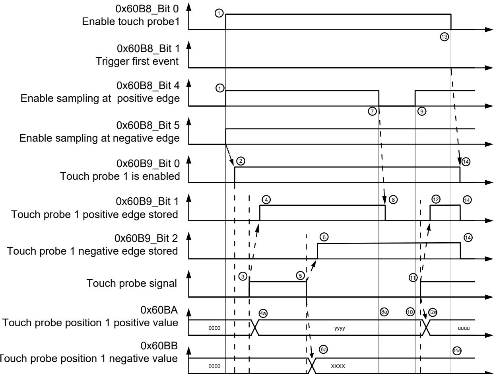

<table><tr><td>Number</td><td colspan="2">Touch probe behavior</td></tr><tr><td rowspan="2">(1)</td><td>60B8_bit0 = 1</td><td>Enable touch probe 1</td></tr><tr><td>60B8_bit1,4,5</td><td>Configure and enable touch probe 1 positive and negative edge</td></tr><tr><td>(2)</td><td>→60B9_bit 0 = 1</td><td>Status&quot;Touch probe 1 enabled&quot; is set</td></tr><tr><td>(3)</td><td colspan="2">External touch probe signal has positive edge</td></tr><tr><td>(4)</td><td>→60B9_bit 1 = 1</td><td>Status&quot;Touch probe 1 positive edge stored&quot; is set</td></tr><tr><td>(4a)</td><td>→60BA</td><td>Touch probe position 1 positive value is stored</td></tr><tr><td>(5)</td><td colspan="2">External touch probe signal has negative edge</td></tr><tr><td>(6)</td><td>→60B9_bit 2 = 1</td><td>Status&quot;Touch probe 1 negative edge stored&quot; is set</td></tr><tr><td>(6a)</td><td>60BB</td><td>Touch probe position 1 negative value is stored</td></tr><tr><td>(7)</td><td>60B8_bit 4 = 0</td><td>Sample positive edge is disabled</td></tr><tr><td>(8)</td><td>→60B9_bit 0 = 0</td><td>Status&quot;Touch probe 1 positive edge stored&quot; is reset</td></tr><tr><td>(8a)</td><td>→60BA</td><td>Touch probe position 1 positive value is not changed</td></tr><tr><td>(9)</td><td>60B8_bit 4 = 1</td><td>Sample positive edge is enabled</td></tr><tr><td>(10)</td><td>→60BA</td><td>Touch probe position 1 positive value is not changed</td></tr><tr><td>(11)</td><td colspan="2">External touch probe signal has positive edge</td></tr><tr><td>(12)</td><td>→60B9_bit 1 = 1</td><td>Status &quot;Touch probe 1 positive edge stored&quot; is set</td></tr><tr><td>(12a)</td><td>→60BA</td><td>Touch probe position 1 positive value is stored</td></tr><tr><td>(13)</td><td>60B8_bit 0 = 0</td><td>Touch probe 1 is disabled</td></tr><tr><td>(14)</td><td>→60B9_bit 0, 1, 2 = 0</td><td>Status bits are reset</td></tr><tr><td>(14a)</td><td>→60BA, 60BB</td><td>Touch probe position 1 positive/negative value are not changed</td></tr></table>

## 4 Object dictionary

With CoE protocol, MOONS' Stepper and StepSERVO EtherCAT drives has follow with CANopen specifiction, the object dictionay is same as CANopen drive. the table obtain the object area of EtherCAT drives in below.

## 4.1 CoE object dictionary description

<table><tr><td>Index</td><td>Description</td></tr><tr><td>0x0000~0x0FFF</td><td>Data type area</td></tr><tr><td>0x1000~0x1FFF</td><td>CoE communication area</td></tr><tr><td>0x2000~0x5FFF</td><td>Manufacturer specific area</td></tr><tr><td>0x6000~0x9FFF</td><td>Profile area</td></tr><tr><td>0xA000~0xFFFF</td><td>Reserved</td></tr></table>

## 4.2 Communication profile

<table><tr><td rowspan="23">CoE(1000h)</td><td>Index</td><td>Sub</td><td>Name</td><td>Access</td><td>Type</td><td>Mapping</td></tr><tr><td>0x1000</td><td>-</td><td>Device type</td><td>RO</td><td>UDINT</td><td>NO</td></tr><tr><td>0x1001</td><td>-</td><td>Error register</td><td>RO</td><td>USINT</td><td>NO</td></tr><tr><td>0x1008</td><td>-</td><td>Device name</td><td>RO</td><td>STRING(20)</td><td>NO</td></tr><tr><td>0x1009</td><td>-</td><td>Manufacturer hardware version</td><td>RO</td><td>STRING(4)</td><td>NO</td></tr><tr><td>0x100A</td><td>-</td><td>Manufacturer software version</td><td>RO</td><td>STRING(4)</td><td>NO</td></tr><tr><td rowspan="2">0x1010</td><td>-</td><td>Store parameters</td><td>-</td><td>-</td><td>-</td></tr><tr><td>1</td><td>Store all parameters</td><td>RW</td><td>UDINT</td><td>NO</td></tr><tr><td rowspan="2">0x1011</td><td>-</td><td>Restore default parameters</td><td>-</td><td>-</td><td>-</td></tr><tr><td>1</td><td>Restore default parameters</td><td>RW</td><td>UDINT</td><td>NO</td></tr><tr><td rowspan="5">0x1018</td><td>-</td><td>Identity object</td><td>-</td><td>-</td><td>-</td></tr><tr><td>1</td><td>Vendor ID</td><td>RO</td><td>UDINT</td><td>NO</td></tr><tr><td>2</td><td>Product code</td><td>RO</td><td>UDINT</td><td>NO</td></tr><tr><td>3</td><td>Revision</td><td>RO</td><td>UDINT</td><td>NO</td></tr><tr><td>4</td><td>Serial number</td><td>RO</td><td>UDINT</td><td>NO</td></tr><tr><td rowspan="3">0x10F1</td><td>-</td><td>Error settings</td><td>-</td><td>-</td><td>-</td></tr><tr><td>1</td><td>Local error reaction</td><td>RW</td><td>UDINT</td><td>NO</td></tr><tr><td>2</td><td>Sync error counter limit</td><td>RW</td><td>UINT</td><td>NO</td></tr><tr><td rowspan="5">0x1600~1603</td><td>8</td><td>RPDO mapping parameter 1~4</td><td>-</td><td>-</td><td>-</td></tr><tr><td>1</td><td>Mapping entry 1</td><td>RW</td><td>UDINT</td><td>NO</td></tr><tr><td>2</td><td>Mapping entry 2</td><td>RW</td><td>UDINT</td><td>NO</td></tr><tr><td>...</td><td>...</td><td>RW</td><td>UDINT</td><td>NO</td></tr><tr><td>12</td><td>Mapping entry 12</td><td>RW</td><td>UDINT</td><td>NO</td></tr></table>

## 0x1000 Device type

Contains information about the device type. The object at index 1000h describes the type of device and its functionality. It is composed of a 16-bit field which describes the device profile that is used and a second 16-bit field which gives additional information about optional functionality of the device. The Additional Information parameter is device profile specific. Its specification does not fall within the scope of this document, it is defined in the appropriate device profile. The value 0000h indicates a device that does not follow a standardized device profile.

<table><tr><td>Index</td><td>Sub</td><td>Name</td><td>Data Type</td><td>Access Type</td><td>PDO mapping</td><td>Default Value</td></tr><tr><td>0x1000</td><td>-</td><td>Device type</td><td>UDINT32</td><td>RO</td><td>NO</td><td>-</td></tr></table>

## Bit 0-15: Device profile number

Bit 16-31: Additional information

0x1001 Error register

This object is an error register for the device. The device can map internal errors in this byte. This entry is mandatory for all devices. It is a part of an Emergency object.

<table><tr><td>Index</td><td>Sub</td><td>Name</td><td>Data Type</td><td>Access Type</td><td>PDO mapping</td><td>Default Value</td></tr><tr><td>0x1001</td><td>-</td><td>Error register</td><td>USINT8</td><td>RO</td><td>NO</td><td>-</td></tr></table>

Bit 0: generic error

Bit 1: current

Bit 2: voltage

Bit 3: temperature

Bit 4: communication error (overrun, error state)

Bit 5-7: Reserved (always 0)

0x1008 Device name

Contains the manufacturer device name.

<table><tr><td>Index</td><td>Sub</td><td>Name</td><td>Data Type</td><td>Access Type</td><td>PDO mapping</td><td>Default Value</td></tr><tr><td>0x1008</td><td>-</td><td>Manufacturer device name</td><td>STRING(20)</td><td>CONST</td><td>NO</td><td>-</td></tr></table>

Name of the manufacturer as string.

0x1009 Hardware version

Contains the hardware version description.

<table><tr><td>Index</td><td>Sub</td><td>Name</td><td>Data Type</td><td>Access Type</td><td>PDO mapping</td><td>Default Value</td></tr><tr><td>0x1009</td><td>-</td><td>Hardware version</td><td>STRING(4)</td><td>CONST</td><td>NO</td><td>-</td></tr></table>

## 0x100A Software version

Contains the software version description.

<table><tr><td>Index</td><td>Sub</td><td>Name</td><td>Data Type</td><td>Access Type</td><td>PDO mapping</td><td>Default Value</td></tr><tr><td>0x100A</td><td>-</td><td>Software version</td><td>STRING(4)</td><td>CONST</td><td>NO</td><td>-</td></tr></table>

## 0x1010 Store parameters

This object supports the saving of parameters in non-volatile memory. By read access the device provides information about its saving capabilities. Several parameter groups are distinguished:

<table><tr><td>Index</td><td>Sub</td><td>Name</td><td>Data Type</td><td>Access Type</td><td>PDO mapping</td><td>Default Value</td></tr><tr><td rowspan="2">0x1010</td><td>0</td><td>Number of sub-index</td><td>USINT8</td><td>RO</td><td>NO</td><td>1</td></tr><tr><td>1</td><td>Store parameters</td><td>UDINT32</td><td>RW</td><td>NO</td><td>0</td></tr></table>

In order to avoid storage of parameters by mistake, storage is only executed when a specific signature is written to the appropriate Sub-Index 1. The signature is “save”.

<table><tr><td></td><td colspan="2">MSB</td><td colspan="2">LSB</td></tr><tr><td>Signature ISO</td><td>e</td><td>v</td><td>a</td><td>s</td></tr><tr><td>8859(&quot;ASCII&quot;)hex</td><td>65h</td><td>76h</td><td>61h</td><td>73h</td></tr></table>

Storage write access signature

## 0x1011 Restore default parameters

With this object the default values of parameters according to the communication or device profile are restored.

<table><tr><td>Index</td><td>Sub</td><td>Name</td><td>Data Type</td><td>Access Type</td><td>PDO mapping</td><td>Default Value</td></tr><tr><td rowspan="2">0x1011</td><td>0</td><td>Number of sub-index</td><td>USINT8</td><td>RO</td><td>NO</td><td>1</td></tr><tr><td>1</td><td>Restore parameters</td><td>UDINT32</td><td>RW</td><td>NO</td><td>0</td></tr></table>

In order to avoid storage of parameters by mistake, storage is only executed when a specific signature is written to the appropriate Sub-Index 1. The signature is "load".

<table><tr><td></td><td colspan="2">MSB</td><td colspan="2">LSB</td></tr><tr><td>Signature ISO</td><td>e</td><td>v</td><td>a</td><td>s</td></tr><tr><td>8859(&quot;ASCII&quot;)hex</td><td>64h</td><td>61h</td><td>6Fh</td><td>6Ch</td></tr></table>

Storage write access signature

## 0x1018 Identity object

The object at index 1018h contains general information about the device.

<table><tr><td>Index</td><td>Sub</td><td>Name</td><td>Data Type</td><td>Access Type</td><td>PDO mapping</td><td>Default Value</td></tr><tr><td rowspan="5">0x1018</td><td>0</td><td>Number of sub-index</td><td>USINT8</td><td>RO</td><td>NO</td><td>4</td></tr><tr><td>1</td><td>Vendor-ID</td><td>UDINT32</td><td>RO</td><td>NO</td><td>-</td></tr><tr><td>2</td><td>Product code</td><td>UIDINT32</td><td>RO</td><td>NO</td><td>-</td></tr><tr><td>3</td><td>Revision number</td><td>UDINT32</td><td>RO</td><td>NO</td><td>-</td></tr><tr><td>4</td><td>Serial number</td><td>UDINT32</td><td>RO</td><td>NO</td><td>-</td></tr></table>

## 0x10F1 Error settings

Reserved.

<table><tr><td>Index</td><td>Sub</td><td>Name</td><td>Data Type</td><td>Access Type</td><td>PDO mapping</td><td>Default Value</td></tr><tr><td rowspan="3">0x10F1</td><td>0</td><td>Number of sub-index</td><td>USINT8</td><td>RO</td><td>NO</td><td>4</td></tr><tr><td>1</td><td>Local error reaction</td><td>UDINT32</td><td>RW</td><td>NO</td><td>1</td></tr><tr><td>2</td><td>SYNC error counter limit</td><td>UIDINT32</td><td>RW</td><td>NO</td><td>4</td></tr></table>

## 0x1600\~1603 Receive PDO mapping parameter

Contains the mapping for the PDOs the device is able to receive.

<table><tr><td>Index</td><td>Sub</td><td>Name</td><td>Data Type</td><td>Access Type</td><td>PDO mapping</td><td>Default Value</td></tr><tr><td rowspan="13">0x1600-1603</td><td>0</td><td>Number of sub-index</td><td>USINT8</td><td>RW</td><td>NO</td><td>4</td></tr><tr><td>1</td><td>Mapping entry 1</td><td>UDINT32</td><td>RW</td><td>NO</td><td>-</td></tr><tr><td>2</td><td>Mapping entry 2</td><td>UIDINT32</td><td>RW</td><td>NO</td><td>-</td></tr><tr><td>3</td><td>Mapping entry 3</td><td>UDINT32</td><td>RW</td><td>NO</td><td>-</td></tr><tr><td>4</td><td>Mapping entry 4</td><td>UDINT32</td><td>RW</td><td>NO</td><td>-</td></tr><tr><td>5</td><td>Mapping entry 5</td><td>UDINT32</td><td>RW</td><td>NO</td><td>-</td></tr><tr><td>6</td><td>Mapping entry 6</td><td>UDINT32</td><td>RW</td><td>NO</td><td>-</td></tr><tr><td>7</td><td>Mapping entry 7</td><td>UDINT32</td><td>RW</td><td>NO</td><td>-</td></tr><tr><td>8</td><td>Mapping entry 8</td><td>UDINT32</td><td>RW</td><td>NO</td><td>-</td></tr><tr><td>9</td><td>Mapping entry 9</td><td>UDINT32</td><td>RW</td><td>NO</td><td>-</td></tr><tr><td>10</td><td>Mapping entry 10</td><td>UDINT32</td><td>RW</td><td>NO</td><td>-</td></tr><tr><td>11</td><td>Mapping entry 11</td><td>UDINT32</td><td>RW</td><td>NO</td><td>-</td></tr><tr><td>12</td><td>Mapping entry 12</td><td>UDINT32</td><td>RW</td><td>NO</td><td>-</td></tr></table>

0x1A00\~1A03 Transmit PDO mapping parameter  
Contains the mapping for the PDOs the device is able to transmit.

<table><tr><td>Index</td><td>Sub</td><td>Name</td><td>Data Type</td><td>Access Type</td><td>PDO mapping</td><td>Default Value</td></tr><tr><td rowspan="13">0x1A00-1A03</td><td>0</td><td>Number of sub-index</td><td>USINT8</td><td>RW</td><td>NO</td><td>12</td></tr><tr><td>1</td><td>Mapping entry 1</td><td>UDINT32</td><td>RW</td><td>NO</td><td>-</td></tr><tr><td>2</td><td>Mapping entry 2</td><td>UIDINT32</td><td>RW</td><td>NO</td><td>-</td></tr><tr><td>3</td><td>Mapping entry 3</td><td>UDINT32</td><td>RW</td><td>NO</td><td>-</td></tr><tr><td>4</td><td>Mapping entry 4</td><td>UDINT32</td><td>RW</td><td>NO</td><td>-</td></tr><tr><td>5</td><td>Mapping entry 5</td><td>UDINT32</td><td>RW</td><td>NO</td><td>-</td></tr><tr><td>6</td><td>Mapping entry 6</td><td>UDINT32</td><td>RW</td><td>NO</td><td>-</td></tr><tr><td>7</td><td>Mapping entry 7</td><td>UDINT32</td><td>RW</td><td>NO</td><td>-</td></tr><tr><td>8</td><td>Mapping entry 8</td><td>UDINT32</td><td>RW</td><td>NO</td><td>-</td></tr><tr><td>9</td><td>Mapping entry 9</td><td>UDINT32</td><td>RW</td><td>NO</td><td>-</td></tr><tr><td>10</td><td>Mapping entry 10</td><td>UDINT32</td><td>RW</td><td>NO</td><td>-</td></tr><tr><td>11</td><td>Mapping entry 11</td><td>UDINT32</td><td>RW</td><td>NO</td><td>-</td></tr><tr><td>12</td><td>Mapping entry 12</td><td>UDINT32</td><td>RW</td><td>NO</td><td>-</td></tr></table>

## 0x1C00 Sync manager type

The sync manager communication type set the communication type of each SM manager. The type of communication that:

1. Mailbox reception

2. Mailbox sending

3. RxPDO

4. TxPDO

<table><tr><td>Index</td><td>Sub</td><td>Name</td><td>Data Type</td><td>Access Type</td><td>PDO mapping</td><td>Default Value</td></tr><tr><td rowspan="5">0x1C00</td><td>0</td><td>Number of sub-index</td><td>USINT8</td><td>RW</td><td>NO</td><td>4</td></tr><tr><td>1</td><td>SM0 communication type</td><td>UDINT32</td><td>RW</td><td>NO</td><td>1</td></tr><tr><td>2</td><td>SM1 communication type</td><td>UIDINT32</td><td>RW</td><td>NO</td><td>2</td></tr><tr><td>3</td><td>SM2 communication type</td><td>UDINT32</td><td>RW</td><td>NO</td><td>3</td></tr><tr><td>4</td><td>SM3 communicaiton type</td><td>UDINT32</td><td>RW</td><td>NO</td><td>4</td></tr></table>

## 0x1C12 RxPDO assign object

The sync manager of RxPDO allocation, sub-indx1-4 set to the index of mapping.

<table><tr><td>Index</td><td>Sub</td><td>Name</td><td>Data Type</td><td>Access Type</td><td>PDO mapping</td><td>Default Value</td></tr><tr><td rowspan="5">0x1C12</td><td>0</td><td>Number of sub-index</td><td>USINT8</td><td>RW</td><td>NO</td><td>1</td></tr><tr><td>1</td><td>RxPDO1 mapping object</td><td>UDINT32</td><td>RW</td><td>NO</td><td>0x1600</td></tr><tr><td>2</td><td>RxPDO2 mapping object</td><td>UIDINT32</td><td>RW</td><td>NO</td><td>-</td></tr><tr><td>3</td><td>RxPDO3 mapping object</td><td>UDINT32</td><td>RW</td><td>NO</td><td>-</td></tr><tr><td>4</td><td>RxPDO4 mapping object</td><td>UDINT32</td><td>RW</td><td>NO</td><td>-</td></tr></table>

## 0x1C13 TxPDO assign object

The sync manager of TxPDO allocation, sub-indx1-4 set to the index of mapping.

<table><tr><td>Index</td><td>Sub</td><td>Name</td><td>Data Type</td><td>Access Type</td><td>PDO mapping</td><td>Default Value</td></tr><tr><td rowspan="5">0x1C13</td><td>0</td><td>Number of sub-index</td><td>USINT8</td><td>RW</td><td>NO</td><td>1</td></tr><tr><td>1</td><td>TxPDO1 mapping object</td><td>UDINT32</td><td>RW</td><td>NO</td><td>0x1A00</td></tr><tr><td>2</td><td>TxPDO2 mapping object</td><td>UIDINT32</td><td>RW</td><td>NO</td><td>-</td></tr><tr><td>3</td><td>TxPDO3 mapping object</td><td>UDINT32</td><td>RW</td><td>NO</td><td>-</td></tr><tr><td>4</td><td>TxPDO4 mapping object</td><td>UDINT32</td><td>RW</td><td>NO</td><td>-</td></tr></table>

## 0x1C32 SM output parameter

The SYNC manager parameter.

<table><tr><td>Index</td><td>Sub</td><td>Name</td><td>Data Type</td><td>Access Type</td><td>PDO mapping</td><td>Default Value</td></tr><tr><td rowspan="13">0x1C32</td><td>0</td><td>Number of sub-index</td><td>USINT8</td><td>RO</td><td>NO</td><td>32</td></tr><tr><td>1</td><td>Synchronization type</td><td>UINT16</td><td>RW</td><td>NO</td><td>2</td></tr><tr><td>2</td><td>Cycle time</td><td>UDINT32</td><td>RO</td><td>NO</td><td>0</td></tr><tr><td>3</td><td>Shift time</td><td>UDINT32</td><td>RW</td><td>NO</td><td>0</td></tr><tr><td>4</td><td>Synchronization types supported</td><td>UDINT32</td><td>RO</td><td>NO</td><td>0x401F</td></tr><tr><td>5</td><td>Minimum cycle time</td><td>UDINT32</td><td>RO</td><td>NO</td><td>0x7A120</td></tr><tr><td>6</td><td>Calc and copy time</td><td>UINT16</td><td>RW</td><td>NO</td><td>0</td></tr><tr><td>8</td><td>Get cycle time</td><td>UINT</td><td>RW</td><td>NO</td><td>0</td></tr><tr><td>9</td><td>Delay time</td><td>UDINT</td><td>RO</td><td>NO</td><td>0</td></tr><tr><td>10</td><td>Sync0 cycle time</td><td>UDINT</td><td>RW</td><td>NO</td><td>0x3D0900</td></tr><tr><td>11</td><td>SM-event missed</td><td>UINT</td><td>RO</td><td>NO</td><td>0</td></tr><tr><td>12</td><td>Cycle time too small</td><td>UINT</td><td>RO</td><td>NO</td><td>0</td></tr><tr><td>32</td><td>Sync error</td><td>BOOL</td><td>RO</td><td>NO</td><td>false</td></tr></table>

## 0x1C33 SM intput parameter

## The SYNC manager parameter.

<table><tr><td>Index</td><td>Sub</td><td>Name</td><td>Data Type</td><td>Access Type</td><td>PDO mapping</td><td>Default Value</td></tr><tr><td rowspan="13">0x1C33</td><td>0</td><td>Number of sub-index</td><td>USINT8</td><td>RO</td><td>NO</td><td>32</td></tr><tr><td>1</td><td>Synchronization type</td><td>UINT16</td><td>RW</td><td>NO</td><td>2</td></tr><tr><td>2</td><td>Cycle time</td><td>UDINT32</td><td>RO</td><td>NO</td><td>0</td></tr><tr><td>3</td><td>Shift time</td><td>UDINT32</td><td>RW</td><td>NO</td><td>0</td></tr><tr><td>4</td><td>Synchronization types supported</td><td>UDINT32</td><td>RO</td><td>NO</td><td>0x401F</td></tr><tr><td>5</td><td>Minimum cycle time</td><td>UDINT32</td><td>RO</td><td>NO</td><td>0x7A120</td></tr><tr><td>6</td><td>Calc and copy time</td><td>UINT16</td><td>RW</td><td>NO</td><td>0</td></tr><tr><td>8</td><td>Get cycle time</td><td>UINT</td><td>RW</td><td>NO</td><td>0</td></tr><tr><td>9</td><td>Delay time</td><td>UDINT</td><td>RO</td><td>NO</td><td>0</td></tr><tr><td>10</td><td>Sync0 cycle time</td><td>UDINT</td><td>RW</td><td>NO</td><td>0x3D0900</td></tr><tr><td>11</td><td>SM-event missed</td><td>UINT</td><td>RO</td><td>NO</td><td>0</td></tr><tr><td>12</td><td>Cycle time too small</td><td>UINT</td><td>RO</td><td>NO</td><td>0</td></tr><tr><td>32</td><td>Sync error</td><td>BOOL</td><td>RO</td><td>NO</td><td>false</td></tr></table>

## 4.3 Motion control profile

<table><tr><td rowspan="41">CoE(6000)</td><td>Index</td><td>Sub</td><td>Name</td><td>Access</td><td>Type</td><td>Mapping</td></tr><tr><td>0x603F</td><td>-</td><td>Error code</td><td>RO</td><td>UINT16</td><td>YES</td></tr><tr><td>0x6040</td><td>-</td><td>Controlword</td><td>WO</td><td>UINT16</td><td>YES</td></tr><tr><td>0x6041</td><td>-</td><td>Statusword</td><td>RO</td><td>UINT16</td><td>YES</td></tr><tr><td>0x605A</td><td>-</td><td>Quick stop option code</td><td>RW</td><td>INT16</td><td>NO</td></tr><tr><td>0x605B</td><td>-</td><td>Shut down option code</td><td>RW</td><td>INT16</td><td>NO</td></tr><tr><td>0x605C</td><td>-</td><td>Disable operation option code</td><td>RW</td><td>INT16</td><td>NO</td></tr><tr><td>0x605D</td><td>-</td><td>Halt option code</td><td>RW</td><td>INT16</td><td>NO</td></tr><tr><td>0x605E</td><td>-</td><td>Fault reaction code</td><td>RW</td><td>INT16</td><td>NO</td></tr><tr><td>0x6060</td><td>-</td><td>Modes of operation</td><td>WO</td><td>INT8</td><td>YES</td></tr><tr><td>0x6061</td><td>-</td><td>Modes of operation display</td><td>RO</td><td>INT8</td><td>YES</td></tr><tr><td>0x6064</td><td>-</td><td>Position actual value</td><td>RO</td><td>INT32</td><td>YES</td></tr><tr><td>0x6065</td><td>-</td><td>Following error window</td><td>RW</td><td>UINT32</td><td>NO</td></tr><tr><td>0x606C</td><td>-</td><td>Velocity actual value</td><td>RO</td><td>INT32</td><td>YES</td></tr><tr><td>0x6071</td><td>-</td><td>Target torque</td><td>RW</td><td>INT16</td><td>YES</td></tr><tr><td>0x6073</td><td>-</td><td>Max current</td><td>RW</td><td>UINT16</td><td>YES</td></tr><tr><td>0x6074</td><td>-</td><td>Torque demand</td><td>RO</td><td>INT16</td><td>YES</td></tr><tr><td>0x6077</td><td>-</td><td>Torque actual value</td><td></td><td>INT</td><td>YES</td></tr><tr><td>0x6078</td><td>-</td><td>Current actual value</td><td>RO</td><td>INT16</td><td>YES</td></tr><tr><td>0x607A</td><td>-</td><td>Target position</td><td>RW</td><td>INT32</td><td>YES</td></tr><tr><td>0x607C</td><td>-</td><td>Home offset</td><td>RW</td><td>INT32</td><td>YES</td></tr><tr><td rowspan="3">0x607D</td><td>-</td><td>Software position limit</td><td>-</td><td>-</td><td>-</td></tr><tr><td>1</td><td>Min position limit</td><td>RW</td><td>DINT</td><td>NO</td></tr><tr><td>2</td><td>Max position limit</td><td>RW</td><td>DINT</td><td>NO</td></tr><tr><td>0x607E</td><td>-</td><td>Polarity</td><td>RW</td><td>UINT8</td><td>YES</td></tr><tr><td>0x607F</td><td>-</td><td>Max profile velocity</td><td>RW</td><td>UINT32</td><td>YES</td></tr><tr><td>0x6081</td><td>-</td><td>Profile velocity</td><td>RW</td><td>UINT32</td><td>YES</td></tr><tr><td>0x6083</td><td>-</td><td>Profile acceleration</td><td>RW</td><td>UINT32</td><td>YES</td></tr><tr><td>0x6084</td><td>-</td><td>Profile deceleration</td><td>RW</td><td>UINT32</td><td>YES</td></tr><tr><td>0x6085</td><td>-</td><td>Quick stop deceleration</td><td>RW</td><td>UINT32</td><td>YES</td></tr><tr><td>0x6087</td><td>-</td><td>Torque slope</td><td>RW</td><td>UINT32</td><td>YES</td></tr><tr><td>0x6098</td><td>-</td><td>Homing method</td><td>RW</td><td>INT8</td><td>YES</td></tr><tr><td rowspan="3">0x6099</td><td>-</td><td>Homing speed</td><td>-</td><td>ARRAY</td><td>-</td></tr><tr><td>1</td><td>Search switch</td><td>RW</td><td>UDINT</td><td>YES</td></tr><tr><td>2</td><td>Search zero</td><td>RW</td><td>UDINT</td><td>YES</td></tr><tr><td>0x609A</td><td>-</td><td>Homing acceleration</td><td>RW</td><td>UDINT32</td><td>YES</td></tr><tr><td>0x60B0</td><td></td><td>Position offset</td><td>RW</td><td>DINT32</td><td>YES</td></tr><tr><td>0x60B1</td><td>-</td><td>Velocity offset</td><td>RW</td><td>DINT</td><td>YES</td></tr><tr><td>0x60B2</td><td></td><td>Torque offset</td><td>RW</td><td>DINT</td><td>YES</td></tr><tr><td>0x60B8</td><td></td><td>Touch probe function</td><td>RW</td><td>UINT</td><td>YES</td></tr><tr><td>0x60B9</td><td></td><td>Touch probe status</td><td>RO</td><td>UINT</td><td>YES</td></tr></table>

0x603F Error code

The error code captures the alarm code of the last error that occurred in the drive.

<table><tr><td>Index</td><td>Sub</td><td>Name</td><td>Data Type</td><td>Access Type</td><td>PDO mapping</td><td>Default Value</td></tr><tr><td>0x603F</td><td>-</td><td>Error code</td><td>UINT</td><td>RO</td><td>YES</td><td>-</td></tr></table>

Each bit in code indicate one type alarm or faults status.

<table><tr><td>Error Code</td><td>Description</td></tr><tr><td>0x7500</td><td>EtherCAT Communication Error</td></tr><tr><td>0xFF01</td><td>Over Current</td></tr><tr><td>0xFF02</td><td>Over Voltage</td></tr><tr><td>0xFF03</td><td>Over Temperature</td></tr><tr><td>0xFF04</td><td>Open Motor Winding</td></tr><tr><td>0xFF05</td><td>Internal Voltage Bad</td></tr><tr><td>0xFF06</td><td>Position limit</td></tr><tr><td>0xFF07</td><td>Encoder bad</td></tr><tr><td>0xFF08</td><td>Fc position limit</td></tr><tr><td>0xFF09</td><td>Fc encoder bad</td></tr><tr><td>0xFF0A</td><td>Regen failed</td></tr><tr><td>0xFF0B</td><td>STO</td></tr><tr><td>0xFF31</td><td>CW Limit</td></tr><tr><td>0xFF32</td><td>CCW Limit</td></tr><tr><td>0xFF33</td><td>CCW CW limit</td></tr><tr><td>0xFF34</td><td>Current limit</td></tr><tr><td>0xFF35</td><td>Move When Disable</td></tr><tr><td>0xFF36</td><td>Voltage Low</td></tr><tr><td>0xFF37</td><td>Qprogram Blank</td></tr><tr><td>0xFF41</td><td>Save Failed</td></tr><tr><td>0xFF42</td><td>Xmlread Failed</td></tr><tr><td>0xFFFF</td><td>Other Error</td></tr></table>

## 0x6040 Controlword

This object shall indicate the received command controlling the PDS FSA. The bits 7, 3, 2, 1, and 0 shall be supported. The bits 0 to 9 shall be supported according to the mode of operation. If the related functionality is not available, an appropriate emergency message shall be generated. The manufacturer-specific bits may be supported.

All implemented bits of the controlword are valid independent of the PDS FSA state. Starting of any movement is operation mode specific and is described in the related clause.

<table><tr><td>Index</td><td>Sub</td><td>Name</td><td>Access Type</td><td>Data Type</td><td>PDO mapping</td><td>Default Value</td></tr><tr><td>0x6040</td><td>-</td><td>Controlword</td><td>RW</td><td>UINT</td><td>YES</td><td>-</td></tr></table>

The bits of the controlword are defined as follows:

<table><tr><td>15</td><td>11</td><td>10</td><td>9</td><td>8</td><td>7</td><td>6</td><td>4</td><td>3</td><td>2</td><td>1</td><td>0</td></tr><tr><td colspan="2">manufacturer specific</td><td colspan="2">reserved</td><td>halt</td><td colspan="2">Fault reset</td><td>Operation mode specific</td><td>Enable operation</td><td>Quick stop</td><td>Enable voltage</td><td>Switch on</td></tr><tr><td colspan="2">O</td><td colspan="2">O</td><td>O</td><td colspan="2">M</td><td>O</td><td>M</td><td>M</td><td>M</td><td>M</td></tr><tr><td colspan="11">MSB</td><td>LSB</td></tr><tr><td></td><td>0</td><td>-</td><td>Optional</td><td></td><td></td><td></td><td>M</td><td>-</td><td>Mandatory</td><td></td><td></td></tr></table>

## 0x6041 Statusword

The status word indicates the current state of the drive. No bits are latched. The status word consist of bits for:

<table><tr><td>Index</td><td>Sub</td><td>Name</td><td>Access Type</td><td>Data Type</td><td>PDO mapping</td><td>Default Value</td></tr><tr><td>0x6041</td><td>-</td><td>Statusword</td><td>RO</td><td>UINT</td><td>YES</td><td>-</td></tr></table>

The bits of the statuslword are defined as follows:

<table><tr><td>15</td><td>14</td><td>13</td><td>12</td><td>11</td><td>10</td><td>9</td><td>8</td><td>7</td><td>6</td><td>5</td><td>4</td><td>3</td><td>2</td><td>1</td><td>0</td></tr><tr><td colspan="2">ms</td><td colspan="2">oms</td><td>ila</td><td>tr</td><td>rm</td><td>ms</td><td>w</td><td>sod</td><td>qs</td><td>ve</td><td>f</td><td>oe</td><td>so</td><td>rtso</td></tr></table>

Key: ms manufacturer specific oms operation mode specific ila internal limit active tr target reached rm remote w warning sod switch on disabled qs quick stop ve voltage enabled f fault oe operation enabled so switched on rtso ready to switch on

<table><tr><td>statusword(6041h)</td><td>PDS FSA state</td></tr><tr><td>xxxx xxxx x0xx 0000</td><td>Not ready to switch on</td></tr><tr><td>xxxx xxxx x1xx 0000</td><td>Switch on disabled</td></tr><tr><td>xxxx xxxx x01x 0001</td><td>Ready to switch on</td></tr><tr><td>xxxx xxxx x01x 0011</td><td>Switch on</td></tr><tr><td>xxxx xxxx x01x 0111</td><td>Operation enabled</td></tr><tr><td>xxxx xxxx x00x 0111</td><td>Quick stop active</td></tr><tr><td>xxxx xxxx x0xx 1111</td><td>Fault reaction active</td></tr><tr><td>xxxx xxxx x0xx 1000</td><td>Fault</td></tr></table>

## 0x605A Quick stop option code

The parameter quick stop option code determines what action should be taken if the Quick Stop Function is executed.

<table><tr><td>Index</td><td>Sub</td><td>Name</td><td>Access Type</td><td>Data Type</td><td>PDO mapping</td><td>Default Value</td></tr><tr><td>0x605A</td><td>-</td><td>Quick stop option code</td><td>RW</td><td>INT</td><td>NO</td><td>-</td></tr></table>

<table><tr><td>Quick stop option code</td><td>Action</td></tr><tr><td>-32768...-1</td><td>Manufacturer Specific</td></tr><tr><td>0</td><td>Disable drive function</td></tr><tr><td>1</td><td>Slow down on slow down ramp and transit into switch on disabled</td></tr><tr><td>2</td><td>Slow down on quick stop ramp and transit into switch on disabled</td></tr><tr><td>3</td><td>Slow down on the current limit and transit into switch on disabled</td></tr><tr><td>4</td><td>Slow down on the voltage limit and transit into switch on disabled</td></tr><tr><td>5</td><td>Slow down on slow down ramp and stay in quick stop active</td></tr><tr><td>6</td><td>Slow down on quick stop ramp and stay in quick stop active</td></tr><tr><td>7</td><td>Slow down on slow current limit and stay in quick stop active</td></tr><tr><td>8</td><td>Slow down on voltage limit and stay in quick stop active</td></tr><tr><td>9...32767</td><td>Reserved</td></tr></table>

It is only supported of option code 1 and 2 feature at this moment.

## 0x605B Shutdown option code

This object shall indicate what action is performed if there is a transition from operation enabled state to ready to switch on state. The slow down ramp is the deceleration value of the used mode of operations.

<table><tr><td>Index</td><td>Sub</td><td>Name</td><td>Access Type</td><td>Data Type</td><td>PDO mapping</td><td>Default Value</td></tr><tr><td>0x605B</td><td>-</td><td>Shutdown option code</td><td>RW</td><td>INT</td><td>NO</td><td>-</td></tr></table>

<table><tr><td>Value</td><td>Action</td></tr><tr><td>-32768...-1</td><td>Manufacturer Specific</td></tr><tr><td>0</td><td>Disable drive function(switch-off drive power stage)</td></tr><tr><td>1</td><td>Slow down on slow down ramp disable of the drive function</td></tr><tr><td>2...32767</td><td>Reserved</td></tr></table>

0x605C Disable operation option code

This object shall indicate what action is performed if there is a transition from operation enabled state to switched on state. The slow down ramp is the deceleration value of the used mode of operations.

<table><tr><td>Index</td><td>Sub</td><td>Name</td><td>Access Type</td><td>Data Type</td><td>PDO mapping</td><td>Default Value</td></tr><tr><td>0x605C</td><td>-</td><td>Disable operation option code</td><td>RW</td><td>INT</td><td>NO</td><td>-</td></tr></table>

<table><tr><td>Value</td><td>Action</td></tr><tr><td>-32768...-1</td><td>Manufacturer Specific</td></tr><tr><td>0</td><td>Disable drive function(switch-off drive power stage)</td></tr><tr><td>1</td><td>Slow down on slow down ramp and then disable of the drive function</td></tr><tr><td>2...32767</td><td>Reserved</td></tr></table>

## 0x605D Halt option code

This object shall indicate what action is performed when the halt function is executed. The slow down ramp is the deceleration value of the used mode of operations.

<table><tr><td>Index</td><td>Sub</td><td>Name</td><td>Access Type</td><td>Data Type</td><td>PDO mapping</td><td>Default Value</td></tr><tr><td>0x605D</td><td>-</td><td>Halt option code</td><td>RW</td><td>INT</td><td>NO</td><td>-</td></tr></table>

<table><tr><td>Value</td><td>Action</td></tr><tr><td>-32768...-1</td><td>Manufacturer Specific</td></tr><tr><td>0</td><td>Reserved</td></tr><tr><td>1</td><td>Slow down on slow down ramp and stay in operation enabled</td></tr><tr><td>2</td><td>Slow down on quick stop ramp and stay in operation enabled</td></tr><tr><td>3</td><td>Slow down on current limit and stay in operation enabled</td></tr><tr><td>4</td><td>Slow down on voltage limit and atay in operation enabled</td></tr><tr><td>5 + 32767</td><td>Reserved</td></tr></table>

## 0x605E Fault reaction option code

This object shall indicate what action is performed when fault is detected in the PDS. The slow down ramp is the deceleration value of the used mode of operations.

<table><tr><td>Index</td><td>Sub</td><td>Name</td><td>Access Type</td><td>Data Type</td><td>PDO mapping</td><td>Default Value</td></tr><tr><td>0x605E</td><td>-</td><td>Fault reaction option code</td><td>RW</td><td>INT</td><td>NO</td><td>-</td></tr></table>

<table><tr><td>Value</td><td>Action</td></tr><tr><td>-32768...-1</td><td>Manufacturer Specific</td></tr><tr><td>0</td><td>Disable drive function, motor is free t rotate</td></tr><tr><td>1</td><td>Slow down on slow down ramp</td></tr><tr><td>2</td><td>Slow down on quick stop ramp</td></tr><tr><td>3</td><td>Slow down on current limit</td></tr><tr><td>4</td><td>Slow down on voltage limit</td></tr><tr><td>5 + 32767</td><td>Reserved</td></tr></table>

0x6060 Mode of operation

The parameter modes of operation switches the actually chosen operation mode.

<table><tr><td>Index</td><td>Sub</td><td>Name</td><td>Access Type</td><td>Data Type</td><td>PDO mapping</td><td>Default Value</td></tr><tr><td>0x6060</td><td>-</td><td>Mode of operation</td><td>RW</td><td>SINT</td><td>NO</td><td>-</td></tr></table>

<table><tr><td>Mode of operation</td><td>Value</td></tr><tr><td>Profile position mode</td><td>1</td></tr><tr><td>Profile velicity mode</td><td>3</td></tr><tr><td>Profile Torque mode</td><td>4</td></tr><tr><td>Homing mode</td><td>6</td></tr><tr><td>Cynclic synchronous position mode</td><td>8</td></tr><tr><td>Cynclic synchronous velocity mode</td><td>9</td></tr><tr><td>Q mode(manufacturer specific mode)</td><td>-1</td></tr></table>

## 0x6061 Mode of operation display

The modes of operation display shows the current mode of operation. The meaning of the returned value corresponds to that of the modes of operation option code (index 6060h).

<table><tr><td>Index</td><td>Sub</td><td>Name</td><td>Access Type</td><td>Data Type</td><td>PDO mapping</td><td>Default Value</td></tr><tr><td>0x6060</td><td>-</td><td>Modes of operation display</td><td>RO</td><td>SINT</td><td>YES</td><td>-</td></tr></table>

0x6064 Position actual value

This object represents the actual value of the position.

<table><tr><td>Index</td><td>Sub</td><td>Name</td><td>Access Type</td><td>Data Type</td><td>PDO mapping</td><td>Default Value</td></tr><tr><td>0x6064</td><td>-</td><td>Position actual value</td><td>RO</td><td>DINT</td><td>YES</td><td>-</td></tr></table>

## 0x6065 Following error window

The following error window defines a range of tolerated position values symmetrically to the position demand value. It is the position fault limit in encoder counts. As it is in most cases used with user defined units, a transformation into increments with the position factor is necessary. If the position actual value is out of the following error window, a following error occurs

A following error might occur when:

• A drive is blocked

• Unreachable profile velocity occurs

• At wrong closed loop coeficients

If the value of the following error window is 0 ,the following control is switched of.

<table><tr><td>Index</td><td>Sub</td><td>Name</td><td>Access Type</td><td>Data Type</td><td>PDO mapping</td><td>Default Value</td></tr><tr><td>0x6065</td><td>-</td><td>Following error window</td><td>RW</td><td>UDINT</td><td>NO</td><td>-</td></tr></table>

## 0x606C Velocity actual value

The velocity actual value is also represented in velocity units and is coupled to the velocity used as input to the velocity controller.

<table><tr><td>Index</td><td>Sub</td><td>Name</td><td>Access Type</td><td>Data Type</td><td>PDO mapping</td><td>Default Value</td></tr><tr><td>0x606C</td><td>-</td><td>Velocity actual value</td><td>RO</td><td>DINT</td><td>YES</td><td>-</td></tr></table>

The unit of this object is in counts/s.

## 0x6071 Target torque

This parameter is the input value for the torque controller in profile torque mode and the value is given per thousand of rated torque.

<table><tr><td>Index</td><td>Sub</td><td>Name</td><td>Access Type</td><td>Data Type</td><td>PDO mapping</td><td>Default Value</td></tr><tr><td>0x6071</td><td>-</td><td>Target torque</td><td>RW</td><td>INT</td><td>YES</td><td>-</td></tr></table>

This object only can be accessed in StepSERVO drives and this object parameters is related to the other torque values, such as current actual value (index 0x6078) and torque constant (index 0x2216).

## 0x6073 Max current

This value represents the maximum permissible torque creating current in the motor.

<table><tr><td>Index</td><td>Sub</td><td>Name</td><td>Access Type</td><td>Data Type</td><td>PDO mapping</td><td>Default Value</td></tr><tr><td>0x6073</td><td>-</td><td>Max current</td><td>RW</td><td>UINT</td><td>NO</td><td>-</td></tr></table>

The unit of this object is 0.01Amps.

0x6074 Torque demand

This parameter is the output value of the torque limit function (if the torque control and power-stage function are available).

<table><tr><td>Index</td><td>Sub</td><td>Name</td><td>Access Type</td><td>Data Type</td><td>PDO mapping</td><td>Default Value</td></tr><tr><td>0x6074</td><td>-</td><td>Torque demand value</td><td>RO</td><td>INT</td><td>YES</td><td>-</td></tr></table>

This object is only available on StepSERVO drives and the unit of this object is mNm.

0x6077 torque actual value

This object shall provide the actual value of the torque. It shall correspond to the instantaneous torque in the motor.

<table><tr><td>Index</td><td>Sub</td><td>Name</td><td>Access Type</td><td>Data Type</td><td>PDO mapping</td><td>Default Value</td></tr><tr><td>0x6077</td><td>-</td><td>Torque actual value</td><td>RO</td><td>INT</td><td>YES</td><td>-</td></tr></table>

## 0x6078 Current actual value

This object shall provide the actual value of the current. It shall correspond to the current in the motor.

<table><tr><td>Index</td><td>Sub</td><td>Name</td><td>Access Type</td><td>Data Type</td><td>PDO mapping</td><td>Default Value</td></tr><tr><td>0x6078</td><td>-</td><td>Current actual value</td><td>RO</td><td>INT</td><td>YES</td><td>-</td></tr></table>

This object is only available on StepSERVO drives and the unit of object is 0.01Amps.

## 0x607A Target position

This object is the position that the drive should move to in position profile mode using the current settings of motion control parameters such as velocity, acceleration, deceleration, motion profile type etc. The target position is given in terms of Electrical Gear parameters steps per motor shaft revolution. The target position will be interpreted as absolute or relative depending on the ‘abs / rel' flag in the controword.

<table><tr><td>Index</td><td>Sub</td><td>Name</td><td>Access Type</td><td>Data Type</td><td>PDO mapping</td><td>Default Value</td></tr><tr><td>0x607A</td><td>-</td><td>Target position</td><td>RW</td><td>DINT</td><td>YES</td><td>-</td></tr></table>

## 0x607C Home ofset

The home ofset object is the diference between the zero position for the application and the machine home position (found during homing), it is measured in position units. During homing the machine home position is found and once the homing is completed the zero position is ofset from the home position by adding the home ofset to the home position. All subsequent absolute moves shall be taken relative to this new zero position. This is illustrated in the following diagram.

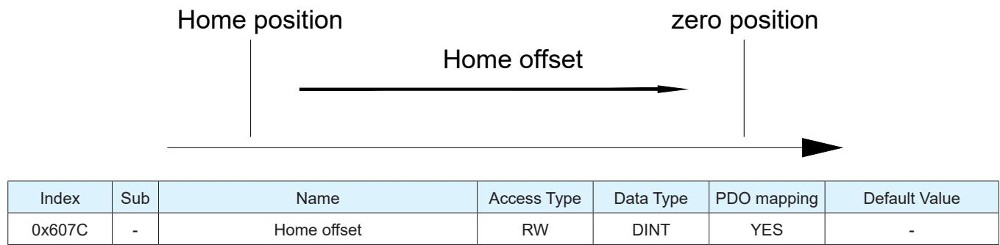

<table><tr><td>Index</td><td>Sub</td><td>Name</td><td>Access Type</td><td>Data Type</td><td>PDO mapping</td><td>Default Value</td></tr><tr><td>0x607C</td><td>-</td><td>Home offset</td><td>RW</td><td>DINT</td><td>YES</td><td>-</td></tr></table>

## 0x607D Software position limit

This object shall indicate the configured maximal and minimal software position limits. These parameters shall define the absolute position limits for the position demand value and the position actual value as specified in below.

<table><tr><td>Index</td><td>Sub</td><td>Name</td><td>Access Type</td><td>Data Type</td><td>PDO mapping</td><td>Default Value</td></tr><tr><td rowspan="3">0x607D</td><td>0</td><td>Number of sub-index</td><td>RW</td><td>USINT8</td><td>NO</td><td>2</td></tr><tr><td>1</td><td>Min position limit</td><td>RW</td><td>DINT</td><td>NO</td><td>-</td></tr><tr><td>2</td><td>Max position limit</td><td>RW</td><td>DINT</td><td>NO</td><td>-</td></tr></table>

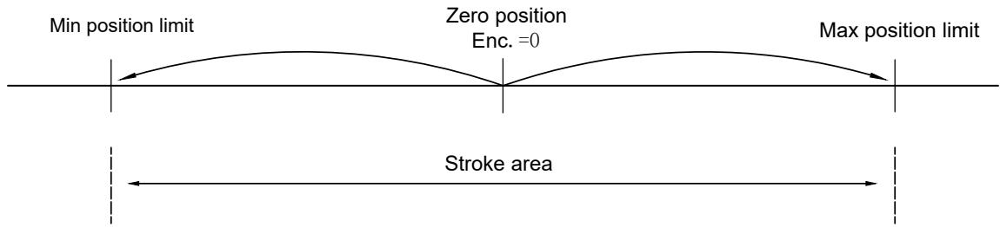

0x607E Polarity

Position demand value and position actual value are multiplied by 1 or -1 depending on the value of the polarity flag. PP PV Mode.

<table><tr><td>Index</td><td>Sub</td><td>Name</td><td>Access Type</td><td>Data Type</td><td>PDO mapping</td><td>Default Value</td></tr><tr><td>0x607E</td><td>-</td><td>Polarity</td><td>RW</td><td>USINT</td><td>YES</td><td>-</td></tr></table>

<table><tr><td>7</td><td>6</td><td>5</td><td>4</td><td>3</td><td>2</td><td>1</td><td>0</td></tr><tr><td>PositionPolarity</td><td>VelocityPolarity</td><td colspan="6">Reserved</td></tr><tr><td colspan="8">MSB LSB</td></tr><tr><td>Value</td><td colspan="7">Description</td></tr><tr><td>0</td><td colspan="7">Multiply by 1</td></tr><tr><td>1</td><td colspan="7">Multiply by -1</td></tr></table>

## 0x607F Max profile speed

The max profile velocity is the maximum allowed speed in either direction during a profiled move. It is given in the same units as profile velocity.

<table><tr><td>Index</td><td>Sub</td><td>Name</td><td>Access Type</td><td>Data Type</td><td>PDO mapping</td><td>Default Value</td></tr><tr><td>0x607F</td><td>-</td><td>Max profile speed</td><td>RW</td><td>UDINT</td><td>YES</td><td>-</td></tr></table>

The unit of this object is in counts/s.

0x6081 Profile velocity

The profile velocity is the velocity normally attained at the end of the acceleration ramp during a profiled move and is valid for both directions of motion.

<table><tr><td>Index</td><td>Sub</td><td>Name</td><td>Access Type</td><td>Data Type</td><td>PDO mapping</td><td>Default Value</td></tr><tr><td>0x6081</td><td>-</td><td>Profile velocity</td><td>RW</td><td>UDINT</td><td>YES</td><td>-</td></tr></table>

The unit of this object is in counts/s.

## 0x6083 Profile acceleration

The profile acceleration is given in counts/s^2. It is converted to position increments per second2 using the normalizing factors.

<table><tr><td>Index</td><td>Sub</td><td>Name</td><td>Access Type</td><td>Data Type</td><td>PDO mapping</td><td>Default Value</td></tr><tr><td>0x6083</td><td>-</td><td>Profile acceleration</td><td>RW</td><td>UDINT</td><td>YES</td><td>-</td></tr></table>

## 0x6084 Profile deceleration

The profile deceleration is given in the same units as profile acceleration.

<table><tr><td>Index</td><td>Sub</td><td>Name</td><td>Access Type</td><td>Data Type</td><td>PDO mapping</td><td>Default Value</td></tr><tr><td>0x6084</td><td>-</td><td>Profile deceleration</td><td>RW</td><td>UDINT</td><td>YES</td><td>-</td></tr></table>

## 0x6085 Quick stop deceleration

The quick stop deceleration is the deceleration used to stop the motor if the ‘Quick Stop’ command is given and the quick stop option code (see 605Ah) is set to 2. The quick stop deceleration is given in the same units as the profile acceleration.

<table><tr><td>Index</td><td>Sub</td><td>Name</td><td>Access Type</td><td>Data Type</td><td>PDO mapping</td><td>Default Value</td></tr><tr><td>0x6085</td><td>-</td><td>Quick stop deceleration</td><td>RW</td><td>UDINT</td><td>NO</td><td>-</td></tr></table>

## 0x6087 Torque slope

This parameter describes the rate of change of torque in units of per thousand of rated torque per second.

<table><tr><td>Index</td><td>Sub</td><td>Name</td><td>Access Type</td><td>Data Type</td><td>PDO mapping</td><td>Default Value</td></tr><tr><td>0x6087</td><td>-</td><td>Torque slope</td><td>RW</td><td>UDINT</td><td>YES</td><td>-</td></tr></table>

The units is Nm/s.

## 0x6098 Home method

The homing method object determines the method that will be used during homing.

<table><tr><td>Index</td><td>Sub</td><td>Name</td><td>Access Type</td><td>Data Type</td><td>PDO mapping</td><td>Default Value</td></tr><tr><td>0x6098</td><td>-</td><td>Home method</td><td>RW</td><td>SINT</td><td>YES</td><td>-</td></tr></table>

<table><tr><td>Value</td><td>Description</td></tr><tr><td>128</td><td>manufacturer specific</td></tr><tr><td>0</td><td>No homing operation required</td></tr><tr><td>1...37</td><td>Methods 1 to 37</td></tr><tr><td>38-127</td><td>Reserved</td></tr></table>

0x6099 Homing speed

This entry in the object dictionary defines the speeds used during homing.

<table><tr><td>Index</td><td>Sub</td><td>Name</td><td>Access Type</td><td>Data Type</td><td>PDO mapping</td><td>Default Value</td></tr><tr><td rowspan="3">0x6099</td><td>0</td><td>Number of sub-index</td><td>RW</td><td>USINT8</td><td>NO</td><td>2</td></tr><tr><td>1</td><td>Search switch</td><td>RW</td><td>UDINT</td><td>NO</td><td>-</td></tr><tr><td>2</td><td>Search zero</td><td>RW</td><td>UDINT</td><td>NO</td><td>-</td></tr></table>

The value shall be given in counts/s.

0x609A Homing acceleration

The homing acceleration establishes the acceleration to be used for all accelerations and decelerations with the standard homing modes.

<table><tr><td>Index</td><td>Sub</td><td>Name</td><td>Access Type</td><td>Data Type</td><td>PDO mapping</td><td>Default Value</td></tr><tr><td>0x609A</td><td>-</td><td>Homing acceleration</td><td>RW</td><td>UDINT</td><td>YES</td><td>-</td></tr></table>

The value units should be the same as profile acceleration/deceleration objects.

0x60B0 Position ofset

This object shall provide the ofset of the target position.

<table><tr><td>Index</td><td>Sub</td><td>Name</td><td>Access Type</td><td>Data Type</td><td>PDO mapping</td><td>Default Value</td></tr><tr><td>0x60B0</td><td>-</td><td>Position offset</td><td>RW</td><td>DINT</td><td>YES</td><td>-</td></tr></table>

## 0x60B1 Velocity ofset

This object shall provide the ofset for the velocity value. In cyclic synchronous position mode, this object contains the input value for velocity feed forward. In cyclic synchronous velocity mode, it contains the commanded ofset of the drive device.

<table><tr><td>Index</td><td>Sub</td><td>Name</td><td>Access Type</td><td>Data Type</td><td>PDO mapping</td><td>Default Value</td></tr><tr><td>0x60B1</td><td>-</td><td>Velocity offset</td><td>RW</td><td>DINT</td><td>YES</td><td>-</td></tr></table>

## 0x60B2 Torque ofset

This object shall provide the ofset for the torque value. In cyclic synchronous position mode and cyclic synchronous velocity mode, this object contains the input value for torque feed forward. In cyclic synchronous torque mode. it contains the commanded additive torque of the drive, which is added to the target torque value.

<table><tr><td>Index</td><td>Sub</td><td>Name</td><td>Access Type</td><td>Data Type</td><td>PDO mapping</td><td>Default Value</td></tr><tr><td>0x60B2</td><td>-</td><td>Torque offset</td><td>RW</td><td>INT</td><td>YES</td><td>-</td></tr></table>

## 0x60B8 Touch probe function

This object shall indicate the configured function of the touch probe.

<table><tr><td>Index</td><td>Sub</td><td>Name</td><td>Access Type</td><td>Data Type</td><td>PDO mapping</td><td>Default Value</td></tr><tr><td>0x60B8</td><td>-</td><td>Touch probe function</td><td>RW</td><td>UINT</td><td>YES</td><td>-</td></tr></table>

<table><tr><td>Bit</td><td>Value</td><td>Definition</td></tr><tr><td>0</td><td>0</td><td>Swith off touch probe 1</td></tr><tr><td></td><td>1</td><td>Enable touch probe 1</td></tr><tr><td>1</td><td>0</td><td>Trigger first event</td></tr><tr><td></td><td>1</td><td>Continuous</td></tr><tr><td>3,2</td><td>00</td><td>Trigger with touch probe 1 input</td></tr><tr><td></td><td>01</td><td>Trigger with zero impulse signal or position encoder</td></tr><tr><td></td><td>10</td><td>Touch probe source as defined in object 60D0, sub-index01</td></tr><tr><td></td><td>11</td><td>Reserved</td></tr><tr><td>4</td><td>0</td><td>Switch off sampling at positive edge of touch probe 1</td></tr><tr><td></td><td>1</td><td>Enable sampling at positive edge of touch probe 1</td></tr><tr><td>5</td><td>0</td><td>Switch off sampling at negative edge of touch probe 1</td></tr><tr><td></td><td>1</td><td>Enable sampling at negative edge of touch probe 1</td></tr><tr><td>6,7</td><td>-</td><td>Reserved</td></tr><tr><td>8</td><td>0</td><td>Swith off touch probe 2</td></tr><tr><td></td><td>1</td><td>Enable touch probe 2</td></tr><tr><td>9</td><td>0</td><td>Trigger first event</td></tr><tr><td></td><td>1</td><td>Continuous</td></tr><tr><td>11,10</td><td>00</td><td>Trigger with touch probe 2 input</td></tr><tr><td></td><td>01</td><td>Trigger with zero impulse signal or position encoder</td></tr><tr><td></td><td>10</td><td>Touch probe source as defined in object 60D0, sub-index02</td></tr><tr><td></td><td>11</td><td>Reserved</td></tr><tr><td>12</td><td>0</td><td>Switch off sampling at positive edge of touch probe 2</td></tr><tr><td></td><td>1</td><td>Enable sampling at positive edge of touch probe 2</td></tr><tr><td>13</td><td>0</td><td>Switch off sampling at negative edge of touch probe 2</td></tr><tr><td></td><td>1</td><td>Enable sampling at negative edge of touch probe 2</td></tr><tr><td>14,15</td><td>-</td><td>Reserved</td></tr></table>

## 0x60B9 Touch probe status

This object shall provide the status of the touch probe.

<table><tr><td>Index</td><td>Sub</td><td>Name</td><td>Access Type</td><td>Data Type</td><td>PDO mapping</td><td>Default Value</td></tr><tr><td>0x60B9</td><td>-</td><td>Velocity offset</td><td>RW</td><td>DINT</td><td>YES</td><td>-</td></tr></table>

<table><tr><td>Bit</td><td>Value</td><td>Definition</td></tr><tr><td rowspan="2">0</td><td>0</td><td>Touch probe 1 is switched off</td></tr><tr><td>1</td><td>Touch probe 1 is enabled</td></tr><tr><td rowspan="2">1</td><td>0</td><td>Touch probe 1 no positive edge value stored</td></tr><tr><td>1</td><td>Touch probe 1 positive edge position stored</td></tr><tr><td rowspan="2">2</td><td>0</td><td>Touch probe 1 no negative edge value stored</td></tr><tr><td>1</td><td>Touch probe 1 negative edge position stored</td></tr><tr><td>3...7</td><td>-</td><td>Reserved</td></tr><tr><td rowspan="2">8</td><td>0</td><td>Touch probe 2 is switched off</td></tr><tr><td>1</td><td>Touch probe 2 is enabled</td></tr><tr><td rowspan="2">9</td><td>0</td><td>Touch probe 2 no positive edge value stored</td></tr><tr><td>1</td><td>Touch probe 2 positive edge position stored</td></tr><tr><td rowspan="2">10</td><td>0</td><td>Touch probe 2 no negative edge value stored</td></tr><tr><td>1</td><td>Touch probe 2 negative edge position stored</td></tr><tr><td>11...15</td><td>-</td><td>Reserved</td></tr></table>

0x60BA Touch probe 1 positive edge

This object shall provide the position value of the touch probe 1 at positive edge.

<table><tr><td>Index</td><td>Sub</td><td>Name</td><td>Access Type</td><td>Data Type</td><td>PDO mapping</td><td>Default Value</td></tr><tr><td>0x60BA</td><td>-</td><td>Touch probe 1 positive edge</td><td>RO</td><td>DINT</td><td>YES</td><td>-</td></tr></table>

## 0x60BB Touch probe 1 negative edge

This object shall provide the position value of the touch probe 1 at negative edge.

<table><tr><td>Index</td><td>Sub</td><td>Name</td><td>Access Type</td><td>Data Type</td><td>PDO mapping</td><td>Default Value</td></tr><tr><td>0x60BB</td><td>-</td><td>Touch probe 1 negative edge</td><td>RO</td><td>DINT</td><td>YES</td><td>-</td></tr></table>

## 0x60BC Touch probe 2 positive edge

This object shall provide the position value of the touch probe 2 at positive edge.

<table><tr><td>Index</td><td>Sub</td><td>Name</td><td>Access Type</td><td>Data Type</td><td>PDO mapping</td><td>Default Value</td></tr><tr><td>0x60BD</td><td>-</td><td>Touch probe 1 negative edge</td><td>RO</td><td>DINT</td><td>YES</td><td>-</td></tr></table>

0x60BD Touch probe 2 negative edge

This object shall provide the position value of the touch probe 2 at negative edge.

<table><tr><td>Index</td><td>Sub</td><td>Name</td><td>Access Type</td><td>Data Type</td><td>PDO mapping</td><td>Default Value</td></tr><tr><td>0x60BD</td><td>-</td><td>Touch probe 1 negative edge</td><td>RO</td><td>DINT</td><td>YES</td><td>-</td></tr></table>

## 0x60E0 Positive torque limit value

This object shall indicate the configured maximum positive torque in the motor. Positive torque takes efect in the case of motive operation is positive velocity or regenerative operation is negative velocity.

<table><tr><td>Index</td><td>Sub</td><td>Name</td><td>Access Type</td><td>Data Type</td><td>PDO mapping</td><td>Default Value</td></tr><tr><td>0x60E0</td><td>-</td><td>Positive torque limit value</td><td>RW</td><td>UINT</td><td>YES</td><td>-</td></tr></table>

## 0x60E1 Negative torque limit value

This object shall indicate the configured maximum negative torque in the motor. Negative torque takes efect in the case of motive operation is negative velocity or regenerative operation is positive velocity.

<table><tr><td>Index</td><td>Sub</td><td>Name</td><td>Access Type</td><td>Data Type</td><td>PDO mapping</td><td>Default Value</td></tr><tr><td>0x60E1</td><td>-</td><td>Positive torque limit value</td><td>RW</td><td>UINT</td><td>YES</td><td>-</td></tr></table>

## 0x60F4 Follow error actual value

This object shall provide the actual value of the following error.

<table><tr><td>Index</td><td>Sub</td><td>Name</td><td>Access Type</td><td>Data Type</td><td>PDO mapping</td><td>Default Value</td></tr><tr><td>0x60F4</td><td>-</td><td>Follow error actual value</td><td>RO</td><td>DINT</td><td>YES</td><td>-</td></tr></table>

## 0x60FD Digital inputs

This object shall provide digital inputs. This object shall represent the logical input levels.

<table><tr><td>Index</td><td>Sub</td><td>Name</td><td>Access Type</td><td>Data Type</td><td>PDO mapping</td><td>Default Value</td></tr><tr><td>0x60FD</td><td>-</td><td>Digital inputs</td><td>RO</td><td>UDINT</td><td>YES</td><td>-</td></tr></table>

<table><tr><td>31</td><td>24</td><td>23</td><td>22</td><td>21</td><td>20</td><td>19</td><td>18</td><td>17</td><td>16</td><td>15</td><td>4</td><td>3</td><td>2</td><td>1</td><td>0</td></tr><tr><td colspan="2">Reserved</td><td>X8</td><td>X7</td><td>X6</td><td>X5</td><td>X4</td><td>X3</td><td>X2</td><td>X1</td><td colspan="2">Reserved</td><td>Interlock</td><td>Home switch</td><td>Positive limit switch</td><td>Negative limit switch</td></tr></table>

MSB

Bit 3 (interlock) provides the state of the interlock input. If the logical input signal changes to not activated, the drive shall enter the switch on disabled or fault reaction active state. This means the power stage of the drive is disabled and locked against switching on.

## 0x60FE Digital outputs

This object shall command the digital outputs. This object shall represent the logical output levels.

<table><tr><td>Index</td><td>Sub</td><td>Name</td><td>Access Type</td><td>Data Type</td><td>PDO mapping</td><td>Default Value</td></tr><tr><td>0x60FE</td><td>0</td><td>Number of sub-index</td><td>RW</td><td>USINT8</td><td>NO</td><td>2</td></tr><tr><td></td><td>1</td><td>Physical outputs</td><td>RW</td><td>UDINT</td><td>YES</td><td>-</td></tr><tr><td></td><td>2</td><td>Bit mask</td><td>RW</td><td>UDINT</td><td>NO</td><td>-</td></tr></table>

The first sub-index defines the assigned outputs. The second sub-index describes a mask to specify which of the outputs shall be used.

Note: the second sub-index are edge triggered, you must set the second sub-index first and then set the bit of first sub-index for change the status of output.

Physical outputs:

<table><tr><td>31</td><td>20</td><td>19</td><td>18</td><td>17</td><td>16</td><td>15</td><td>0</td></tr><tr><td colspan="2">Reserved</td><td>Y4</td><td>Y3</td><td>Y2</td><td>Y1</td><td colspan="2">Reserved</td></tr><tr><td colspan="7">MSB</td><td>LSB</td></tr></table>

<table><tr><td>Field</td><td>Value</td><td>Definition</td></tr><tr><td rowspan="2">Each bit</td><td>0</td><td>Switch off</td></tr><tr><td>1</td><td>Switch on</td></tr></table>

## Bit mask:

<table><tr><td>31</td><td>20</td><td>19</td><td>18</td><td>17</td><td>16</td><td>15</td><td>0</td></tr><tr><td colspan="2">Reserved</td><td>Y4</td><td>Y3</td><td>Y2</td><td>Y1</td><td colspan="2">Reserved</td></tr><tr><td colspan="7">MSB</td><td>LSB</td></tr></table>

<table><tr><td>Field</td><td>Value</td><td>Definition</td></tr><tr><td rowspan="2">Each bit</td><td>0</td><td>Disable output</td></tr><tr><td>1</td><td>Enable output</td></tr></table>

## 0x60FF Target velocity

This object shall indicate the configured target velocity and shall be used as input for the trajectory generator. The value shall be given in counts/s.

<table><tr><td>Index</td><td>Sub</td><td>Name</td><td>Access Type</td><td>Data Type</td><td>PDO mapping</td><td>Default Value</td></tr><tr><td>0x60FF</td><td>-</td><td>Target velocity</td><td>RW</td><td>DINT</td><td>YES</td><td>-</td></tr></table>

## 0x6502 Supported drive modes

This object shall provide information on the supported drive modes.

<table><tr><td>Index</td><td>Sub</td><td colspan="5">Name</td><td colspan="2">Access Type</td><td colspan="2">Data Type</td><td colspan="2">PDO mapping</td><td colspan="2">Default Value</td></tr><tr><td>0x6502</td><td>-</td><td colspan="5">Supported drive modes</td><td colspan="2">RO</td><td colspan="2">UDINT</td><td colspan="2">NO</td><td colspan="2">-</td></tr><tr><td colspan="15">31 16 15 11 10 9 8 7 6 5 4 3 2 1 0</td></tr><tr><td colspan="2">Reserved</td><td>Reserved</td><td>CSTCA</td><td>CST</td><td>CSV</td><td>CSP</td><td>IP</td><td>HM</td><td>R</td><td>TQ</td><td>PV</td><td>VL</td><td>PP</td><td></td></tr></table>

The supported mode in Moons' EtherCAT drive:

• Bit0: Profile Position Mode

• Bit2: Profile Velocity Mode

• Bit3: Profile Torque Mode ( StepSERVO)

• Bit5: Homing Mode

• Bit7: CSP

• Bit8: CSV

<table><tr><td>Index</td><td>Sub</td><td colspan="2">Name</td><td>Access Type</td><td>Data Type</td><td>PDO mapping</td><td>Default Value</td></tr><tr><td>0x2002</td><td>-</td><td colspan="2">Output status</td><td>RO</td><td>UDINT</td><td>NO</td><td>0x000F0000</td></tr><tr><td colspan="8">Bit 31 20 19 18 17 16 15 0</td></tr><tr><td>Output</td><td colspan="2">Reserved</td><td>Y4</td><td>Y3</td><td>Y2</td><td>Y1</td><td>Reserved</td></tr></table>

This object shall indicate the digital output status.

## 4.4 Manufacturer profile

<table><tr><td rowspan="23">0x2000~2100h</td><td>Index</td><td>Sub</td><td>Name</td><td>Access</td><td>Type</td><td>Mapping</td></tr><tr><td>0x2001</td><td>-</td><td>Home switch</td><td>RW</td><td>UINT8</td><td>YES</td></tr><tr><td>0x2002</td><td>-</td><td>Output status</td><td>RO</td><td>UDINT</td><td>NO</td></tr><tr><td>0x2006</td><td>-</td><td>Clear alarm</td><td>WO</td><td>UINT8</td><td>YES</td></tr><tr><td>0x2007</td><td>-</td><td>Q segment NO.</td><td>RW</td><td>UINT8</td><td>YES</td></tr><tr><td>0x200B</td><td>-</td><td>DSP status code</td><td>RO</td><td>UINT32</td><td>YES</td></tr><tr><td>0x200C</td><td>-</td><td>Zero position</td><td>WO</td><td>UINT8</td><td>NO</td></tr><tr><td>0x200F</td><td>-</td><td>DSP alarm code</td><td>RO</td><td>UINT32</td><td>YES</td></tr><tr><td>0x2019</td><td>-</td><td>Device temperature</td><td>RO</td><td>UINT</td><td>NO</td></tr><tr><td>0x201F</td><td>-</td><td>S-Curve filter time</td><td>RW</td><td>UINT</td><td>NO</td></tr><tr><td>0x2020</td><td>-</td><td>Physical address</td><td>RW</td><td>UINT16</td><td>NO</td></tr><tr><td>0x2021</td><td>-</td><td>EtherCAT ID</td><td>RW</td><td>UINT16</td><td>NO</td></tr><tr><td>0x2022</td><td>-</td><td>Alias source</td><td>RO</td><td>UINT</td><td>NO</td></tr><tr><td>0x2030</td><td>-</td><td>Bus voltage</td><td>RO</td><td>UINT16</td><td>NO</td></tr><tr><td>0x2031</td><td>-</td><td>DSP version</td><td>RO</td><td>STRING(10)</td><td>NO</td></tr><tr><td>0x2036</td><td>-</td><td>Move homeoffset</td><td>RW</td><td>UINT</td><td>NO</td></tr><tr><td>0x2040</td><td>-</td><td>Q controlword</td><td>RW</td><td>UINT</td><td>YES</td></tr><tr><td>0x2041</td><td>-</td><td>Q statusword</td><td>RW</td><td>UINT</td><td>YES</td></tr><tr><td rowspan="5">0x2100</td><td>-</td><td>User registers</td><td>-</td><td>-</td><td>-</td></tr><tr><td>1</td><td>User register 1</td><td>RW</td><td>DINT</td><td>YES</td></tr><tr><td>2</td><td>User register 2</td><td>RW</td><td>DINT</td><td>YES</td></tr><tr><td>...</td><td>...</td><td>...</td><td>...</td><td>...</td></tr><tr><td>23</td><td>User register 23</td><td>RW</td><td>DINT</td><td>YES</td></tr></table>

0x2001 Home switch

This object shall configure the number of Inputs as the Home switch in Homing mode.

<table><tr><td>Index</td><td>Sub</td><td colspan="3">Name</td><td colspan="2">Access Type</td><td>Data Type</td><td>PDO mapping</td><td>Default Value</td></tr><tr><td>0x2001</td><td>-</td><td colspan="3">Home switch</td><td colspan="2">RW</td><td>USINT</td><td>NO</td><td>-</td></tr><tr><td colspan="10"></td></tr><tr><td colspan="2">Value</td><td>8</td><td>7</td><td>6</td><td>5</td><td>4</td><td>3</td><td>2</td><td>1</td></tr><tr><td colspan="2">Output</td><td>X8</td><td>X7</td><td>X6</td><td>X5</td><td>X4</td><td>X3</td><td>X2</td><td>X1</td></tr></table>

## 0x2002 Output status

## 0x2006 Clear alarm

This object provides the feature to clear alarm of the drives.

<table><tr><td>Index</td><td>Sub</td><td>Name</td><td>Access Type</td><td>Data Type</td><td>PDO mapping</td><td>Default Value</td></tr><tr><td>0x2006</td><td>-</td><td>Clear alarm</td><td>RW</td><td>USINT</td><td>YES</td><td>-</td></tr></table>

${ \mathsf { S T F } } ^ { \star \star } { \mathsf { \mathrm { - } } } { \mathsf { E C } } ,$ , SSDC\*\*-EC: Set to 0x01 can clear all alarm

STF\*\*-ECX, SSDC\*\*-ECX: Set the value with 0x55 to 0xAA can clear all alarm

0x2007 Q segment NO.

This object shall configure the number of Q Segment will be executed in Q mode.

<table><tr><td>Index</td><td>Sub</td><td>Name</td><td>Access Type</td><td>Data Type</td><td>PDO mapping</td><td>Default Value</td></tr><tr><td>0x2007</td><td>-</td><td>Q segment NO.</td><td>RW</td><td>USINT</td><td>YES</td><td>0</td></tr></table>

## 0x200B DSP status code

This object represents the current status code of the drive.

<table><tr><td>Index</td><td>Sub</td><td>Name</td><td>Access Type</td><td>Data Type</td><td>PDO mapping</td><td>Default Value</td></tr><tr><td>0x200B</td><td>-</td><td>DSP status code</td><td>RO</td><td>UDINT</td><td>YES</td><td>-</td></tr></table>

<table><tr><td>BIT</td><td>Status Code Bit Definition</td></tr><tr><td>0</td><td>Motor Enabled - motor disabled is this bit = 0</td></tr><tr><td>1</td><td>Sampling - for Quick Tuner</td></tr><tr><td>2</td><td>Drive Fault - check alarm code</td></tr><tr><td>3</td><td>In Position - motor is in position</td></tr><tr><td>4</td><td>Moving - motor is moving</td></tr><tr><td>5</td><td>Jogging - currently in jog mode</td></tr><tr><td>6</td><td>Stopping - in the process of stopping from a stop command</td></tr><tr><td>7</td><td>Waiting - for an input</td></tr><tr><td>8</td><td>Saving - parameter data is being saved</td></tr><tr><td>9</td><td>Alarm present - check alarm code</td></tr><tr><td>10</td><td>Homing - executing an SH command</td></tr><tr><td>11</td><td>Wait Time - executing a WT command</td></tr><tr><td>12</td><td>Wizard running - timing wizard is running</td></tr><tr><td>13</td><td>Checking encoder - timing wizard is running</td></tr><tr><td>14</td><td>Q Program is running</td></tr><tr><td>15</td><td>Initializing</td></tr></table>

0x200C Zero position

This object provides the feature to zero all position parameters, such as position actual value (which index is 0x6064h).Set this value to 01h can zero all position parameters.

<table><tr><td>Index</td><td>Sub</td><td>Name</td><td>Access Type</td><td>Data Type</td><td>PDO mapping</td><td>Default Value</td></tr><tr><td>0x200C</td><td>-</td><td>Zero position</td><td>RW</td><td>USINT</td><td>NO</td><td>-</td></tr></table>

## 0x200F DSP alarm code

This object shall indicate the high 16bit field of alarm code about the object at 0x603F.

<table><tr><td>Index</td><td>Sub</td><td>Name</td><td>Access Type</td><td>Data Type</td><td>PDO mapping</td><td>Default Value</td></tr><tr><td>0x200F</td><td>-</td><td>DSP alarm code</td><td>RO</td><td>UDINT</td><td>YES</td><td>-</td></tr></table>

## 0x2019 Device temperature

This object contains the information of device temperature.

<table><tr><td>Index</td><td>Sub</td><td>Name</td><td>Access Type</td><td>Data Type</td><td>PDO mapping</td><td>Default Value</td></tr><tr><td>0x2019</td><td>-</td><td>Device temperature</td><td>RO</td><td>UINT</td><td>NO</td><td>-</td></tr></table>

The unit of this object is in 0.1 centigrade.

0x201F S-Curve filter time

This object is used to be set the S-Curve fliter time.

<table><tr><td>Index</td><td>Sub</td><td>Name</td><td>Access Type</td><td>Data Type</td><td>PDO mapping</td><td>Default Value</td></tr><tr><td>0x201F</td><td>-</td><td>S-Curve filter time</td><td>RW</td><td>UINT</td><td>NO</td><td>-</td></tr></table>

## 0x2020 Physical address

This object contains the physical address of drives.

<table><tr><td>Index</td><td>Sub</td><td>Name</td><td>Access Type</td><td>Data Type</td><td>PDO mapping</td><td>Default Value</td></tr><tr><td>0x2020</td><td>-</td><td>Physical address</td><td>RO</td><td>UINT</td><td>NO</td><td>-</td></tr></table>

## 0x2021 EtherCAT ID

This object contains the EtherCAT ID of drives.

<table><tr><td>Index</td><td>Sub</td><td>Name</td><td>Access Type</td><td>Data Type</td><td>PDO mapping</td><td>Default Value</td></tr><tr><td>0x2021</td><td>-</td><td>EtherCAT ID</td><td>RO</td><td>UINT</td><td>NO</td><td>-</td></tr></table>

## 0x2022 Alias source

This object is used to set the methold of EtherCAT address setting. The value is 0 means that set by software, 1 means set by the EtherCAT master.

<table><tr><td>Index</td><td>Sub</td><td>Name</td><td>Access Type</td><td>Data Type</td><td>PDO mapping</td><td>Default Value</td></tr><tr><td>0x2022</td><td>-</td><td>Alias source</td><td>RO</td><td>UINT</td><td>NO</td><td>-</td></tr></table>

## 0x2030 Bus voltage

This object shall provide the present value of drive's DC bus voltage.

<table><tr><td>Index</td><td>Sub</td><td>Name</td><td>Access Type</td><td>Data Type</td><td>PDO mapping</td><td>Default Value</td></tr><tr><td>0x2030</td><td>-</td><td>Bus voltage</td><td>RO</td><td>UINT</td><td>NO</td><td>-</td></tr></table>

The voltage reads out in 0.1 volts revolution.

## 0x2031 DSP version

This object shall provide the DSP version of the drive.

<table><tr><td>Index</td><td>Sub</td><td>Name</td><td>Access Type</td><td>Data Type</td><td>PDO mapping</td><td>Default Value</td></tr><tr><td>0x2031</td><td>-</td><td>DSP version</td><td>RO</td><td>STRING(10)</td><td>NO</td><td>-</td></tr></table>

## 0x2036 Homing ofset mode

This object is used to set homing ofset mode.

<table><tr><td>Object Type</td><td>Data Type</td><td>Access Type</td><td>PDO mapping</td><td>COS</td><td>Default Value</td></tr><tr><td>VAR</td><td>UINT16</td><td>RW</td><td>NO</td><td>NO</td><td>0</td></tr></table>

Set the value to 0:

The motor will be stopped on machine home position and the current position value is the home ofset. Set the value to 1:

The motor will moving with a distance that home ofset provided after the machine home position has found. The new position is the zero position.

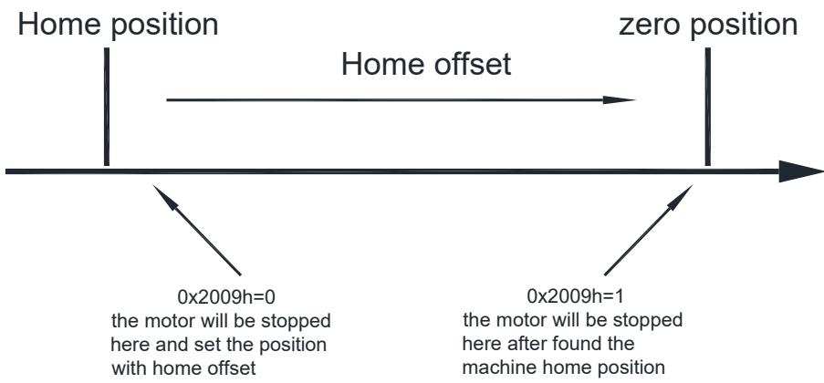

0x2040 Q controlword

This object is used to execute the Q program.

<table><tr><td>Index</td><td>Sub</td><td>Name</td><td>Access type</td><td>Date type</td><td>PDO mapping</td><td>Default value</td></tr><tr><td>0x2040</td><td>-</td><td>Q controlword</td><td>RW</td><td>UINT</td><td>YES</td><td>0</td></tr></table>

## 0x2041 Q controlword

This object provide the status of Q program.

<table><tr><td>Index</td><td>Sub</td><td>Name</td><td>Access type</td><td>Date type</td><td>PDO mapping</td><td>Default value</td></tr><tr><td>0x2041</td><td>-</td><td>Q statusword</td><td>RO</td><td>UINT</td><td>YES</td><td>0x400</td></tr></table>

The value is 0x400 means that the Q program is not running, 0x000 means that is running.

## 0x2100 User registers

This object provide user 23 general purpose registers. They are volatile, so the information sent there will not be saved after a power cycle.

<table><tr><td>Index</td><td>Sub</td><td>Name</td><td>Access Type</td><td>Data Type</td><td>PDO mapping</td><td>Default Value</td></tr><tr><td rowspan="24">0x2100</td><td>0</td><td>Number of sub-index</td><td>RO</td><td>USINT</td><td>NO</td><td>23</td></tr><tr><td>1</td><td>User register1</td><td>RW</td><td>DINT</td><td>YES</td><td>-</td></tr><tr><td>2</td><td>User register2</td><td>RW</td><td>DINT</td><td>YES</td><td>-</td></tr><tr><td>3</td><td>User register3</td><td>RW</td><td>DINT</td><td>YES</td><td>-</td></tr><tr><td>4</td><td>User register4</td><td>RW</td><td>DINT</td><td>YES</td><td>-</td></tr><tr><td>5</td><td>User register5</td><td>RW</td><td>DINT</td><td>YES</td><td>-</td></tr><tr><td>6</td><td>User register6</td><td>RW</td><td>DINT</td><td>YES</td><td>-</td></tr><tr><td>7</td><td>User register7</td><td>RW</td><td>DINT</td><td>YES</td><td>-</td></tr><tr><td>8</td><td>User register8</td><td>RW</td><td>DINT</td><td>YES</td><td>-</td></tr><tr><td>9</td><td>User register9</td><td>RW</td><td>DINT</td><td>YES</td><td>-</td></tr><tr><td>10</td><td>User register10</td><td>RW</td><td>DINT</td><td>YES</td><td>-</td></tr><tr><td>11</td><td>User register11</td><td>RW</td><td>DINT</td><td>YES</td><td>-</td></tr><tr><td>12</td><td>User register12</td><td>RW</td><td>DINT</td><td>YES</td><td>-</td></tr><tr><td>13</td><td>User register13</td><td>RW</td><td>DINT</td><td>YES</td><td>-</td></tr><tr><td>14</td><td>User register14</td><td>RW</td><td>DINT</td><td>YES</td><td>-</td></tr><tr><td>15</td><td>User register15</td><td>RW</td><td>DINT</td><td>YES</td><td>-</td></tr><tr><td>16</td><td>User register16</td><td>RW</td><td>DINT</td><td>YES</td><td>-</td></tr><tr><td>17</td><td>User register17</td><td>RW</td><td>DINT</td><td>YES</td><td>-</td></tr><tr><td>18</td><td>User register18</td><td>RW</td><td>DINT</td><td>YES</td><td>-</td></tr><tr><td>19</td><td>User register19</td><td>RW</td><td>DINT</td><td>YES</td><td>-</td></tr><tr><td>20</td><td>User register20</td><td>RW</td><td>DINT</td><td>YES</td><td>-</td></tr><tr><td>21</td><td>User register21</td><td>RW</td><td>DINT</td><td>YES</td><td>-</td></tr><tr><td>22</td><td>User register22</td><td>RW</td><td>DINT</td><td>YES</td><td>-</td></tr><tr><td>23</td><td>User register23</td><td>RW</td><td>DINT</td><td>YES</td><td>-</td></tr></table>

4.5 Manufacturer parameter for StepSERVO

<table><tr><td rowspan="42">0x2200~2300h</td><td>Index</td><td>Sub</td><td>Name</td><td>Access</td><td>Type</td><td>Mapping</td></tr><tr><td>0x2200</td><td>-</td><td>Continuous current</td><td>RW</td><td>UINT</td><td>NO</td></tr><tr><td>0x2201</td><td>-</td><td>Peak current</td><td>RW</td><td>UINT</td><td>NO</td></tr><tr><td>0x2202</td><td>-</td><td>Hard stop current limit</td><td>RW</td><td>UINT</td><td>NO</td></tr><tr><td>0x2203</td><td>-</td><td>Idle current</td><td>RW</td><td>UINT</td><td>NO</td></tr><tr><td>0x2204</td><td>-</td><td>Idle current delay time</td><td>RW</td><td>UINT</td><td>NO</td></tr><tr><td>0x2205</td><td>-</td><td>Acceleration current</td><td>RW</td><td>UINT</td><td>NO</td></tr><tr><td>0x2206</td><td>-</td><td>Stall prevention time</td><td>RW</td><td>UINT</td><td>NO</td></tr><tr><td>0x2207</td><td>-</td><td>Steps per rev</td><td>RO</td><td>UINT</td><td>NO</td></tr><tr><td>0x2208</td><td>-</td><td>Reverse motor direction</td><td>RW</td><td>UINT</td><td>NO</td></tr><tr><td>0x2209</td><td>-</td><td>Powerup probing</td><td>RW</td><td>UINT</td><td>NO</td></tr><tr><td>0x220B</td><td>-</td><td>Fault output on Y1</td><td>RW</td><td>UINT</td><td>NO</td></tr><tr><td rowspan="4">0x220C</td><td>-</td><td>Brake output on Y2</td><td>-</td><td>-</td><td>-</td></tr><tr><td>1</td><td>Brake output</td><td>RW</td><td>UINT</td><td>NO</td></tr><tr><td>2</td><td>Brake disengage delay</td><td>RW</td><td>UINT</td><td>NO</td></tr><tr><td>3</td><td>Brake engage delay</td><td>RW</td><td>UINT</td><td>NO</td></tr><tr><td rowspan="5">0x220D</td><td>-</td><td>Motion output</td><td>-</td><td>-</td><td>-</td></tr><tr><td>1</td><td>Motion output on Y1</td><td>RW</td><td>UINT</td><td>NO</td></tr><tr><td>2</td><td>Motion output on Y2</td><td>RW</td><td>UINT</td><td>NO</td></tr><tr><td>3</td><td>Motion output on Y3</td><td>RW</td><td>UINT</td><td>NO</td></tr><tr><td>4</td><td>Motion output on Y4</td><td>RW</td><td>UINT</td><td>NO</td></tr><tr><td>0x220E</td><td>-</td><td>Alarm reset on input X6</td><td>RW</td><td>UINT</td><td>NO</td></tr><tr><td>0x220F</td><td>-</td><td>Define limits</td><td>RW</td><td>UINT</td><td>NO</td></tr><tr><td rowspan="5">0x2210</td><td>-</td><td>Inputs filter</td><td>-</td><td>-</td><td>-</td></tr><tr><td>1</td><td>Inputs filter X1 filter time</td><td>RW</td><td>UINT</td><td>NO</td></tr><tr><td>2</td><td>Inputs filter X2 filter time</td><td>RW</td><td>UINT</td><td>NO</td></tr><tr><td>...</td><td>...</td><td>...</td><td>...</td><td>...</td></tr><tr><td>8</td><td>Inputs filter X8 filter time</td><td>RW</td><td>UINT</td><td>NO</td></tr><tr><td rowspan="5">0x2211</td><td>-</td><td>Notch filter</td><td>-</td><td>-</td><td>-</td></tr><tr><td>1</td><td>Notch filter_paraA</td><td>RW</td><td>INT</td><td>NO</td></tr><tr><td>2</td><td>Notch filter_paraB</td><td>RW</td><td>INT</td><td>NO</td></tr><tr><td>...</td><td>...</td><td>...</td><td>...</td><td>...</td></tr><tr><td>8</td><td>Notch filter_paraH</td><td>RW</td><td>INT</td><td>NO</td></tr><tr><td rowspan="6">0x2212</td><td>-</td><td>Analog configuration</td><td>-</td><td>-</td><td>-</td></tr><tr><td>1</td><td>Analog deadband</td><td>RW</td><td>UINT</td><td>NO</td></tr><tr><td>2</td><td>Analog offset vallue</td><td>RW</td><td>UINT</td><td>NO</td></tr><tr><td>3</td><td>Analog filter</td><td>RW</td><td>UINT</td><td>NO</td></tr><tr><td>4</td><td>Analog threshold</td><td>RW</td><td>UINT</td><td>NO</td></tr><tr><td>5</td><td>Analog scaling</td><td>RW</td><td>UINT</td><td>NO</td></tr><tr><td>0x2213</td><td>-</td><td>Analog auto zero</td><td>RW</td><td>UINT</td><td>NO</td></tr><tr><td>0x2214</td><td>-</td><td>Operation mode</td><td>RW</td><td>UINT</td><td>NO</td></tr><tr><td>0x2215</td><td>-</td><td>Jog mode</td><td>RW</td><td>UINT</td><td>NO</td></tr></table>

## 0x2200 Continuous current

This object is used to set the continuous (RMS) current of the StepSERVO drives.

<table><tr><td>Index</td><td>Sub</td><td>Name</td><td>Access Type</td><td>Data Type</td><td>PDO mapping</td><td>Default Value</td></tr><tr><td>0x2200</td><td>-</td><td>Continuous current</td><td>RW</td><td>UINT</td><td>NO</td><td>-</td></tr></table>

0x2201 Peak current

This object is used to set the peak (RMS) current of the StepSERVO drives.

<table><tr><td>Index</td><td>Sub</td><td>Name</td><td>Access Type</td><td>Data Type</td><td>PDO mapping</td><td>Default Value</td></tr><tr><td>0x2201</td><td>-</td><td>Peak current</td><td>RW</td><td>UINT</td><td>NO</td><td>-</td></tr></table>

## 0x2202 Hardstop current limit

This object is used for hard stop homing mode that setting the current when the motor hit the hard stop position.

<table><tr><td>Index</td><td>Sub</td><td>Name</td><td>Access Type</td><td>Data Type</td><td>PDO mapping</td><td>Default Value</td></tr><tr><td>0x2202</td><td>-</td><td>Hardstop current limit</td><td>RW</td><td>UINT</td><td>NO</td><td>-</td></tr></table>

## 0x2203 Idle current

This object configures monitors the motor holding current of the device in idle mode.

<table><tr><td>Index</td><td>Sub</td><td>Name</td><td>Access Type</td><td>Data Type</td><td>PDO mapping</td><td>Default Value</td></tr><tr><td>0x2203</td><td>-</td><td>Idle current</td><td>RW</td><td>UINT</td><td>NO</td><td>-</td></tr></table>

The value shall be given in mA, If the reading value is 100. That means 1.00Amps.

0x2204 Idle current delay time

This object is used to set the amount of time the drive will delay before transitioning from full current (CC) to idle current(CI).

<table><tr><td>Index</td><td>Sub</td><td>Name</td><td>Access Type</td><td>Data Type</td><td>PDO mapping</td><td>Default Value</td></tr><tr><td>0x2204</td><td>-</td><td>Idle current delay time</td><td>RW</td><td>UINT</td><td>NO</td><td>-</td></tr></table>

The value shall be given in second, If the reading value is 10. That means 1.0 seconds.

0x2205 Acceleration current

This object shall provide the acceleration current when the motor is running with stepper mode.

<table><tr><td>Index</td><td>Sub</td><td>Name</td><td>Access Type</td><td>Data Type</td><td>PDO mapping</td><td>Default Value</td></tr><tr><td>0x2205</td><td>-</td><td>Acceleration current</td><td>RW</td><td>UINT</td><td>NO</td><td>-</td></tr></table>

If the reading value is 100 that means 1.00Amps.

0x2206 Stall prevention time

This obeject is used to set the stall prevention time.

<table><tr><td>Index</td><td>Sub</td><td>Name</td><td>Access Type</td><td>Data Type</td><td>PDO mapping</td><td>Default Value</td></tr><tr><td>0x2206</td><td>-</td><td>Stall precention time</td><td>RW</td><td>UINT</td><td>NO</td><td>-</td></tr></table>

If the value is 10 means set to 0.1 second.

## 0x2207 Steps per rev

This object is used to get the steps per revolution about motor.

<table><tr><td>Index</td><td>Sub</td><td>Name</td><td>Access Type</td><td>Data Type</td><td>PDO mapping</td><td>Default Value</td></tr><tr><td>0x2207</td><td>-</td><td>Step per rev</td><td>RO</td><td>UINT</td><td>NO</td><td>-</td></tr></table>

The value shall be given in steps/rev.

0x2208 Reverse motor direction

This object is used to reverse motor rotating direction.

<table><tr><td>Index</td><td>Sub</td><td>Name</td><td>Access Type</td><td>Data Type</td><td>PDO mapping</td><td>Default Value</td></tr><tr><td>0x2208</td><td>-</td><td>Reverse motor direction</td><td>RW</td><td>UINT</td><td>NO</td><td>-</td></tr></table>

The value can be set to 0 - 1.

Value =0 default rotating direction =1 reverse rotating direction

## 0x2209 Powerup probing

This obejct is used to set the drive to probe when power up.

<table><tr><td>Index</td><td>Sub</td><td>Name</td><td>Access Type</td><td>Data Type</td><td>PDO mapping</td><td>Default Value</td></tr><tr><td>0x2209</td><td>-</td><td>Powerup probing</td><td>RW</td><td>UINT</td><td>NO</td><td>-</td></tr></table>

Value =0 NO probing =1 Probing

## 0x220B Fault output on Y1

This object is used to set the fault output on Y1.

<table><tr><td>Index</td><td>Sub</td><td>Name</td><td>Access Type</td><td>Data Type</td><td>PDO mapping</td><td>Default Value</td></tr><tr><td>0x220B</td><td>-</td><td>Fault output on Y1</td><td>RW</td><td>UINT</td><td>NO</td><td>-</td></tr></table>

Value =1 output Y1 is open when the driver is fault =2 output Y1 is closed when the driver is fault =3 output Y1 is used for general purpose

## 0x220C Brake output on Y2

This object at 0x220C is used to set the parameter of brake configuration. There has 3 sub-index to configure brake, the first is used for brake output, and the second is used for disengage delay. The last is used to set brake engage delay.

<table><tr><td>Index</td><td>Sub</td><td>Name</td><td>Access Type</td><td>Data Type</td><td>PDO mapping</td><td>Default Value</td></tr><tr><td rowspan="4">0x220C</td><td>0</td><td>Number of sub-index</td><td>RO</td><td>USINT8</td><td>NO</td><td>3</td></tr><tr><td>1</td><td>Brake output</td><td>RW</td><td>UINT</td><td>NO</td><td>-</td></tr><tr><td>2</td><td>Brake disengage delay</td><td>RW</td><td>UINT</td><td>NO</td><td>-</td></tr><tr><td>3</td><td>Brake engage delay</td><td>RW</td><td>UINT</td><td>NO</td><td>-</td></tr></table>

## Brake output:

Value =1 output is closed when drive is enabled, and open when the drive is disabled. =2 output is open when drive is enabled, and closed when the drive is disabled. =3 output is not used as a brake output and can be used as g general purpose output.

## Brake disengage delay and brake engage delay

The units is 1ms, if write 100 to the index means 0.1s.

## 0x220D Motion output

## This object is used to define the drive Motion output function.

<table><tr><td>Index</td><td>Sub</td><td>Name</td><td>Access Type</td><td>Data Type</td><td>PDO mapping</td><td>Default Value</td></tr><tr><td rowspan="5">0x220D</td><td>0</td><td>Number of sub-index</td><td>RO</td><td>USINT8</td><td>NO</td><td>3</td></tr><tr><td>1</td><td>Motion output on Y1</td><td>RW</td><td>UINT</td><td>NO</td><td>-</td></tr><tr><td>2</td><td>Motion output on Y2</td><td>RW</td><td>UINT</td><td>NO</td><td>-</td></tr><tr><td>3</td><td>Motion output on Y3</td><td>RW</td><td>UINT</td><td>NO</td><td>-</td></tr><tr><td>4</td><td>Motion output on Y4</td><td>RW</td><td>UINT</td><td>NO</td><td>-</td></tr></table>

They can be set to various functions.

Value =1 Open when static position error less than in-position counts.

=2 Closed when static position error less than in-position counts.

=3 General purpose

=4 Tach output with 100 pulses/rev

=5 Tach output with 200 pulses/rev

=6 Tach output with 400 pulses/rev

=7 Tach output with 800 pulses/rev

=8 Tach output with 1600 pulses/rev

=9 Closed (energized) when dynamic position error is less than set value

=10 Open (de-energized) when dynamic position error is less than set value.

=11 Timing out (50 pulses/rev)

## 0x220E Alarm reset on input X6

This object is used to set usage of the alarm reset input. Input X6 is the default AR input on MOONS drive.

<table><tr><td>Index</td><td>Sub</td><td>Name</td><td>Access Type</td><td>Data Type</td><td>PDO mapping</td><td>Default Value</td></tr><tr><td>0x220E</td><td>-</td><td>Alarm reset on input X6</td><td>RW</td><td>UINT</td><td>NO</td><td>-</td></tr></table>

Value =1 input x6 is used for drive alarm reset when open

=2 input x6 is used for drive alarm reset when closed

=3 input x6 is used for general purpose

## 0x220F Define limits

This object is used to set the definition of limit.

<table><tr><td>Index</td><td>Sub</td><td>Name</td><td>Access Type</td><td>Data Type</td><td>PDO mapping</td><td>Default Value</td></tr><tr><td>0x220F</td><td>-</td><td>Define limits</td><td>RW</td><td>UINT</td><td>NO</td><td>-</td></tr></table>

## 0x2210 Input filter

This object is used to set a digital filter to the input.

<table><tr><td>Index</td><td>Sub</td><td>Name</td><td>Access Type</td><td>Data Type</td><td>PDO mapping</td><td>Default Value</td></tr><tr><td rowspan="9">0x2210</td><td>0</td><td>Number of sub-index</td><td>RO</td><td>USINT8</td><td>NO</td><td>8</td></tr><tr><td>1</td><td>Input X1 filter time</td><td>RW</td><td>UINT</td><td>NO</td><td>-</td></tr><tr><td>2</td><td>Input X2 filter time</td><td>RW</td><td>UINT</td><td>NO</td><td>-</td></tr><tr><td>3</td><td>Input X3 filter time</td><td>RW</td><td>UINT</td><td>NO</td><td>-</td></tr><tr><td>4</td><td>Input X4 filter time</td><td>RW</td><td>UINT</td><td>NO</td><td>-</td></tr><tr><td>5</td><td>Input X5 filter time</td><td>RW</td><td>UINT</td><td>NO</td><td>-</td></tr><tr><td>6</td><td>Input X6 filter time</td><td>RW</td><td>UINT</td><td>NO</td><td>-</td></tr><tr><td>7</td><td>Input X7 filter time</td><td>RW</td><td>UINT</td><td>NO</td><td>-</td></tr><tr><td>8</td><td>Input X8 filter time</td><td>RW</td><td>UINT</td><td>NO</td><td>-</td></tr></table>

The unit of this parameter is 200us. If the value you set to 100, means 20ms delay.

## 0x2211 Notch filter

These eight objects shall configure the Notch Filter parameters in torque mode. This object is only available on StepSERVO drive.

<table><tr><td>Index</td><td>Sub</td><td>Name</td><td>Access Type</td><td>Data Type</td><td>PDO mapping</td><td>Default Value</td></tr><tr><td rowspan="9">0x2211</td><td>0</td><td>Number of sub-index</td><td>RO</td><td>USINT8</td><td>NO</td><td>8</td></tr><tr><td>1</td><td>Notch filter_paraA</td><td>RW</td><td>INT</td><td>NO</td><td>-</td></tr><tr><td>2</td><td>Notch filter_paraB</td><td>RW</td><td>INT</td><td>NO</td><td>-</td></tr><tr><td>3</td><td>Notch filter_paraC</td><td>RW</td><td>INT</td><td>NO</td><td>-</td></tr><tr><td>4</td><td>Notch filter_paraD</td><td>RW</td><td>INT</td><td>NO</td><td>-</td></tr><tr><td>5</td><td>Notch filter_paraE</td><td>RW</td><td>INT</td><td>NO</td><td>-</td></tr><tr><td>6</td><td>Notch filter_paraF</td><td>RW</td><td>INT</td><td>NO</td><td>-</td></tr><tr><td>7</td><td>Notch filter_paraG</td><td>RW</td><td>INT</td><td>NO</td><td>-</td></tr><tr><td>8</td><td>Notch filter_paraH</td><td>RW</td><td>INT</td><td>NO</td><td>-</td></tr></table>

## 0x2212 Analog configuration

This object shall indicate the configuration of running mode about analog. We should set the value of this object when running with analog velocity/position/torque mode.

<table><tr><td>Index</td><td>Sub</td><td>Name</td><td>Access Type</td><td>Data Type</td><td>PDO mapping</td><td>Default Value</td></tr><tr><td rowspan="6">0x2212</td><td>0</td><td>Number of sub-index</td><td>RO</td><td>USINT8</td><td>NO</td><td>5</td></tr><tr><td>1</td><td>Analog deadband</td><td>RW</td><td>UINT</td><td>NO</td><td>-</td></tr><tr><td>2</td><td>Analog offset value</td><td>RW</td><td>UINT</td><td>NO</td><td>-</td></tr><tr><td>3</td><td>Analog filter</td><td>RW</td><td>UINT</td><td>NO</td><td>-</td></tr><tr><td>4</td><td>Analog threshold</td><td>RW</td><td>UINT</td><td>NO</td><td>-</td></tr><tr><td>5</td><td>Analog scaling</td><td>RW</td><td>UINT</td><td>NO</td><td>-</td></tr></table>

## Analog deadband

The unit is in 0.001volit

Analog ofset value

The unit is in 0.001volit

Analog filter

Filter value = 72090 / [ (1400 / x ) + 2.2 ]. Where x = desired value of the analog filter in Hz

## Analog threshold

Sets or requests the Analog Input Threshold that is used by the “Feed to Sensor” command. The threshold value sets the Analog voltage that determines a sensor state or a trigger value.

## Analog scaling

Value =0 single-ended +/- 10 volts

=1 single-ended 0 - 10 volts

=2 single-ended +/- 5 volts

=3 single-ended 0 - 5 volts

=4 diferential +/- 10 volts

=5 diferential 0 - 10 volts

=6 diferential +/- 5 volts

=7 diferential 0 - 5 volts

## 0x2213 Analog auto zero

This object is used to set the current analog to zero, the value can be set to 1.

<table><tr><td>Index</td><td>Sub</td><td>Name</td><td>Access Type</td><td>Data Type</td><td>PDO mapping</td><td>Default Value</td></tr><tr><td>0x2213</td><td>-</td><td>Analog auto zero</td><td>RW</td><td>UINT</td><td>NO</td><td>-</td></tr></table>

## 0x2214 Operation mode

This object is used to set the power-up mode of the drive.

<table><tr><td>Index</td><td>Sub</td><td>Name</td><td>Access Type</td><td>Data Type</td><td>PDO mapping</td><td>Default Value</td></tr><tr><td>0x2214</td><td>-</td><td>Operation mode</td><td>RW</td><td>UINT</td><td>NO</td><td>-</td></tr></table>

<table><tr><td>Value =1</td><td>Si program</td></tr><tr><td>=2</td><td>Q/SCL(drive enabled)</td></tr><tr><td>=3</td><td>Quick tuner(servos) or Configurator(STeppers)</td></tr><tr><td>=4</td><td>SiNET Hub</td></tr><tr><td>=5</td><td>Q/SCL(drive disabled)</td></tr><tr><td>=6</td><td>not used</td></tr><tr><td>=7</td><td>Q program, auto-execute</td></tr></table>

## 0x2215 Jog mode

This object is used to set the jog mode. There has two mode for MOONS' drive.

<table><tr><td>Index</td><td>Sub</td><td>Name</td><td>Access Type</td><td>Data Type</td><td>PDO mapping</td><td>Default Value</td></tr><tr><td>0x2215</td><td>-</td><td>Jog mode</td><td>RW</td><td>UINT</td><td>NO</td><td>-</td></tr></table>

Value =1 position-type servo control when jogging =2 velocity-type servo control when jogging

## 0x2216 Torque constant

This object shall configure the motor's torque constant in manufacturer specific units. The units should be m Nm/Amps.

<table><tr><td>Index</td><td>Sub</td><td>Name</td><td>Access Type</td><td>Data Type</td><td>PDO mapping</td><td>Default Value</td></tr><tr><td>0x2216</td><td>-</td><td>Torque constant</td><td>RW</td><td>UINT</td><td>NO</td><td>-</td></tr></table>

This object only supported in StepSERVO drives.

0x2218 Encoder resolution

This object shall provide the encoder configuration of the motor. It contains how many counts per revolution.

<table><tr><td>Index</td><td>Sub</td><td>Name</td><td>Access Type</td><td>Data Type</td><td>PDO mapping</td><td>Default Value</td></tr><tr><td>0x2218</td><td>-</td><td>Encoder resolution</td><td>RO</td><td>UINT</td><td>NO</td><td>-</td></tr></table>

## 0x2220 Position gain

This object shall configure the proportional Gain in Position loop to StepSERVO drives.

<table><tr><td>Index</td><td>Sub</td><td>Name</td><td>Access Type</td><td>Data Type</td><td>PDO mapping</td><td>Default Value</td></tr><tr><td>0x2220</td><td>-</td><td>Position gain</td><td>RW</td><td>UINT</td><td>NO</td><td>-</td></tr><tr><td>0x2221</td><td>-</td><td>Positionderi gain</td><td>RW</td><td>UINT</td><td>NO</td><td>-</td></tr></table>

## 0x2221 Position derigain

This object shall configure the Derivative Gain in Position loop to StepSERVO drives.

## 0x2222 Position derifilter

This object provides a very simple single-pole low pass filter that is used to limit this high frequency noise and make the system quieter and more stable.

<table><tr><td>Index</td><td>Sub</td><td>Name</td><td>Access Type</td><td>Data Type</td><td>PDO mapping</td><td>Default Value</td></tr><tr><td>0x2222</td><td>-</td><td>Positionderi filter</td><td>RW</td><td>UINT</td><td>NO</td><td>-</td></tr></table>

## 0x2224 Velocity gain

This object shall configure the proportional Gain in Velocity loop to StepSERVO drives.

<table><tr><td>Index</td><td>Sub</td><td>Name</td><td>Access Type</td><td>Data Type</td><td>PDO mapping</td><td>Default Value</td></tr><tr><td>0x2224</td><td>-</td><td>Velocity gain</td><td>RW</td><td>UINT</td><td>NO</td><td>-</td></tr></table>

## 0x2225 Velocityinterg gain

This object shall configure the Integral Gain in Velocity loop to StepSERVO drive.

<table><tr><td>Index</td><td>Sub</td><td>Name</td><td>Access Type</td><td>Data Type</td><td>PDO mapping</td><td>Default Value</td></tr><tr><td>0x2225</td><td>-</td><td>Velocityinterg gain</td><td>RW</td><td>UINT</td><td>NO</td><td>-</td></tr></table>

## 0x2226 Accfeedforward

This object shall configure to add a feed forward acceleration/deceleration to the torque command to faster the system's response.

<table><tr><td>Index</td><td>Sub</td><td>Name</td><td>Access Type</td><td>Data Type</td><td>PDO mapping</td><td>Default Value</td></tr><tr><td>0x2226</td><td>-</td><td>Accfeedforward</td><td>RW</td><td>UINT</td><td>NO</td><td>-</td></tr></table>

## 0x2227 PID filter

This object provide a torque command over-all filter at the end of Velocity loop. The filter is a very simple single-pole low pass filter that is used to limit the high frequency response of the Velocity and therefore the Position control loops.

<table><tr><td>Index</td><td>Sub</td><td>Name</td><td>Access Type</td><td>Data Type</td><td>PDO mapping</td><td>Default Value</td></tr><tr><td>0x2227</td><td>-</td><td>PID filter</td><td>RW</td><td>UINT</td><td>NO</td><td>-</td></tr></table>

## 0x2252 Inposition counts

This object is used to set static in-position error range.

<table><tr><td>Index</td><td>Sub</td><td>Name</td><td>Access Type</td><td>Data Type</td><td>PDO mapping</td><td>Default Value</td></tr><tr><td>0x2252</td><td>-</td><td>Inposition counts</td><td>RW</td><td>UINT</td><td>NO</td><td>-</td></tr></table>

## 0x2253 CSP complete time

This object is used to set the delay time that the motor is in completion of rotating with CSP mode.

<table><tr><td>Index</td><td>Sub</td><td>Name</td><td>Access Type</td><td>Data Type</td><td>PDO mapping</td><td>Default Value</td></tr><tr><td>0x2253</td><td>-</td><td>CSP complete time</td><td>RW</td><td>UINT</td><td>NO</td><td>-</td></tr></table>

The units is 0.001 second.

0x2254 In position error range

This object is used to set static in-position error range. When the actual position is within the target In position error range for a time duration that exceeds the PE specified timing, then the driver will define the motion complete or motor in-position.

<table><tr><td>Index</td><td>Sub</td><td>Name</td><td>Access Type</td><td>Data Type</td><td>PDO mapping</td><td>Default Value</td></tr><tr><td>0x2254</td><td>-</td><td>In position error range</td><td>RW</td><td>UINT</td><td>NO</td><td>-</td></tr></table>

## 0x2255 In position time

This object is used to set the time duration for in range determination. For example, when In position error PD is defined, PE will set the time duration for in-position test condition. The drive defines the motor as in position when the actual position is within the target position range (PD) for the defined minimum time (PE).

<table><tr><td>Index</td><td>Sub</td><td>Name</td><td>Access Type</td><td>Data Type</td><td>PDO mapping</td><td>Default Value</td></tr><tr><td>0x2255</td><td>-</td><td>In position time</td><td>RW</td><td>UINT</td><td>NO</td><td>-</td></tr></table>

## 0x2260 Actual current

This object shall provide the current of the motor.

<table><tr><td>Index</td><td>Sub</td><td>Name</td><td>Access Type</td><td>Data Type</td><td>PDO mapping</td><td>Default Value</td></tr><tr><td>0x2260</td><td>-</td><td>Actual current</td><td>RO</td><td>INT</td><td>NO</td><td>-</td></tr></table>

## 0x2261 Analog reading

This object shall provide the analog value of drive.

<table><tr><td>Index</td><td>Sub</td><td>Name</td><td>Access Type</td><td>Data Type</td><td>PDO mapping</td><td>Default Value</td></tr><tr><td rowspan="4">0x2261</td><td>0</td><td>Number of sub-index</td><td>RO</td><td>USINT8</td><td>NO</td><td>3</td></tr><tr><td>1</td><td>Analog reading</td><td>RW</td><td>INT</td><td>YES</td><td>-</td></tr><tr><td>2</td><td>Analog reading input 1</td><td>RW</td><td>INT</td><td>YES</td><td>-</td></tr><tr><td>3</td><td>Analog reading inupt 2</td><td>RW</td><td>INT</td><td>YES</td><td>-</td></tr></table>

## 0x2262 Motor name

This object shall provide the name of the motor.

<table><tr><td>Index</td><td>Sub</td><td>Name</td><td>Access Type</td><td>Data Type</td><td>PDO mapping</td><td>Default Value</td></tr><tr><td>0x2262</td><td>-</td><td>Motor</td><td>RO</td><td>STRING(15)</td><td>NO</td><td>-</td></tr></table>

## 0x2265 E-Stop on input X8

This object is used to set the E-Stop function on input X8.

<table><tr><td>Index</td><td>Sub</td><td>Name</td><td>Access type</td><td>Date type</td><td>PDO mapping</td><td>Default value</td></tr><tr><td>0x2265</td><td>-</td><td>E-Stop on input X8</td><td>RW</td><td>UINT</td><td>NO</td><td>0</td></tr></table>

Value =1 Emergency stop when closed(fault) =2 Emergency stop when open(fault) =3 General purpose/Touch probe2 =5 Emergency stop when closed(warning) =6 Emergency stop when open(warning) =7 Emergency stop when closed(auto clear alarm) =8 Emergency stop when open(auto clear alarm)

## 0x2270 Encoder error

This object shall provide the error of encoder for absolute encoder stepper motor.

<table><tr><td>Index</td><td>Sub</td><td>Name</td><td>Access Type</td><td>Data Type</td><td>PDO mapping</td><td>Default Value</td></tr><tr><td>0x2270</td><td>-</td><td>Encoder error</td><td>RO</td><td>UINT</td><td>NO</td><td>-</td></tr></table>

## 0X2271 Clear multi-turn

This obejct is used to clear the multi-turn position of absolute encoder motor.

<table><tr><td>Index</td><td>Sub</td><td>Name</td><td>Access Type</td><td>Data Type</td><td>PDO mapping</td><td>Default Value</td></tr><tr><td>0x2271</td><td>-</td><td>Clear multi-turn</td><td>RW</td><td>UINT</td><td>NO</td><td>-</td></tr></table>

4.6 Manufacturer parameter for Stepper

<table><tr><td rowspan="43">0x2600~2700</td><td>Index</td><td>Sub</td><td>Name</td><td>Access</td><td>Type</td><td>mapping</td></tr><tr><td>0x2600</td><td>-</td><td>Running current</td><td>RW</td><td>UINT</td><td>NO</td></tr><tr><td>0x2601</td><td>-</td><td>Idle current</td><td>RW</td><td>UINT</td><td>NO</td></tr><tr><td>0x2602</td><td>-</td><td>Idle current delya time</td><td>RW</td><td>UINT</td><td>NO</td></tr><tr><td>0x2603</td><td>-</td><td>Acceleration current</td><td>RW</td><td>UINT</td><td>NO</td></tr><tr><td>0x2604</td><td>-</td><td>Steps per rev</td><td>RW</td><td>UINT</td><td>NO</td></tr><tr><td>0x2605</td><td>-</td><td>Reverse motor direction</td><td>RW</td><td>UINT</td><td>NO</td></tr><tr><td>0x2606</td><td>-</td><td>Fault output on Y1</td><td>RW</td><td>UINT</td><td>NO</td></tr><tr><td rowspan="4">0x2607</td><td>-</td><td>Brake output on Y2</td><td>-</td><td>-</td><td>-</td></tr><tr><td>-</td><td>Brake output</td><td>RW</td><td>UINT</td><td>NO</td></tr><tr><td>-</td><td>Brake disengage delay</td><td>RW</td><td>UINT</td><td>NO</td></tr><tr><td>-</td><td>Brake engage delay</td><td>RW</td><td>UINT</td><td>NO</td></tr><tr><td rowspan="5">0x2608</td><td>-</td><td>Motion output</td><td>-</td><td>-</td><td>-</td></tr><tr><td>-</td><td>MO on output Y1</td><td>RW</td><td>UINT</td><td>NO</td></tr><tr><td>-</td><td>MO on output Y2</td><td>RW</td><td>UINT</td><td>NO</td></tr><tr><td>-</td><td>MO on output Y3</td><td>RW</td><td>UINT</td><td>NO</td></tr><tr><td>-</td><td>MO on output y4</td><td>RW</td><td>UINT</td><td>NO</td></tr><tr><td>0x2609</td><td>-</td><td>Alarm reset on input X6</td><td>RW</td><td>UINT</td><td>NO</td></tr><tr><td>0x260B</td><td>-</td><td>Define limits</td><td>RW</td><td>UINT</td><td>NO</td></tr><tr><td rowspan="5">0x260C</td><td>-</td><td>Inputs filter</td><td>-</td><td>-</td><td>-</td></tr><tr><td>-</td><td>Inputs X1 filter time</td><td>RW</td><td>UINT</td><td>NO</td></tr><tr><td></td><td>Inputs X2 filter time</td><td>RW</td><td>UINT</td><td>NO</td></tr><tr><td></td><td>...</td><td>...</td><td>...</td><td>...</td></tr><tr><td></td><td>Inputs X8 filter time</td><td>RW</td><td>UINT</td><td>NO</td></tr><tr><td>0x260D</td><td>-</td><td>Dynamic open winding detection</td><td>RW</td><td>UINT</td><td>NO</td></tr><tr><td>0x260E</td><td>-</td><td>Open winding detect speed limit</td><td>RW</td><td>UDINT</td><td>NO</td></tr><tr><td>0x260F</td><td>-</td><td>Powerup open winding detection</td><td>RW</td><td>UINT</td><td>NO</td></tr><tr><td>0x2610</td><td>-</td><td>Motor model number</td><td>RW</td><td>UINT</td><td>NO</td></tr><tr><td>0x2611</td><td>-</td><td>Load ratio</td><td>RW</td><td>UINT</td><td>NO</td></tr><tr><td rowspan="13">0x2612</td><td>-</td><td>Third party motor parameters</td><td>-</td><td>ARRAY</td><td>NO</td></tr><tr><td>1</td><td>MotorName 1</td><td>RW</td><td>UDINT</td><td>NO</td></tr><tr><td>2</td><td>MotorName 2</td><td>RW</td><td>UDINT</td><td>NO</td></tr><tr><td>3</td><td>MotorName 3</td><td>RW</td><td>UDINT</td><td>NO</td></tr><tr><td>4</td><td>MotorName 4</td><td>RW</td><td>UDINT</td><td>NO</td></tr><tr><td>5</td><td>MotorPara_01</td><td>RW</td><td>UINT</td><td>NO</td></tr><tr><td>6</td><td>MotorPara_01</td><td>RW</td><td>UINT</td><td>NO</td></tr><tr><td>...</td><td>...</td><td>...</td><td>...</td><td>...</td></tr><tr><td>12</td><td>MotorPara_14</td><td>RW</td><td>UINT</td><td>NO</td></tr><tr><td>13</td><td>Reserved_01</td><td>RW</td><td>UINT</td><td>NO</td></tr><tr><td>14</td><td>Reserved_02</td><td>RW</td><td>UINT</td><td>NO</td></tr><tr><td>...</td><td>..</td><td>...</td><td>...</td><td>...</td></tr><tr><td>18</td><td>Reserved_06</td><td>RW</td><td>UINT</td><td>NO</td></tr><tr><td>0x2615</td><td>-</td><td>StepInputs counts</td><td>RO</td><td>DINT</td><td>NO</td></tr><tr><td rowspan="10">0x2600~2700h</td><td>Index</td><td>Sub</td><td>Name</td><td>Access</td><td>Type</td><td>Mapping</td></tr><tr><td>0x2617</td><td>-</td><td>E-stop on input X8</td><td>RW</td><td>UINT</td><td>NO</td></tr><tr><td rowspan="3">0x2618</td><td>-</td><td>Waveform smoothing</td><td>-</td><td>-</td><td>-</td></tr><tr><td>1</td><td>Harmonic gain</td><td>RW</td><td>UINT</td><td>NO</td></tr><tr><td>2</td><td>Harmonic</td><td>RW</td><td>INT</td><td>NO</td></tr><tr><td>0x2619</td><td>-</td><td>Current coeff</td><td>RW</td><td>UINT</td><td>NO</td></tr><tr><td>0x26D5</td><td>-</td><td>Touch probe 1 pos edge counter</td><td>RW</td><td>UINT</td><td>NO</td></tr><tr><td>0x26D6</td><td>-</td><td>Touch probe 1 neg edge counter</td><td>RW</td><td>UINT</td><td>NO</td></tr><tr><td>0x26D7</td><td>-</td><td>Touch probe 2 pos edge counter</td><td>RW</td><td>UINT</td><td>NO</td></tr><tr><td>0x26D8</td><td>-</td><td>Touch probe 2 neg edge counter</td><td>RW</td><td>UINT</td><td>NO</td></tr></table>

## 0x2600 Running current

This object is used to set the continuous (RMS) current of the Stepper drives.

<table><tr><td>Index</td><td>Sub</td><td>Name</td><td>Access Type</td><td>Data Type</td><td>PDO mapping</td><td>Default Value</td></tr><tr><td>0x2600</td><td>-</td><td>Running current</td><td>RW</td><td>UINT</td><td>NO</td><td>-</td></tr></table>

0x2601 Idle current

This object configures monitors the motor holding current of the device in idle mode.

<table><tr><td>Index</td><td>Sub</td><td>Name</td><td>Access Type</td><td>Data Type</td><td>PDO mapping</td><td>Default Value</td></tr><tr><td>0x2601</td><td>-</td><td>Idle current</td><td>RW</td><td>UINT</td><td>NO</td><td>-</td></tr></table>

If the reading value is 100. That means 1.00Amps.

0x2602 Idle current delay time

This object is used to set the amount of time the drive will delay before transitioning from full current (CC) to idle current(CI).

<table><tr><td>Index</td><td>Sub</td><td>Name</td><td>Access Type</td><td>Data Type</td><td>PDO mapping</td><td>Default Value</td></tr><tr><td>0x2602</td><td>-</td><td>Idle current delay time</td><td>RW</td><td>UINT</td><td>NO</td><td>-</td></tr></table>

If the reading value is 10. That means 1.0 seconds.

## 0x2603 Acceleration current

This object shall provide the acceleration current when the motor is running with stepper mode.

<table><tr><td>Index</td><td>Sub</td><td>Name</td><td>Access Type</td><td>Data Type</td><td>PDO mapping</td><td>Default Value</td></tr><tr><td>0x2603</td><td>-</td><td>Acceleration current</td><td>RW</td><td>UINT</td><td>NO</td><td>-</td></tr></table>

If the reading value is 100 that means 1.00Amps.

0x2604 Steps per rev

This object is used to get the steps per revolution about motor.

<table><tr><td>Index</td><td>Sub</td><td>Name</td><td>Access Type</td><td>Data Type</td><td>PDO mapping</td><td>Default Value</td></tr><tr><td>0x2604</td><td>-</td><td>Step per rev</td><td>RW</td><td>UINT</td><td>NO</td><td>-</td></tr></table>

The value shall be given in steps/rev.

## 0x2605 Reverse motor direction

This object is used to reverse motor rotating direction.

<table><tr><td>Index</td><td>Sub</td><td>Name</td><td>Access Type</td><td>Data Type</td><td>PDO mapping</td><td>Default Value</td></tr><tr><td>0x2605</td><td>-</td><td>Reverse motor direction</td><td>RW</td><td>UINT</td><td>NO</td><td>-</td></tr></table>

The value can be set to 0 - 1. Value =0 default rotating direction =1 reverse rotating direction

0x2606 Fault output on Y1

This object is used to set the fault output on Y1.

<table><tr><td>Index</td><td>Sub</td><td>Name</td><td>Access Type</td><td>Data Type</td><td>PDO mapping</td><td>Default Value</td></tr><tr><td>0x2606</td><td>-</td><td>Fault output on Y1</td><td>RW</td><td>UINT</td><td>NO</td><td>-</td></tr></table>

Value =1 output Y1 is open when the driver is fault =2 output Y1 is closed when the driver is fault =3 output Y1 is used for general purpose

## 0x2607 Brake output on Y2

This object at 0x2607 is used to set the parameter of brake configuration. There has 3 sub-index to configure brake, the first is used for brake output, and the second is used for disengage delay. The last is used to set brake engage delay.

<table><tr><td>Index</td><td>Sub</td><td>Name</td><td>Access Type</td><td>Data Type</td><td>PDO mapping</td><td>Default Value</td></tr><tr><td rowspan="4">0x2607</td><td>0</td><td>Number of sub-index</td><td>RO</td><td>USINT8</td><td>NO</td><td>3</td></tr><tr><td>1</td><td>Brake output</td><td>RW</td><td>UINT</td><td>NO</td><td>-</td></tr><tr><td>2</td><td>Brake disengage delay</td><td>RW</td><td>UINT</td><td>NO</td><td>-</td></tr><tr><td>3</td><td>Brake engage delay</td><td>RW</td><td>UINT</td><td>NO</td><td>-</td></tr></table>

## Brake output:

Value =1 output is closed when drive is enabled, and open when the drive is disabled.

=2 output is open when drive is enabled, and closed when the drive is disabled.

=3 output is not used as a brake output and can be used as g general purpose output.

## Brake disengage delay and brake engage delay

The units is 1ms, if write 100 to the index means 0.1s.X

## 0x2608 Motion output

This object is used to define the drive Motion output function.

<table><tr><td>Index</td><td>Sub</td><td>Name</td><td>Access Type</td><td>Data Type</td><td>PDO mapping</td><td>Default Value</td></tr><tr><td rowspan="5">0x2608</td><td>0</td><td>Number of sub-index</td><td>RO</td><td>USINT8</td><td>NO</td><td>3</td></tr><tr><td>1</td><td>Motion output on Y1</td><td>RW</td><td>UINT</td><td>NO</td><td>-</td></tr><tr><td>2</td><td>Motion output on Y2</td><td>RW</td><td>UINT</td><td>NO</td><td>-</td></tr><tr><td>3</td><td>Motion output on Y3</td><td>RW</td><td>UINT</td><td>NO</td><td>-</td></tr><tr><td>4</td><td>Motion output on Y4</td><td>RW</td><td>UINT</td><td>NO</td><td>-</td></tr></table>

Value =1 Open when static position error less than in-position counts.

=2 Closed when static positi

on error less than in-position counts.

=3 General purpose (fault output or brake output)

=4 Tach output with 100 pulses/rev

=5 Tach output with 200 pulses/rev

=6 Tach output with 400 pulses/rev

=7 Tach output with 800 pulses/rev

=8 Tach output with 1600 pulses/rev

=9 Closed (energized) when dynamic position error is less than set value.

=10 Open (de-energized) when dynamic position error is less than set value.

=11 Timing out (50 pulses/rev)

## 0x2609 Alarm reset on input X6

This object is used to set usage of the alarm reset input. Input X6 is the default AR function on MOONS' drive.

<table><tr><td>Index</td><td>Sub</td><td>Name</td><td>Access Type</td><td>Data Type</td><td>PDO mapping</td><td>Default Value</td></tr><tr><td>0x2609</td><td>-</td><td>Alarm reset on input X6</td><td>RW</td><td>UINT</td><td>NO</td><td>-</td></tr></table>

Value =1 input x6 is used for drive alarm reset when open

=2 input x6 is used for drive alarm reset when closed

=3 input x6 is used for general purpose

<table><tr><td>Value</td><td>=0x01</td><td>At end of travel, (X3=CW,X4=CCW)will be closed</td></tr><tr><td></td><td>=0x02</td><td>At end of travel, (X3=CW,X4=CCW)will be open</td></tr><tr><td></td><td>=0x07</td><td>At end of travel, X3=CW will be closed, X4=GP</td></tr><tr><td></td><td>=0x08</td><td>At end of travel, X3=CW will be open, X4=GP</td></tr><tr><td></td><td>=0x09</td><td>At end of travel, X4=CCW will be closed, X3=GP</td></tr><tr><td></td><td>=0x0A</td><td>At end of travel, X4=CCW will be open, X3=GP</td></tr><tr><td></td><td>=0x0B</td><td>At end of travel, (X3=CCW,X4=CW)will be closed</td></tr><tr><td></td><td>=0x0C</td><td>At end of travel, (X3=CCW,X4=CW)will be open</td></tr><tr><td></td><td>=0x11</td><td>At end of travel, X3=CCW will be closed, X4=GP</td></tr><tr><td></td><td>=0x12</td><td>At end of travel, X3=CCW will be open, X4=GP</td></tr><tr><td></td><td>=0x13</td><td>At end of travel, X4=CW will be closed, X3=GP</td></tr><tr><td></td><td>=0x14</td><td>At end of travel, X4=CW will be open, X3=GP</td></tr><tr><td></td><td>=0x15</td><td>At end of travel, (X3=CW,X4=CCW)will be closed[No Alarm]</td></tr><tr><td></td><td>=0x16</td><td>At end of travel, (X3=CW,X4=CCW)will be open[No Alarm]</td></tr><tr><td></td><td>=0x1B</td><td>At end of travel, X3=CW will be closed, X4=GP[No Alarm]</td></tr><tr><td></td><td>=0x1C</td><td>At end of travel, X3=CW will be open, X4=GP[No Alarm]</td></tr><tr><td></td><td>=0x1D</td><td>At end of travel, X4=CCW will be closed, X3=GP[No Alarm]</td></tr><tr><td></td><td>=0x1E</td><td>At end of travel, X4=CCW will be open, X3=GP[No Alarm]</td></tr><tr><td></td><td>=0x1F</td><td>At end of travel, (X3=CCW,X4=CW)will be closed[No Alarm]</td></tr><tr><td></td><td>=0x20</td><td>At end of travel, (X3=CCW,X4=CW)will be open[No Alarm]</td></tr><tr><td></td><td>=0x25</td><td>At end of travel, X3=CCW will be closed, X4=GP[No Alarm]</td></tr><tr><td></td><td>=0x26</td><td>At end of travel, X3=CCW will be open, X4=GP[No Alarm]</td></tr><tr><td></td><td>=0x27</td><td>At end of travel, X4=CW will be closed, X3=GP[No Alarm]</td></tr><tr><td></td><td>=0x28</td><td>At end of travel, X4=CW will be open, X3=GP[No Alarm]</td></tr></table>

## 0x260B Define limits

This object is used to set the definition of limit.

<table><tr><td>Index</td><td>Sub</td><td>Name</td><td>Access Type</td><td>Data Type</td><td>PDO mapping</td><td>Default Value</td></tr><tr><td>0x260B</td><td>-</td><td>Alarm reset on input X6</td><td>RW</td><td>UINT</td><td>NO</td><td>-</td></tr></table>

0x260C Inputs filter

This object is used to set a digital filter to the input.

<table><tr><td>Index</td><td>Sub</td><td>Name</td><td>Access Type</td><td>Data Type</td><td>PDO mapping</td><td>Default Value</td></tr><tr><td rowspan="9">0x2210</td><td>0</td><td>Number of sub-index</td><td>RO</td><td>USINT8</td><td>NO</td><td>8</td></tr><tr><td>1</td><td>Input X1 filter time</td><td>RW</td><td>UINT</td><td>NO</td><td>-</td></tr><tr><td>2</td><td>Input X2 filter time</td><td>RW</td><td>UINT</td><td>NO</td><td>-</td></tr><tr><td>3</td><td>Input X3 filter time</td><td>RW</td><td>UINT</td><td>NO</td><td>-</td></tr><tr><td>4</td><td>Input X4 filter time</td><td>RW</td><td>UINT</td><td>NO</td><td>-</td></tr><tr><td>5</td><td>Input X5 filter time</td><td>RW</td><td>UINT</td><td>NO</td><td>-</td></tr><tr><td>6</td><td>Input X6 filter time</td><td>RW</td><td>UINT</td><td>NO</td><td>-</td></tr><tr><td>7</td><td>Input X7 filter time</td><td>RW</td><td>UINT</td><td>NO</td><td>-</td></tr><tr><td>8</td><td>Input X8 filter time</td><td>RW</td><td>UINT</td><td>NO</td><td>-</td></tr></table>

The unit of this parameter is 200us. If the value you set to 100, means 20ms delay.

0x260D Dynamic open winding detection

This object is used to set the function of Dynamic open winding detection.

<table><tr><td>Index</td><td>Sub</td><td>Name</td><td>Access Type</td><td>Data Type</td><td>PDO mapping</td><td>Default Value</td></tr><tr><td>0x260D</td><td>-</td><td>Dynamic open winding detection</td><td>RW</td><td>UINT</td><td>NO</td><td>-</td></tr></table>

0x260E Open winding detection speed limit

This object is used to set the velocity limit of the open winding status detect when the motor is moving.

<table><tr><td>Index</td><td>Sub</td><td>Name</td><td>Access Type</td><td>Data Type</td><td>PDO mapping</td><td>Default Value</td></tr><tr><td>0x260E</td><td>-</td><td>Open winding detection speed limit</td><td>RW</td><td>UDINT</td><td>NO</td><td>-</td></tr></table>

The unit of this object is counts/s.

0x260F Powerup open winding detection

This object is used to configurate the detection of open winding when power up.

<table><tr><td>Index</td><td>Sub</td><td>Name</td><td>Access Type</td><td>Data Type</td><td>PDO mapping</td><td>Default Value</td></tr><tr><td>0x260F</td><td>-</td><td>Powerup open winding detection</td><td>RW</td><td>UINT</td><td>NO</td><td>-</td></tr></table>

0x2610 Motor model number

This object provide the model number of motor.

<table><tr><td>Index</td><td>Sub</td><td>Name</td><td>Access Type</td><td>Data Type</td><td>PDO mapping</td><td>Default Value</td></tr><tr><td>0x2610</td><td>-</td><td>Motor model number</td><td>RW</td><td>UINT</td><td>NO</td><td>-</td></tr></table>

## 0x2611 Load ratio

This object sets the ratio of the load inertia to the rotor inertia.

<table><tr><td>Index</td><td>Sub</td><td>Name</td><td>Access Type</td><td>Data Type</td><td>PDO mapping</td><td>Default Value</td></tr><tr><td>0x2611</td><td>-</td><td>Load ratio</td><td>RW</td><td>UINT</td><td>NO</td><td>-</td></tr></table>

Value =1 1x rotor inertia =2 1x-3x rotor inertia =3 3x-5x rotor inertia =4 5x-7x rotor inertia =5 7x-10x rotor inertia

## 0x2612 Third party motor parameters

This object shall indicate the motor of custom.

<table><tr><td>Index</td><td>Sub</td><td>Name</td><td>Access Type</td><td>Data Type</td><td>PDO mapping</td><td>-Default Value-</td></tr><tr><td rowspan="25">0x2612</td><td>0</td><td>Number of sub-index</td><td>RO</td><td>USINT8</td><td>NO</td><td>25</td></tr><tr><td>1</td><td>MotorName_1</td><td>RW</td><td>UDINT</td><td>NO</td><td>-</td></tr><tr><td>2</td><td>MotorName_2</td><td>RW</td><td>UDINT</td><td>NO</td><td>-</td></tr><tr><td>3</td><td>MotorName_3</td><td>RW</td><td>UDINT</td><td>NO</td><td>-</td></tr><tr><td>4</td><td>MotorName_4</td><td>RW</td><td>UDINT</td><td>NO</td><td>-</td></tr><tr><td>5</td><td>MotorPara_1</td><td>RW</td><td>UINT</td><td>NO</td><td>-</td></tr><tr><td>6</td><td>MotorPara_2</td><td>RW</td><td>UINT</td><td>NO</td><td>-</td></tr><tr><td>7</td><td>MotorPara_3</td><td>RW</td><td>UINT</td><td>NO</td><td>-</td></tr><tr><td>8</td><td>MotorPara_4</td><td>RW</td><td>UINT</td><td>NO</td><td>-</td></tr><tr><td>9</td><td>MotorPara_5</td><td>RW</td><td>UINT</td><td>NO</td><td>-</td></tr><tr><td>A</td><td>MotorPara_6</td><td>RW</td><td>UINT</td><td>NO</td><td>-</td></tr><tr><td>B</td><td>MotorPara_7</td><td>RW</td><td>UINT</td><td>NO</td><td>-</td></tr><tr><td>C</td><td>MotorPara_8</td><td>RW</td><td>UINT</td><td>NO</td><td>-</td></tr><tr><td>D</td><td>MotorPara_9</td><td>RW</td><td>UINT</td><td>NO</td><td>-</td></tr><tr><td>E</td><td>MotorPara_10</td><td>RW</td><td>UINT</td><td>NO</td><td>-</td></tr><tr><td>F</td><td>MotorPara_11</td><td>RW</td><td>UINT</td><td>NO</td><td>-</td></tr><tr><td>10</td><td>MotorPara_12</td><td>RW</td><td>UINT</td><td>NO</td><td>-</td></tr><tr><td>11</td><td>MotorPara_13</td><td>RW</td><td>UINT</td><td>NO</td><td>-</td></tr><tr><td>12</td><td>MotorPara_14</td><td>RW</td><td>UINT</td><td>NO</td><td>-</td></tr><tr><td>13</td><td>Reseverd_01</td><td>RW</td><td>UINT</td><td>NO</td><td>-</td></tr><tr><td>14</td><td>Reseverd_02</td><td>RW</td><td>UINT</td><td>NO</td><td>--</td></tr><tr><td>15</td><td>Reseverd_03</td><td>RW</td><td>UINT</td><td>NO</td><td>-</td></tr><tr><td>16</td><td>Reseverd_04</td><td>RW</td><td>UINT</td><td>NO</td><td>-</td></tr><tr><td>17</td><td>Reseverd_05</td><td>RW</td><td>UINT</td><td>NO</td><td>-</td></tr><tr><td>18</td><td>Reseverd_06</td><td>RW</td><td>UINT</td><td>NO</td><td>-</td></tr></table>

## 0x2615 StepInputs counts

This object provide the pulse counter coming into the X1/STEP and X2/DIR input of the drive.

<table><tr><td>Index</td><td>Sub</td><td>Name</td><td>Access type</td><td>Date type</td><td>PDO mapping</td><td>Default value</td></tr><tr><td>0x2615</td><td>-</td><td>StepInputs counts</td><td>RO</td><td>DINT</td><td>YES</td><td>0</td></tr></table>

## 0x2617 E-stop on input X8

This object is used to set usage of the E-stop input.

<table><tr><td>Index</td><td>Sub</td><td>Name</td><td>Access Type</td><td>Data Type</td><td>PDO mapping</td><td>Default Value</td></tr><tr><td>0x2617</td><td>-</td><td>E-stop on input X8</td><td>RW</td><td>UINT</td><td>NO</td><td>-</td></tr></table>

<table><tr><td>Value =1</td><td>Emergency stop when closed(fault)</td></tr><tr><td>=2</td><td>Emergency stop when open(fault)</td></tr><tr><td>=3</td><td>General purpose/Touch probe2</td></tr><tr><td>=5</td><td>Emergency stop when closed(warning)</td></tr><tr><td>=6</td><td>Emergency stop when open(warning)</td></tr><tr><td>=7</td><td>Emergency stop when closed(auto clear alarm)</td></tr><tr><td>=8</td><td>Emergency stop when open(auto clear alarm)</td></tr></table>

## 0x2618 Waveform smoothiing

This object is used to set the 4th harmonic filter gain/phase setting.

<table><tr><td>Index</td><td>Sub</td><td>Name</td><td>Access Type</td><td>Data Type</td><td>PDO mapping</td><td>Default Value</td></tr><tr><td rowspan="3">0x2618</td><td>0</td><td>Number of sub-index</td><td>RO</td><td>USINT8</td><td>NO</td><td>2</td></tr><tr><td>1</td><td>Harmonic gain</td><td>RW</td><td>UINT</td><td>NO</td><td>-</td></tr><tr><td>2</td><td>Harmonic phase</td><td>RW</td><td>UINT</td><td>NO</td><td>-</td></tr></table>

## 0x2619 Current coef

This object shall indicate the value of current coeficient, the value should be given per hundard of rated current.

<table><tr><td>Index</td><td>Sub</td><td>Name</td><td>Access Type</td><td>Data Type</td><td>PDO mapping</td><td>Default Value</td></tr><tr><td>0x2619</td><td>-</td><td>Current coeff</td><td>RW</td><td>UINT</td><td>NO</td><td>-</td></tr></table>

## 0x26D5 Touch probe 1 pos edge counter

This object shall provide the position value of the touch probe 1 at positive edge.

<table><tr><td>Index</td><td>Sub</td><td>Name</td><td>Access Type</td><td>Data Type</td><td>PDO mapping</td><td>Default Value</td></tr><tr><td>0x26D5</td><td>-</td><td>Touch probe 1 pos edge counter</td><td>RO</td><td>UINT</td><td>YES</td><td>-</td></tr></table>

## 0x26D6 Touch probe 1 neg edge counter

This object shall provide the position value of the touch probe 1 at negitive edge.

<table><tr><td>Index</td><td>Sub</td><td>Name</td><td>Access Type</td><td>Data Type</td><td>PDO mapping</td><td>Default Value</td></tr><tr><td>0x26D6</td><td>-</td><td>Touch probe 1 pos edge counter</td><td>RO</td><td>UINT</td><td>YES</td><td>-</td></tr></table>

## 0x26D7 Touch probe 2 pos edge counter

This object shall provide the position value of the touch probe 2 at positive edge.

<table><tr><td>Index</td><td>Sub</td><td>Name</td><td>Access Type</td><td>Data Type</td><td>PDO mapping</td><td>Default Value</td></tr><tr><td>0x26D7</td><td>-</td><td>Touch probe 1 pos edge counter</td><td>RO</td><td>UINT</td><td>YES</td><td>-</td></tr></table>

## 0x26D8 Touch probe 2 neg edge counter

This object shall provide the position value of the touch probe 2 at negitive edge.

<table><tr><td>Index</td><td>Sub</td><td>Name</td><td>Access Type</td><td>Data Type</td><td>PDO mapping</td><td>Default Value</td></tr><tr><td>0x26D8</td><td>-</td><td>Touch probe 1 pos edge counter</td><td>RO</td><td>UINT</td><td>YES</td><td>-</td></tr></table>

# 400-820-9661

## MOONS’ Headquarters

168 Mingjia Road, Minhang District, Shanghai 201107, P.R. China

## Domestic Offices

## Shenzhen

Room 503, Building A7,Nanshan iPark,No.1001,Xueyuan Ave, Nanshan Dist, Shenzhen 518071, P.R. China

## Beijing

Room 816, Tower B, China Electronics Plaza, 3 Danling Street, Haidian District, Beijing 100080, P.R. China

## Nanjing

Room 1101-1102, Building 2，New Town Development Center，No.126 Tianyuan Road ，Moling Street， Jiangning District，Nanjing 211106, P.R. China

## Qingdao

Room 1012, Zhuoyue Tower, No.16 Fengcheng Road, Shibei District, Qingdao 26000, P.R. China

## Wuhan

Room 3001, World Trade Tower, 686 Jiefang Avenue, Jianghan District, Wuhan 430022, P.R. China

## Chengdu

Room 1917, Western Tower, 19, 4th Section of South People Road, Wuhou District, Chengdu 610041, P.R. China

## Xi an’

Room 1006, Tower D, Wangzuo International City, 1 Tangyan Road, Xi an 710065, P.R. China’

## Ningbo

Room 309, Tower B, Taifu Plaza, 565 Jiangjia Road, Jiangdong District, Ningbo, 315040, P.R. China

## Guangzhou

Room 4006, Tower B, China Shine Plaza, 9 Linhe Xi Road, Tianhe District, Guangzhou 510610, P.R. China

## Chongqing

Rm. 2108, South yuanzhu Buliding 20, No.18 Fuquan Rd., Jiangbei District, Chongqing 400000 P.R. China

## North America Company

MOONS’ INDUSTRIES (AMERICA), INC. (Chicago) 1113 North Prospect Avenue, Itasca, IL 60143 USA

MOONS’ INDUSTRIES (AMERICA), INC. (Boston) 36 Cordage Park Circle, Suite 310 Plymouth, MA 02360 USA

APPLIED MOTION PRODUCTS, INC. 404 Westridge Dr. Watsonville, CA 95076 USA

LIN ENGINEERING, INC. 16245 Vineyard Blvd., Morgan Hill, CA 95037 USA

## Europe Company

MOONS’ INDUSTRIES (EUROPE) S.R.L. Via Torri Bianche n.1 20871 Vimercate (MB) Italy

## AMP & MOONS’ AUTOMATION (GERMANY) GMBH

Borsenstrabe 14 60313 Frankfurt am Main Germany

## South-East Asia Company

MOONS’ INDUSTRIES (SOUTH-EAST ASIA) PTE. LTD. 33 Ubi Avenue 3 #08-23 Vertex Singapore 408868

## Japan Company

Room 602, 6F, Shin Yokohama Koushin Building, 2-12-1, Shin-Yokohama, Kohoku-ku, Yokohama, Kanagawa, 222-0033, Janpan

https://www.moonsindustries.com E-mail:ama-info@moons.com.cn MOONS'